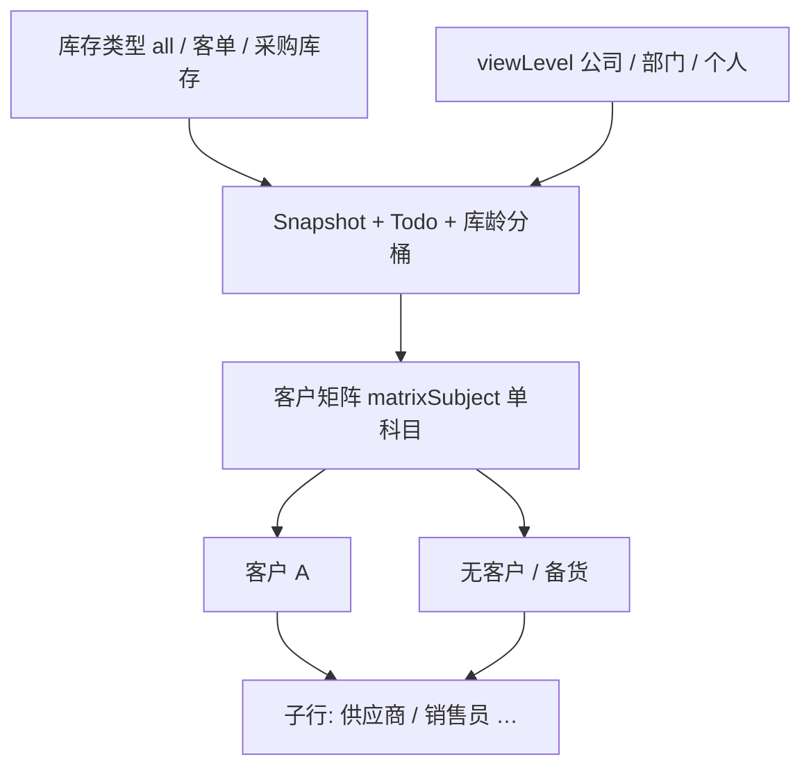
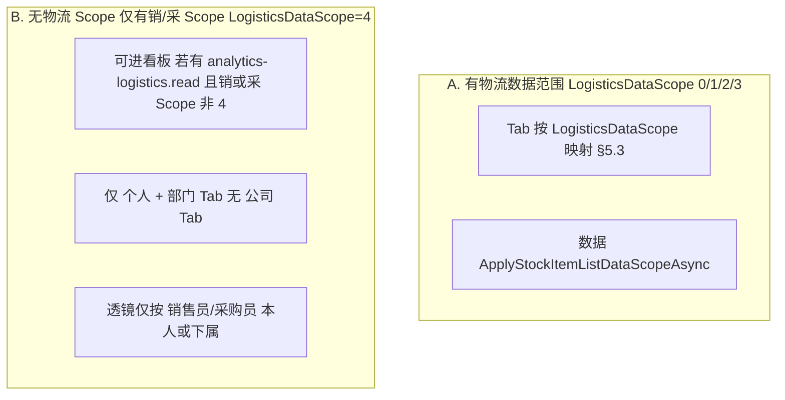

# 物流统计分析 — 实现方案（IMP）

> **状态**：一期已落地（2026-06-03）；全栈联调通过  
> **范围**：统计分析模块 — **物流 / 库存方向**（对齐 [`数据看板总要求.md`](./数据看板总要求.md) §5.3）  
> **总要求**：须符合 [`数据看板总要求.md`](./数据看板总要求.md)（角色权限、四类呈现、统计维度、跨域架构）  
> **对照模板**：[`销售统计.md`](./销售统计.md)、[`采购统计.md`](./采购统计.md)

---

## 一、背景与现状

| 项 | 现状 |
| --- | --- |
| 菜单 | 侧栏「报表分析」→ **物流分析** `/reports/logistics` **已开放** |
| 数据基础 | `stock_item` 在库明细冗余客户、销售员、采购员、供应商、品牌、`stock_type`、采购 USD 单价；`stock_in.stock_in_date` 供库龄 |
| 列表口径 | `InventoryStockItemEfListQuery`：`qty_repertory > 0`、`ApplyStockItemListDataScopeAsync`、排除移库源行 |
| 库存类型 | `stock_type`：1=客单、2=备货（**采购库存**）、3=样品（`StockInventoryTypeCodes`） |
| 看板层级 | **公司 / 部门 / 个人** Tab；**无物流 Scope 的销/采用户**仅部门+个人（见 §5） |
| 功能权限 | `analytics-logistics.read` **或** `inventory.read`（Controller / 路由 `RequireAnyPermission`） |
**结论**：以 `stock_item` 在库行为事实表；所有指标须支持 **库存类型三档切换**（§3.0）；权限分 **物流岗** 与 **仅销/采 Scope** 两套 Tab 规则；矩阵 API **按科目分请求**。

---

## 二、模块定位与路由

```
报表分析（/reports）
├── 销售分析（/reports/sales）     ← 已落地
├── 采购分析（/reports/purchase）  ← 已落地
├── 物流分析（/reports/logistics） ← 本文（**已落地**）
└── 财务分析（/reports/finance）   ← 方案见 财务统计.md
```

- 功能权限码：`analytics-logistics.read`
- 页头副标题：「在库存量截至查询日；库龄按入库日；金额为折算美元（USD）采购成本」；在库金额 KPI 后缀「（折算美元）」

---

## 三、物流域指标清单

呈现类：`[静]` 静态 · `[趋]` 趋势 · `[分]` 分解 · `[待]` 待办  

**全局约束**：下列 **全部指标**（含 snapshot、todo、flow、breakdown、customer-matrix、trends）均受 **库存类型**（§3.0）与 **viewLevel 透镜**（§5.4）约束，二者正交。

### 3.0 库存类型（Inventory Type）— 产品已确认

UI 顶部 **Segmented / Tab**（与日期、viewLevel 并列），参数名 `inventoryType`：

| 值 | 中文 | 过滤规则（`stock_item.stock_type`） |
| --- | --- | --- |
| `all` | **全部库存** | 不筛类型（含 1/2/3；仍仅 `qty_repertory > 0`） |
| `customerOrder` | **客单库存** | `stock_type = 1` |
| `purchaseStock` | **采购库存** | `stock_type = 2`（备货） |

> **样品（`stock_type = 3`）**：仅计入 **全部库存**；不在「客单」「采购库存」单独一档中展示。  
> **待入库 Todo**：按关联 `purchaseorder.type` 同口径拆分（1=客单、2=备货）。

切换库存类型时：**KPI、库龄饼图、科目数目、客户矩阵、趋势、钻取 query** 同步切换，无需另开路由。

### 3.1 在库存量 — Snapshot

| 指标 | 维度 | 呈现 | 一期 | 说明 |
| --- | --- | --- | --- | --- |
| 在库商品数量 | 数量 | 静 | ✅ | Σ `qty_repertory` |
| 在库商品金额 | 金额数 | 静 | ✅ | Σ `qty_repertory × purchase_price_usd` |
| 在库商品库龄 | 日期 | 静、分 | ✅ | 加权平均库龄（天）+ 分桶饼图 |
| 统计科目数目 | 主体数 | 静 | ✅ | 五科目去重数（§3.3） |
**时间语义**：存量截至 `dateTo`（时点），非区间累加。

### 3.1b 出入库概况 — Flow（方案 B）

| 指标 | 维度 | 呈现 | 一期 | 说明 |
| --- | --- | --- | --- | --- |
| 入库金额 | 金额 | 静 | ✅ | 趋势区间内已过账采购入库；USD = `qty × PurchasePriceUsd` |
| 出库金额 | 金额 | 静 | ✅ | 趋势区间内出库完成的销售出库；USD = `qty × SalesPriceUsd`；**仅状态 4** |

**时间语义**：期间流量，用 `dateFrom`～`trendDateTo`（与出入库数量趋势同窗）。设计见 [物流分析-出入库概况-设计与实现](../../System/数据分析/物流分析-出入库概况-设计与实现.md)。  
**脱敏**：入库卡跟 `maskAmounts`（采购金额）；出库卡跟 `maskSalesAmounts`（销售金额）。

### 3.2 待办 Todo

| 指标 | 维度 | 呈现 | 一期 | 说明 |
| --- | --- | --- | --- | --- |
| 待入库商品数量 | 数量 | 待 | ✅ | PO 未收 **PCS**（§4.4）；随 `inventoryType` 过滤 PO 类型 |

### 3.3 统计科目（Statistical Subject）

| 科目 Key | 中文 | 分组键 |
| --- | --- | --- |
| `customer` | 客户 | `customer_id` / `customer_name` |
| `salesperson` | 销售员 | `salesperson_id` / `salesperson_name` |
| `vendor` | 供应商 | `vendor_id` / `vendor_name` |
| `purchaser` | 采购员 | `purchaser_id` / `purchaser_name` |
| `brand` | 品牌 | `purchase_brand` |

**科目数目**：各科目在当次 scoped + 类型过滤后的 **去重计数**；空值不计入数目，但行仍计入总量 KPI。

### 3.4 客户锚点 × 统计科目矩阵 — 产品已确认

1. **锚点 = 客户**；有 `customer_id` 的客户各占一行。  
2. **无客户 / 备货**（`customer_id` 为空）：**单独一行锚点**，与客户行同级（产品确认 **方案 A**）。  
3. 子表科目：`salesperson | vendor | purchaser | brand`（不含客户）。  
4. 每格度量：**数量、金额、加权平均库龄**。  
5. **API 按科目分请求**（产品确认）：`GET .../customer-matrix?matrixSubject=vendor`，切换科目时重新拉取，**禁止**一次返回四科目。



### 3.5 趋势与排行（一期落地状态）

| 能力 | 一期 | 说明 |
| --- | --- | --- |
| 入库 PCS 趋势（按 `stock_in_date`） | ✅ | `GET .../trends` → `stockInQty`；与 **入库金额** 同窗同单据（已过账采购入库行 `Quantity`） |
| 出库 PCS 趋势（按 `stock_out_date`） | ✅ | `GET .../trends` → `stockOutQty`；与 **出库金额** 同窗同单据（出库完成销售出库行 `Quantity`） |
| 出入库概况金额 | ✅ | `dashboard.flow`；方案 B 过账快照 USD |
| 待入库 PCS 趋势 | ⏳ | API 字段 `pendingStockInQty` 已预留；`LoadPendingStockInByPeriodAsync` 一期返回空（图表恒为 0） |
| rankings Top10 | ✅ | `dashboard.rankings.primary`；公司=客户、部门=销售员、个人=供应商 |
| 仓库筛选 `warehouseId` | ⏳ | Query 层已支持；**前端未做**筛选 UI |
| 日末在库量曲线 | — | 二期；需日快照表 |
---

## 四、统计口径（已确认）

### 4.1 在库行纳入条件

| 规则 | 说明 |
| --- | --- |
| 软删 | `is_deleted = false` |
| 在库 | `qty_repertory > 0` |
| 移库源行 | 排除 `transfer_type = ManualTransferSource` |
| 库存类型 | 见 §3.0 |
| 时点 | 截至 `dateTo`；一期不做历史日回溯重算 |
| 权限天花板 | `ApplyStockItemListDataScopeAsync` → 再叠加 viewLevel 透镜（§5.4） |

### 4.2 数量与金额

| 度量 | 公式 |
| --- | --- |
| 行在库数量 | `qty_repertory` |
| 行在库金额（USD） | 优先 `qty_repertory ×` PO 行 `convert_price`；否则 `qty_repertory × purchase_price_usd`（入库快照，写库时亦优先 PO `convert_price`） |
| 脱敏 | `PurchaseSensitiveFieldMask511` / 无 `purchase.amount.read` → `maskAmounts`，金额字段 `null` |

### 4.3 库龄 — 已确认

| 项 | 定义 |
| --- | --- |
| 起算日 | **`stock_in.stock_in_date`**（与库存明细列表一致） |
| 行库龄 | `dateTo − stock_in_date`（自然日） |
| 汇总库龄 | **按数量加权平均**：Σ(库龄 × `qty_repertory`) / Σ(`qty_repertory`) |
| 分桶 | `0–30` / `31–90` / `91–180` / `181–365` / `365+` 天，按 **数量** 占比 |

### 4.4 待入库 — 已确认（一期）

| 项 | 定义 |
| --- | --- |
| 公式 | Σ `max(0, poi.qty − extend.qty_receive_total)`（PCS） |
| 权限 | `ApplyPurchaseOrderDataScopeAsync` |
| 类型 | `inventoryType=customerOrder` → `po.type=1`；`purchaseStock` → `po.type=2`；`all` 不筛 |
| 口径边界 | **不含**「仅到货通知/质检、未记 PO 已收」；二期扩展 |

### 4.5 统计科目与「无客户 / 备货」锚点 — 已确认

| 场景 | 处理 |
| --- | --- |
| 有 `customer_id` | 正常客户锚点行；计入 `customerCount` |
| 无 `customer_id` | 锚点显示 **「无客户 / 备货」**（固定文案）；**不计入** `customerCount` |
| 子表空值 | 各科目子表内仍可有「未分配销售员」等桶 |

---

## 五、权限与三层 Tab（产品已确认）

### 5.1 两类访问主体



| 主体 | 能否访问页面 | 可见 Tab | 数据边界 |
| --- | --- | --- | --- |
| **A. 物流岗**（`LogisticsDataScope` 0/1/2/3） | ✅ | 按 §5.3 | 列表 Scope 天花板 + viewLevel 透镜 |
| **B. 仅销/采**（`LogisticsDataScope=4`，销或采 Scope 1/2/3） | ✅ | **个人**；销/采 Scope **2/3** 时另有 **部门**；**无公司** | **仅** `salesperson_id` 或 `purchaser_id` 挂 **本人**（个人）或 **本人∪下属**（部门） |
| 销/采/物流 **均为 4** | ❌ 403 | — | 空 |
| **SYS_ADMIN** | ✅ | 全部 | 全量 |

**B 类说明（产品原话落地）**：

- **个人**：在库行的 `salesperson_id == 我` **或** `purchaser_id == 我`（满足其一即可计入）。  
- **部门**：销或采 Scope 为 **2（本部门）/ 3（本部门及下级）** 时开放；行可见若 `salesperson_id` **或** `purchaser_id` ∈ **允许用户集**（`GetAllowedUserIdsAsync`，与对应 Sale/Purchase Scope 一致；销/采两侧允许集 **取并集** 后过滤）。  
- **不**按客户、供应商维度扩大可见范围；与库存列表「销∨采」天花板取 **交集**。

### 5.2 在库列表数据天花板（共用）

`ApplyStockItemListDataScopeAsync`（销∨采 OR 规则）→ 得到 `scopedStockItems` → 再应用 §5.1 B 类透镜或 §5.4 viewLevel。

### 5.3 Tab 与 `LogisticsDataScope`（A 类：有物流 Scope）

| LogisticsDataScope | 公司 | 部门 | 个人 |
| --- | --- | --- | --- |
| 0 全部 | ✅ | ✅ | ✅ |
| 3 本部门及下级 | ✅ 可见范围 | ✅ | ✅ |
| 2 本部门 | ❌ | ✅ | ✅ |
| 1 自己 | ❌ | ❌ | ✅ |
| 4 禁止 | — | — | —（改走 §5.1 B 类若销/采可访问） |

### 5.4 viewLevel 透镜（A 类，在 scoped 之后）

| viewLevel | 过滤 |
| --- | --- |
| 公司 | 不额外缩小 |
| 部门 | `salesperson_id` 或 `purchaser_id` ∈ 所选部门主部门用户集 |
| 个人 | `salesperson_id == 指定用户` 或 `purchaser_id == 指定用户` |

部门归属：销售员/采购员用户的 **主部门**（`sys_user_department.is_primary`）。

### 5.5 `scopeContext` 建议字段

| 字段 | 说明 |
| --- | --- |
| `logisticsDataScope` / `saleDataScope` / `purchaseDataScope` | 透明展示 |
| `accessMode` | `logistics` \| `salesPurchaseOnly`（B 类标识） |
| `allowedViewLevels` | 服务端下发的可用 Tab |
| `scopeLabel` | 如「本人」「本部门及下级」「全公司」 |
| `maskAmounts` | 金额脱敏 |
| `inventoryType` | 回显当前库存类型 |

---

## 六、API 契约

### 6.1 公共 Query

| 参数 | 必填 | 说明 |
| --- | --- | --- |
| `viewLevel` | 是 | `company \| department \| personal` |
| `inventoryType` | 是 | `all \| customerOrder \| purchaseStock` |
| `dateTo` | 否 | 存量截至日，默认今天 |
| `dateFrom` | 否 | 趋势用 |
| `departmentId` | 否 | 部门透镜 |
| `ownerUserId` | 否 | 个人透镜（B 类 Scope=1 强制当前用户） |
| `groupBy` | 否 | `day \| week \| month` |
| `warehouseId` | 否 | P1 |
| `matrixSubject` | 矩阵必填 | `salesperson \| vendor \| purchaser \| brand` |

### 6.2 端点

| 端点 | 返回 |
| --- | --- |
| `GET /api/v1/analytics/logistics/dashboard` | `scopeContext` + `snapshot` + `todo` + `rankings` |
| `GET /api/v1/analytics/logistics/trends` | 入库/出库 PCS 趋势（`pendingStockInQty` 预留） |
| `GET /api/v1/analytics/logistics/breakdowns` | `ageBucket` 等 |
| `GET /api/v1/analytics/logistics/customer-matrix` | 客户锚点 + **单科目** 子行 |

> **前端 API 客户端**须使用完整前缀 `/api/v1/analytics/logistics/...`（与采购/销售一致），经 Vite `/api` 代理转发；**禁止**省略 `/api/v1`（否则请求落至前端 dev server，页面会一直 loading）。

### 6.3 鉴权与功能权限

| 项 | 说明 |
| --- | --- |
| Controller | `[RequireAnyPermission("analytics-logistics.read", "inventory.read")]` |
| 路由 | `routes.ts` → `permissions: ['analytics-logistics.read', 'inventory.read']` |
| 菜单 | `AppLayout.vue`：同上二选一即可见「物流分析」 |
| 种子 SQL | `scripts/analytics_logistics_read_permission_postgresql.sql`（向已有 `inventory.read` 的角色授予 `analytics-logistics.read`） |
| 数据 Scope | 仍由 `LogisticsAnalyticsScopeValidator` + `ApplyStockItemListDataScopeAsync` 控制；**功能权限**与**数据权限**独立 |

### 6.4 响应示例
**dashboard.snapshot**（随 `inventoryType` 变化）：

```json
{
  "inventoryType": "customerOrder",
  "onHandQty": 8000,
  "onHandAmountUsd": 210000.5,
  "weightedAvgAgeDays": 38.2,
  "subjectCounts": {
    "customer": 15,
    "salesperson": 10,
    "vendor": 20,
    "purchaser": 6,
    "brand": 35
  }
}
```

**customer-matrix**（单次仅一个 `matrixSubject`）：

```json
{
  "inventoryType": "all",
  "matrixSubject": "vendor",
  "rows": [
    {
      "anchorCustomerId": "cust-1",
      "anchorCustomerName": "某某科技",
      "onHandQty": 500,
      "onHandAmountUsd": 12000,
      "weightedAvgAgeDays": 35.2,
      "children": [
        {
          "subjectKey": "v-1",
          "subjectLabel": "Digikey",
          "onHandQty": 300,
          "onHandAmountUsd": 8000,
          "weightedAvgAgeDays": 28
        }
      ]
    },
    {
      "anchorCustomerId": null,
      "anchorCustomerName": "无客户 / 备货",
      "onHandQty": 200,
      "onHandAmountUsd": 5000,
      "weightedAvgAgeDays": 62,
      "children": []
    }
  ]
}
```

### 6.5 后端要点

1. `LogisticsAnalyticsScopeValidator`：区分 A/B 类、`allowedViewLevels`、B 类禁止 `company`。  
2. `LogisticsAnalyticsQuery`：`LoadStockRowsAsync` 先 `ApplyStockItemListDataScopeAsync` → `inventoryType` → viewLevel 透镜 → JOIN `stock_in` 取 `stock_in_date`。  
3. B 类部门允许用户：`BuildSalesPurchaseLensUserIdsAsync`（销/采 Scope 允许集 **并集**）。  
4. 矩阵子表空值桶：`subjectKey = __none__`，文案如「未分配销售员」等；**不可钻取**。  
5. 对账：同用户、同 `inventoryType`、同 viewLevel → 与库存明细列表 Σ `qty_repertory` 一致（抽样验收）。
---

## 七、前端交互

```
┌─ 物流分析 ─────────────────────────────────────────────────────────┐
│ [公司|部门|个人]  库存类型 [全部|客单|采购库存]  截至 [dateTo]        │
│ 趋势区间 [dateFrom–dateTo]  groupBy  查询                           │
│ scopeContext：accessMode · 可见范围 · 库龄按入库日                   │
├─ 待办：待入库 PCS（随库存类型） ─────────────────────────────────────┤
├─ 出入库概况：入库金额 | 出库金额（趋势区间，方案 B） ──────────────────┤
├─ KPI：在库数量 | 金额 | 平均库龄 | 五科目数目 ────────────────────────┤
├─ 库龄分桶饼图 │ 入库 PCS 趋势 │ 出库 PCS 趋势 ─────────────────────────────┤
├─ 客户矩阵  科目 [销售员|供应商|采购员|品牌]  ← 切换触发 matrix API ──┤
│  ▼ 客户 A   …                                                        │
│  ▼ 无客户 / 备货  …                                                  │
├─ 排行 Top10（随 viewLevel：客户 / 销售员 / 供应商）──────────────────┤
└─ 钻取 → 库存明细 / 采购明细（待入库）────────────────────────────────┘
```

- 页面：`LogisticsAnalyticsPage.vue`；复用 `AnalyticsScopeTabs`（`i18n-prefix="logisticsAnalytics"`），Tab 显隐由 `scopeContext.allowedViewLevels` 驱动。  
- B 类用户（`accessMode=salesPurchaseOnly`）：不渲染「公司」Tab；服务端校验通过后 `viewLevel` 回写为默认透镜。  
- **钻取**（`logisticsAnalyticsDrill.ts`）：
  - 在库 KPI / 矩阵 / 排行 → `/inventory/stock-items?repertoryHasStock=true` + 客户/供应商/品牌/销售员/采购员 query；
  - 待入库 Todo → `/purchase-order-items` + `type=1|2`（随 `inventoryType`）+ 可选 `purchaseUserId`；
  - 出入库概况入库卡 → `/inventory/stock-in` + `stockInType=10` + 入库日区间；
  - 出入库概况出库卡 → `/inventory/stock-out/items` + `status=4` + `stockOutType=10` + 出库日区间；
  - **已知限制**：库存明细列表 API **暂无 `stockType` 筛选**，钻取时**未**携带 `inventoryType` 对应 `stock_type`（用户需在列表侧自行过滤，或待二期补 API）。入库列表无过账状态筛。
- i18n：`logisticsAnalytics.*`（`zh-CN.ts` / `en-US.ts`）。

---

## 八、技术文件（已落地）

| 层 | 路径 |
| --- | --- |
| Controller | `CRM.API/Controllers/LogisticsAnalyticsController.cs` |
| Service | `CRM.Core/Services/LogisticsAnalyticsService.cs` |
| Validator | `CRM.Core/Utilities/LogisticsAnalyticsScopeValidator.cs` |
| Query | `CRM.Infrastructure/Analytics/LogisticsAnalyticsQuery.cs` |
| 内部行类型 | `CRM.Infrastructure/Analytics/LogisticsAnalyticsInternalTypes.cs` |
| DTO | `CRM.Core/Models/Analytics/LogisticsAnalyticsContracts.cs` |
| 接口 | `ILogisticsAnalyticsService`、`ILogisticsAnalyticsQuery` |
| DI | `CRM.API/Extensions/ServiceExtensions.cs`、`CRM.Infrastructure/Extensions/ServiceCollectionExtensions.cs` |
| 页面 | `CRM.Web/src/views/Reports/LogisticsAnalyticsPage.vue` |
| API 客户端 | `CRM.Web/src/api/analytics/logistics.ts` |
| 钻取 | `CRM.Web/src/utils/logisticsAnalyticsDrill.ts` |
| 路由 | `CRM.Web/src/router/routes.ts` → `/reports/logistics` |
| 菜单 | `CRM.Web/src/layouts/AppLayout.vue` |
| 权限 SQL | `scripts/analytics_logistics_read_permission_postgresql.sql` |
---

## 九、一期 MVP 范围

### 9.1 已做（P0）

1. ✅ 菜单与路由 `/reports/logistics` + 权限种子 SQL  
2. ✅ A/B 类权限与 Tab 规则（§5.1）  
3. ✅ **库存类型三档**贯穿 snapshot / todo / breakdown / matrix / trends / rankings  
4. ✅ Snapshot + Todo + 库龄分桶（`breakdowns` → `ageBucket`）  
5. ✅ Customer-matrix（**分科目请求**）+ 「无客户 / 备货」锚点  
6. ✅ 入库/出库 PCS 趋势 + 排行 Top10  
7. ✅ 钻取库存明细、待入库采购明细  
8. ✅ API 四端点 + 前端页面 / i18n / 菜单  

### 9.2 延后（P1 / 二期）

| 项 | 说明 |
| --- | --- |
| 待入库 PCS **趋势** | `trends.pendingStockInQty` 一期恒 0 |
| 仓库筛选 UI | 后端 `warehouseId` 已支持 |
| 钻取携带 `stockType` | 依赖库存列表 API 扩展 |
| reconcile 对账 API | 与销售/采购对齐 |
| 日末在库趋势 | 需日快照表 |
| 到货/质检待入库 | 不含于一期 PO 未收口径 |
| 样品单独一档 | 仅「全部库存」含 type=3 |

---

## 十、落地步骤与运维

| 步骤 | 产出 |
| --- | --- |
| ① 权限 | 执行 `scripts/analytics_logistics_read_permission_postgresql.sql`（或手动授予 `analytics-logistics.read`） |
| ② 后端 | 已含 Controller + Service + Query + Validator；**部署后须重启 CRM.API** |
| ③ 前端 | 页面、API（`/api/v1/...`）、菜单、i18n、钻取 |
| ④ 联调 | A 类 Scope 0/1/2/3 + B 类销/采 Scope + 超管；核对 KPI 与库存列表 Σ `qty_repertory` |
| ⑤ 验收 | 切换库存类型三档、矩阵四科目、库龄分桶、待入库 Todo 与 PO 未收一致 |

---

## 十一、产品确认纪要（2026-06-03）
| # | 议题 | **确认结论** |
| --- | --- | --- |
| 1 | 无物流 Scope、仅有销/采 Scope | **可访问**；**个人**=仅 `salesperson_id`/`purchaser_id` 为本人；**部门**=本人∪下属（销/采 Scope 2/3）；**无公司 Tab** |
| 2 | 客户矩阵 API | **按科目分请求**（`matrixSubject`） |
| 3 | 金额脱敏 | 对齐 `PurchaseSensitiveFieldMask511` + 库存列表 |
| 4 | 无客户 / 备货 | 锚点行 **「无客户 / 备货」**；不计入客户数目 |
| 5 | 库龄起算日 | **`stock_in_date`**；加权平均 |
| 6 | 待入库 | 一期 **PO 未收 PCS**；随 PO/库存类型过滤 |
| 7 | 库存类型拆分 | **全部 / 客单（type=1）/ 采购库存（type=2 备货）**；全指标生效 |

---

## 十二、文档与代码索引

| 用途 | 路径 |
| --- | --- |
| 数据看板总要求 | `document/IMP/数据看板/数据看板总要求.md` |
| 库存类型常量 | `CRM.Core/Constants/StockInventoryTypeCodes.cs` |
| 在库明细 | `CRM.Core/Models/Inventory/StockItem.cs` |
| 库存列表 | `CRM.Infrastructure/InventoryCenter/InventoryStockItemEfListQuery.cs` |
| 在库数据范围 | `DataPermissionService.ApplyStockItemListDataScopeAsync` |
| 备货业务 | `document/实现方案/备货库存可拣货实施方案.md` |
| 物流 Scope | `document/System/权限/权限-部门.md` §五 |
| 出库明细列表看板 | [`出库明细列表看板-设计与实现.md`](./出库明细列表看板-设计与实现.md) |
| 入库单列表看板 | [`入库单列表看板-设计与实现.md`](./入库单列表看板-设计与实现.md) |

---

## 十三、修订记录

| 日期 | 说明 |
| --- | --- |
| 2026-06-03 | 初稿 |
| 2026-06-03 | 产品确认：B 类销/采访问规则、矩阵分请求、无客户锚点、库龄/待入库；新增库存类型三档维度 |
| 2026-06-03 | **全栈落地回写**：§3 指标一期状态、§6 鉴权与 API 路径、§7 钻取限制、§8 文件清单、§9～§10 运维步骤；修正前端 API 须带 `/api/v1` 前缀 |
| 2026-08-11 | 金额文案：副标题与在库金额 KPI 标明折算美元（USD） |
| 2026-08-11 | 在库金额优先 PO 行 `convert_price`（历史成交），与销/采/财看板折算主口径对齐 |
| 2026-08-28 | 入库/出库 PCS 趋势：`stockInQty`/`stockOutQty` 对齐出入库概况同窗同单据 |
| 2026-08-27 | 出入库概况：方案 B 过账快照 USD；出库仅完成态；趋势窗用 `trendDateTo` |
| 2026-08-27 | 出库明细列表嵌入看板（跟筛选、出库金额；见 `出库明细列表看板-设计与实现.md`） |
| 2026-08-27 | 入库单列表嵌入看板（跟筛选、全部入库金额、入库单数；见 `入库单列表看板-设计与实现.md`） |