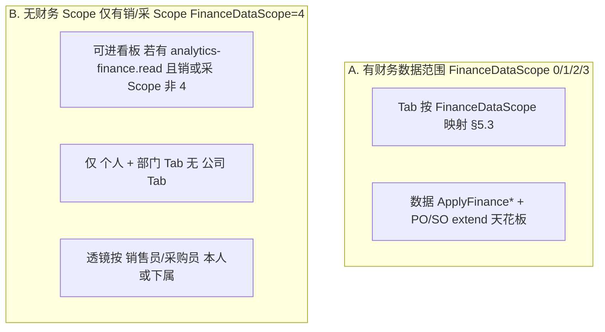

# 财务统计分析 — 实现方案（IMP）

> **状态**：已落地（一期 P0）  
> **范围**：统计分析模块 — **财务方向**（对齐 [`数据看板总要求.md`](./数据看板总要求.md) §5.4）  
> **总要求**：须符合 [`数据看板总要求.md`](./数据看板总要求.md)（角色权限、四类呈现、统计维度、跨域架构）  
> **对照模板**：[`销售统计.md`](./销售统计.md)、[`采购统计.md`](./采购统计.md)、[`物流统计.md`](./物流统计.md)

---

## 一、背景与现状

| 项 | 现状 |
| --- | --- |
| 菜单 | 计划 `/reports/finance`（报表分析 → **财务分析**） |
| 数据基础 | 付款/收款/进销项发票（`financepayment`、`financereceipt`、`financepurchaseinvoice`、`financesellinvoice`）；应收（`finance_receivable`）；订单明细 extend 票款汇总（`sellorderitemextend`、`purchaseorderitemextend`） |
| 列表权限 | `ApplyFinancePaymentListDataScopeAsync`、`ApplyFinanceReceiptListDataScopeAsync`、`ApplyFinancePurchaseInvoiceListDataScopeAsync`、`ApplyFinanceSellInvoiceListDataScopeAsync`、`ApplyFinanceReceivableListDataScopeAsync` |
| 销/采 legacy | 无独立财务 Scope 时，付款/进项按 **供应商采购员**；收款/销项/应收按 **销售员**（见 `DataPermissionService`） |
| 汇率 | `ExchangeRateToUsdConverter` + 财务参数 `FinanceExchangeRateSetting`；订单行已有 `convert_price`（USD 单价） |
| 看板层级 | **公司 / 部门 / 个人** Tab；**无财务 Scope 的销/采用户**仅部门+个人（见 §5） |

**结论**：财务看板以 **票 + 款** 八项指标为核心；每项同时输出 **美元折算合计** 与 **分原币合计**；权限分 **财务岗（A 类）** 与 **仅销/采 Scope（B 类）** 两套 Tab 规则，B 类按销售员/采购员归属过滤。

---

## 二、模块定位与路由

```
报表分析（/reports）
├── 销售分析（/reports/sales）     ← 已落地
├── 采购分析（/reports/purchase）  ← 已落地
├── 物流分析（/reports/logistics） ← 已落地
└── 财务分析（/reports/finance）   ← 本文
```

- 功能权限码：`analytics-finance.read`（建议 **或** 任一 `finance-*-read` 只读码，与物流看板 `inventory.read` 兜底模式对称）
- 页头副标题建议：「应收 = 已出库账上余额（finance_receivable）；与销售看板应收口径不同」

---

## 三、财务域指标清单

呈现类：`[静]` 静态 · `[趋]` 趋势 · `[分]` 分解 · `[待]` 待办  

**全局约束**：下列指标均受 **viewLevel 透镜**（§5.4）约束；**金额**须同时提供 **USD 合计** 与 **原币分档**（§4.2）。

### 3.1 八项核心金额指标

| # | 指标 | 业务含义 | 维度 | 呈现 | 归类 |
| --- | --- | --- | --- | --- | --- |
| 1 | **已付款金额** | 已完成付款核销的货款 | 金额数 | 静、趋 | 采购侧「款」 |
| 2 | **应付款金额** | 尚未付清的应付余额（待付） | 金额数 | 待、趋 | 采购侧「款」 |
| 3 | **已收款金额** | 已完成收款核销的金额 | 金额数 | 静、趋 | 销售侧「款」 |
| 4 | **应收款金额** | 尚未收清的应收余额 | 金额数 | 待、趋 | 销售侧「款」 |
| 5 | **待开进项发票金额** | 应付票额中尚未取得进项发票的部分 | 金额数 | 待、趋 | 采购侧「票」 |
| 6 | **已开进项发票金额** | 已取得/已登记的进项发票金额 | 金额数 | 静、趋 | 采购侧「票」 |
| 7 | **待开销项发票金额** | 应开票额中尚未开具销项发票的部分 | 金额数 | 待、趋 | 销售侧「票」 |
| 8 | **已开销项发票金额** | 已开具销项发票金额 | 金额数 | 静、趋 | 销售侧「票」 |

> 产品输入「应付**收款**金额」按业务语义统一为 **应付款金额**（payable / 待付）。

### 3.2 金额展示结构（产品已确认）

**每一项金额**在 API 中统一为：

```typescript
interface FinanceAnalyticsMoney {
  /** 折算美元合计（看板主 KPI 默认展示） */
  totalUsd: number | null
  /** 各原币别合计（分解区 / 明细抽屉） */
  byCurrency: FinanceAnalyticsCurrencyAmount[]
}

interface FinanceAnalyticsCurrencyAmount {
  currency: number          // 1=RMB 2=USD 3=EUR …（CurrencyCode）
  currencyLabel: string     // CNY / USD / EUR …
  amount: number            // 原币金额合计
}
```

- **KPI 卡片**：优先展示 `totalUsd`（格式 `$ 12,345.67`）；无权限脱敏时为 `null`。  
- **币别分解饼图 / 表格**：展示 `byCurrency[]`；可与「八指标 × 单指标币别构成」或「全指标汇总币别构成」两种模式（一期建议 **按指标分组** 各一张饼图，或 Tab 切换指标后刷新分解）。  
- **跨指标对比**：仅允许比较 `totalUsd`，禁止不同原币直接相加。

### 3.3 Snapshot / Todo 划分

| 区 | 包含指标 | 时间语义 |
| --- | --- | --- |
| **todo** | 应付款、应收款、待开进项、待开销项 | 截至 `dateTo` 的**存量余额**；其中 **应收** 取自 `finance_receivable`（§4.4），其余与采购/销售 extend todo 对齐 |
| **snapshot.completed** | 已付款、已收款、已开进项、已开销项 | **区间内**（`dateFrom`～`dateTo`）发生额；亦可在 dashboard 附带「截至 dateTo 累计」子字段（二期） |

**趋势 `trends[]`**：八指标均可按 `groupBy` 输出每期 `FinanceAnalyticsMoney`（一期 P0 优先 **已付/已收/应 pay/应 rece** 四条趋势，发票四条可 P1）。

### 3.4 分解与排行（一期分级）

| 能力 | 优先级 | 说明 |
| --- | --- | --- |
| 单指标原币构成饼图 | P0 | `breakdowns` → `groupKey=currency:{metricKey}` |
| 采购 vs 销售侧汇总 | P1 | `groupKey=side`（payable/payment/invoice 采购；receivable/receipt/invoice 销售） |
| 客户 / 供应商 Top N | P1 | 随 `viewLevel`：公司=客户/供应商；部门=销售员/采购员；个人=对手方 |
| 核销状态分布 | P2 | 部分/完成/未开始 |

---

## 四、统计口径（建议默认）

### 4.1 归属键（销/采透镜与 B 类过滤）

| 业务侧 | 指标 | 归属字段（用于 viewLevel / B 类过滤） |
| --- | --- | --- |
| 销售 | 已收款、应收款、待开/已开销项 | **应收**：`finance_receivable.sales_user_id`（§4.4）；**已收/发票**：`financereceipt.sales_user_id`、`financesellinvoice` → SO 销售员；extend 票款字段经 SO 归属 |
| 采购 | 已付款、应付款、待开/已开进项 | `financepayment` → `vendorinfo.purchase_user_id`；extend 行通过 **PO 头** `purchase_user_id` 或供应商采购员 |

**B 类（§5.1）**：

- **个人**：销售侧字段 **= 当前用户** **或** 采购侧归属 **= 当前用户**（满足其一即可计入该行金额）。  
- **部门**：销售侧 **或** 采购侧归属 ∈ **允许用户集**（销 Scope 与采 Scope 分别 `GetAllowedUserIdsForDataScopeAsync` 后 **取并集**）。  
- **不**因客户/供应商主体扩大可见范围；与列表权限天花板取 **交集**。

### 4.2 美元折算与原币分档

| 数据源 | 原币 `amount` | 折 USD |
| --- | --- | --- |
| PO 明细 extend（款/进项票） | PO 头 `currency` + extend 金额字段 | `qty × convert_price` 等价：按 PO 行 `convert_price`（USD 单价）× 比例，或 `extend_amount / po_line_total × line_convert_usd`（推荐 **按行 convert_price 与 extend 金额同币别** 折算） |
| SO 明细 extend（款/销项票） | SO 头 `currency` + extend 金额 | 同上，用 SO 行 `convert_price` |
| `finance_receivable` | `currency` + `amount` / `verified_*` | 原币字段直取；USD = `ExchangeRateToUsdConverter`（查询日或 `stock_out_date` 快照汇率，**一期默认查询日当前汇率**，页头须提示） |
| `financepayment` / `financereceipt` | `payment_currency` / `receipt_currency` + 头/明细金额 | 收款明细优先 `receipt_convert_amount` 作 USD；付款按 payment 币别 + 当前汇率折算 |
| 进/销项发票 | 关联 PO/SO 币别；发票头金额 | 优先追溯订单行 `convert_price`；无法追溯时用发票登记日汇率 |

**`byCurrency` 聚合**：按 `CurrencyCode` 分组对 **原币 amount** 求和；`totalUsd` = Σ 各行折 USD（**禁止**对原币跨币别直接相加后再折算）。

**脱敏**：无 `purchase.amount.read` / 销售侧等价权限 / `FinanceSensitiveFieldMask`（若后续引入）时 `maskAmounts=true`，`totalUsd` 与 `byCurrency` 均为 `null`（与采购/销售看板 `PurchaseSensitiveFieldMask511` 对齐）。

### 4.3 八项指标 — 数据源与公式（一期）

统一前提：PO/SO 须过 `PurchaseAnalyticsDateFilter.ApplyAnalyticsStatusFilter` / 销售等价状态过滤（排除取消、审核失败）；extend / 财务单据 `is_deleted = false`。

| 指标 | 字段 Key | 主数据源（推荐） | 公式要点 |
| --- | --- | --- | --- |
| 已付款 | `paidAmount` | PO extend + 可选 FinancePayment 交叉校验 | Σ `purchaseorderitemextend.payment_amount_finish`（scoped PO 明细）；趋势按 **付款完成日** `financepayment.payment_date` 或核销日记账 |
| 应付款 | `payableAmount` | PO extend | Σ `payment_amount_not`（与 [`采购统计.md`](./采购统计.md) todo 一致） |
| 已收款 | `receivedAmount` | `finance_receivable` + FinanceReceipt | 存量/累计：Σ `finance_receivable.verified_done`（与 extend `receipt_amount_finish` 同源）；区间趋势按 `financereceipt.receipt_date` |
| 应收款 | `receivableAmount` | **`finance_receivable`** | Σ `verified_to_be`（`is_deleted = false`）；**产品已确认**，见 §4.4 |
| 待开进项 | `pendingPurchaseInvoiceAmount` | PO extend | Σ `purchase_invoice_to_be` |
| 已开进项 | `issuedPurchaseInvoiceAmount` | PO extend + FinancePurchaseInvoice | Σ `purchase_invoice_done`；趋势可按 `financepurchaseinvoice.invoice_date` |
| 待开销项 | `pendingSellInvoiceAmount` | SO extend | Σ `invoice_amount_not` |
| 已开销项 | `issuedSellInvoiceAmount` | SO extend + FinanceSellInvoice | Σ `invoice_amount_finish`；趋势按 `financesellinvoice.make_invoice_date` |

**权限天花板（须先于聚合）**：

| 数据域 | Apply 方法 |
| --- | --- |
| 付款 | `ApplyFinancePaymentListDataScopeAsync` |
| 收款 | `ApplyFinanceReceiptListDataScopeAsync` |
| 进项发票 | `ApplyFinancePurchaseInvoiceListDataScopeAsync` |
| 销项发票 | `ApplyFinanceSellInvoiceListDataScopeAsync` |
| 应收 | `ApplyFinanceReceivableListDataScopeAsync` |
| PO 明细 extend | `ApplyPurchaseOrderDataScopeAsync` |
| SO 明细 extend | `ApplySellOrderDataScopeAsync` |

B 类用户在 finance Scope=4 时：**应收** 直接 `ApplyFinanceReceivableListDataScopeAsync`；extend 类指标仍走 **销/采 Scope** 过滤 PO/SO，再叠加 §4.1 归属透镜。

### 4.4 应收款口径 — 产品已确认（`finance_receivable`）

**财务看板应收**固定使用 **`finance_receivable` 表**，**不使用** `sellorderitemextend.receipt_amount_not`。

| 项 | 说明 |
| --- | --- |
| 待办公式 | Σ `verified_to_be`（仅 `verified_to_be > 0` 行，或全表求和等价） |
| 粒度 | **出库单维度**（一出库完成生成一行，`TryEnsureFromStockOutAsync`） |
| 业务含义 | **已出库、财务挂账、尚未核销** 的应收余额 |
| 原币 | 行字段 `currency` + `verified_to_be` → `byCurrency[]` |
| 折 USD | 按行原币 + `ExchangeRateToUsdConverter`（一期默认查询日汇率） |
| 权限 | `ApplyFinanceReceivableListDataScopeAsync`；过滤键 `sales_user_id` |
| 钻取 | `/finance/receivables?onlyOpen=true`（与应收列表一致） |

**与销售看板 todo 的差异（须页头提示，不要求数字一致）**：

| 口径 | 数据源 | 含义 |
| --- | --- | --- |
| 销售分析 · 应收 todo | extend `receipt_amount_not` | 订单行全额 − 已核销；**含未出库部分的「待收」** |
| 财务分析 · 应收 todo | `finance_receivable.verified_to_be` | **仅已出库** 产生的账上应收 |

差额 ≈ `ReceiptAmount − Σ receivable.amount`（同一销售明细行上）。全量出库且应收金额覆盖订单行后，两者趋近一致。

**已收款与 extend 的关系**：extend `receipt_amount_finish` = Σ `finance_receivable.verified_done`（同步于 `SellOrderItemExtendSyncService`），故 **已收金额** 可用应收表 `verified_done` 汇总，与 extend 数值一致，但应收 todo **必须** 用 `verified_to_be`。

## 五、权限与三层 Tab（产品已确认）

### 5.1 两类访问主体



| 主体 | 能否访问页面 | 可见 Tab | 数据边界 |
| --- | --- | --- | --- |
| **A. 财务岗**（`FinanceDataScope` 0/1/2/3） | ✅ | 按 §5.3 | 财务列表 Scope + viewLevel 透镜（§5.4 A 类） |
| **B. 仅销/采**（`FinanceDataScope=4`，销或采 Scope 1/2/3） | ✅ | **个人**；销/采 Scope **2/3** 时另有 **部门**；**无公司** | **仅** 销售侧 `sales_user_id` **或** 采购侧 `vendor.purchase_user_id` / `po.purchase_user_id` 为 **本人**（个人）或 **本人∪下属**（部门） |
| 销/采/财务 **均为 4** | ❌ 403 | — | 空 |
| **SYS_ADMIN** | ✅ | 全部 | 全量 |

**B 类说明（产品原话落地）**：

- **个人**：财务相关数据的 **销售员** 或 **采购员** 挂 **本人** 名字的行才计入。  
- **部门**：若销/采 Scope 为 **2/3**，可查看 **本人 + 下属** 合计；归属字段同上，允许用户集为销/采 Scope 对应 `GetAllowedUserIdsForDataScopeAsync` 的 **并集**。  
- **无公司 Tab**；与 [`物流统计.md`](./物流统计.md) §5.1 B 类对称。

**财务部身份（`IdentityType=5`）**：走 A 类；列表层面对同部门财务单据 **不按** 业务员/采购员缩小（与 [`权限-财务.md`](../System/权限/权限-财务.md) §7.2 一致），看板聚合仍可按 viewLevel 做组织透镜。

### 5.2 Tab 与 `FinanceDataScope`（A 类）

| FinanceDataScope | 公司 | 部门 | 个人 |
| --- | --- | --- | --- |
| 0 全部 | ✅ | ✅ | ✅ |
| 3 本部门及下级 | ✅ 可见范围 | ✅ | ✅ |
| 2 本部门 | ❌ | ✅ | ✅ |
| 1 自己 | ❌ | ❌ | ✅ |
| 4 禁止 | — | — | —（改走 §5.1 B 类若销/采可访问） |

### 5.3 viewLevel 透镜

**A 类（FinanceDataScope 1–3，在 scoped 之后）**：

| viewLevel | 过滤 |
| --- | --- |
| 公司 | 不额外缩小 |
| 部门 | 财务单据：`create_by_user_id` ∈ 所选部门主部门用户集；extend 聚合：PO `purchase_user_id` / SO 销售员 ∈ 部门用户集 |
| 个人 | 财务单据：指定 `ownerUserId` 或 Scope=1 强制当前用户；extend：对应采购员/销售员 |

**B 类（SalesPurchaseOnly 模式）**：

| viewLevel | 过滤 |
| --- | --- |
| 个人 | §4.1 归属 = 当前用户 |
| 部门 | §4.1 归属 ∈ 销/采允许用户并集 |

### 5.4 `scopeContext` 建议字段

| 字段 | 说明 |
| --- | --- |
| `financeDataScope` / `saleDataScope` / `purchaseDataScope` | 透明展示 |
| `accessMode` | `finance` \| `salesPurchaseOnly` |
| `allowedViewLevels` | 服务端下发的可用 Tab |
| `scopeLabel` | 「全公司」「本部门及下级」「本人（销/采归属）」等 |
| `maskAmounts` | 金额脱敏 |
| `exchangeRateHint` | 如「美元折算按查询日财务参数汇率」 |
| `resolvedOwnerUserId` / `resolvedDepartmentId` | 与销/采/物流看板一致 |

---

## 六、API 契约

### 6.1 公共 Query

| 参数 | 必填 | 说明 |
| --- | --- | --- |
| `viewLevel` | 是 | `company \| department \| personal` |
| `dateTo` | 否 | 待办存量截至日；默认今天 |
| `dateFrom` | 否 | 已付/已收/已开票 **区间** 起；趋势必填 |
| `departmentId` | 否 | 部门透镜 |
| `ownerUserId` | 否 | 个人透镜 |
| `groupBy` | 否 | `day \| week \| month` |
| `metric` | 否 | 趋势/分解切换单指标（二期）；一期 trends 返回多字段 |

### 6.2 端点

| 端点 | 返回 |
| --- | --- |
| `GET /api/v1/analytics/finance/dashboard` | `scopeContext` + `snapshot` + `todo` + `rankings?` |
| `GET /api/v1/analytics/finance/trends` | 八指标（或一期子集）按 period 的 `FinanceAnalyticsMoney` |
| `GET /api/v1/analytics/finance/breakdowns` | 币别构成、侧别构成等 |

> 前端 API 路径须带完整前缀 `/api/v1/analytics/finance/...`（见物流看板路径教训）。

### 6.3 响应示例

**dashboard.todo**（截至 `dateTo`）：

```json
{
  "payableAmount": { "totalUsd": 120000.5, "byCurrency": [{ "currency": 1, "currencyLabel": "CNY", "amount": 500000 }] },
  "receivableAmount": { "totalUsd": 80000, "byCurrency": [{ "currency": 2, "currencyLabel": "USD", "amount": 80000 }] },
  "pendingPurchaseInvoiceAmount": { "totalUsd": 30000, "byCurrency": [] },
  "pendingSellInvoiceAmount": { "totalUsd": 45000, "byCurrency": [] }
}
```

**dashboard.snapshot.completed**（区间 `dateFrom`～`dateTo`）：

```json
{
  "paidAmount": { "totalUsd": 90000, "byCurrency": [] },
  "receivedAmount": { "totalUsd": 110000, "byCurrency": [] },
  "issuedPurchaseInvoiceAmount": { "totalUsd": 25000, "byCurrency": [] },
  "issuedSellInvoiceAmount": { "totalUsd": 60000, "byCurrency": [] }
}
```

**trends[]**：

```json
[
  {
    "period": "2026-06",
    "paidAmount": { "totalUsd": 10000, "byCurrency": [] },
    "receivedAmount": { "totalUsd": 15000, "byCurrency": [] },
    "payableAmount": { "totalUsd": null, "byCurrency": [] },
    "receivableAmount": { "totalUsd": null, "byCurrency": [] }
  }
]
```

> 趋势中 **todo 类指标**（应 pay/应 rece/待开票）若做时序，须定义为 **各 period 末日存量**（计算成本高）；一期可仅 dashboard todo + 已发生类趋势。

### 6.4 后端要点

1. `FinanceAnalyticsScopeValidator`：区分 A/B 类；B 类禁止 `company`；`CanAccessPage` 与物流 validator 对称。  
2. `FinanceAnalyticsQuery`：分 **采购侧 extend 管道** 与 **销售侧 extend 管道** 聚合，再合并八指标；财务单据趋势单独查询。  
3. `FinanceAnalyticsMoneyBuilder`：统一 `totalUsd` + `byCurrency` 构造，复用 `ExchangeRateToUsdConverter`。  
4. 必须先 Scope 再聚合；B 类 `BuildSalesPurchaseLensUserIdsAsync` 可复用物流 validator 模式。  
5. 对账：个人层 **应付款** 与采购看板 `todo.payableAmount` 一致；**应收** 与应收列表 `OnlyOpen` 合计一致；**不要求** 与销售看板 extend 应收 todo 相等（§4.4）。

---

## 七、前端交互

```
┌─ 财务分析 ─────────────────────────────────────────────────────────┐
│ [公司|部门|个人]  区间 [dateFrom–dateTo]  截至 [dateTo]  groupBy  查询 │
│ scopeContext：accessMode · 可见范围 · 汇率提示                        │
├─ 待办：应付款 | 应收款 | 待开进项 | 待开销项 （USD + 币别明细）────────┤
├─ 已完成：已付款 | 已收款 | 已开进项 | 已开销项 （区间内）──────────────┤
├─ 趋势图（已付/已收 …） │  币别分解饼图（按选中指标） ───────────────────┤
└─ 排行 Top10 │ 钻取 → 付款/收款/发票/PO/SO 列表 ──────────────────────┘
```

- 页面：`FinanceAnalyticsPage.vue`；复用 `AnalyticsScopeTabs`、`AnalyticsKpiGrid`、`AnalyticsTrendChart`、`AnalyticsBreakdownPieChart`。  
- KPI 展示：`totalUsd` 大号 + 副标题列出主要原币（如 `CNY 500,000`）。  
- B 类：隐藏公司 Tab；默认 `personal`。  
- 钻取：映射现有财务列表路由（`/finance/payments`、`/finance/receipts` 等）与 PO/SO 明细列表 query。

---

## 八、技术文件（规划）

| 层 | 路径 |
| --- | --- |
| Controller | `CRM.API/Controllers/FinanceAnalyticsController.cs` |
| Service | `CRM.Core/Services/FinanceAnalyticsService.cs` |
| Validator | `CRM.Core/Utilities/FinanceAnalyticsScopeValidator.cs` |
| Query | `CRM.Infrastructure/Analytics/FinanceAnalyticsQuery.cs` |
| DTO | `CRM.Core/Models/Analytics/FinanceAnalyticsContracts.cs` |
| 页面 | `CRM.Web/src/views/Reports/FinanceAnalyticsPage.vue` |
| API | `CRM.Web/src/api/analytics/finance.ts` |
| 钻取 | `CRM.Web/src/utils/financeAnalyticsDrill.ts` |
| 权限 SQL | `scripts/analytics_finance_read_permission_postgresql.sql` |

---

## 九、一期 MVP

### 9.1 P0

1. `/reports/finance` + `analytics-finance.read`（或 `finance-*-read` 兜底）  
2. A/B 类权限与 Tab（§5）  
3. 八项指标 dashboard：`todo` 四 + `snapshot.completed` 四，均为 `FinanceAnalyticsMoney`  
4. 美元合计 + 原币 `byCurrency`  
5. 已付款 / 已收款趋势 + 至少一种币别分解  
6. 与采购/销售 todo 对账验收  

### 9.2 P1

- 四待办指标趋势（period 末日存量）  
- 发票四条趋势、排行 Top N、钻取完善  
- `metric` 单指标切换  

### 9.3 不做（二期）

- 应收表 vs extend 双轨 reconcile API  
- 按单据创建人财务部门 Scope 与销/采归属冲突的复杂仲裁 UI  
- 导出 / 订阅 / 日汇总表  

---

## 十、产品确认纪要

| # | 议题 | **确认结论** |
| --- | --- | --- |
| 1 | 指标范围 | 八项：已付/应付/已收/应收/待开进项/已开进项/待开销项/已开销项 |
| 2 | 金额展示 | **每项**均含 **USD 折算合计** + **各原币别单独合计** |
| 3 | 无财务 Scope、仅有销/采 | **可访问**；**个人**=销售员或采购员归属本人；**部门**=本人∪下属（销/采 Scope 2/3）；**无公司 Tab** |
| 4 | 归属 | 销售侧看 `sales_user_id`；采购侧看采购员/供应商采购员 |
| 5 | 与现有看板关系 | 应 pay 与采购 todo 对齐；**应收用 `finance_receivable`**，与销售 extend todo **刻意区分**（§4.4） |

---

## 十一、文档与代码索引

| 用途 | 路径 |
| --- | --- |
| 数据看板总要求 | `document/IMP/数据看板/数据看板总要求.md` |
| 财务功能权限 | `document/System/权限/权限-财务.md` |
| 财务 DataScope | `document/System/权限/权限-部门.md` §六 |
| PO extend 票款 | `CRM.Core/Models/Purchase/PurchaseOrderItemExtend.cs` |
| SO extend 票款 | `CRM.Core/Models/Sales/SellOrderItemExtend.cs` |
| 应收 | `CRM.Core/Models/Finance/FinanceReceivable.cs` |
| 汇率折算 | `CRM.Core/Utilities/ExchangeRateToUsdConverter.cs` |
| 列表 Scope | `CRM.Core/Services/DataPermissionService.cs` |

---

## 十二、修订记录

| 日期 | 说明 |
| --- | --- |
| 2026-06-03 | 初稿：八项指标、USD+原币结构、A/B 类权限、API/前端规划（对齐总要求 §5.4） |
| 2026-06-03 | **产品确认**：应收 todo 固定 `finance_receivable.verified_to_be`；新增 §4.4 与销售 extend 差异说明 |
