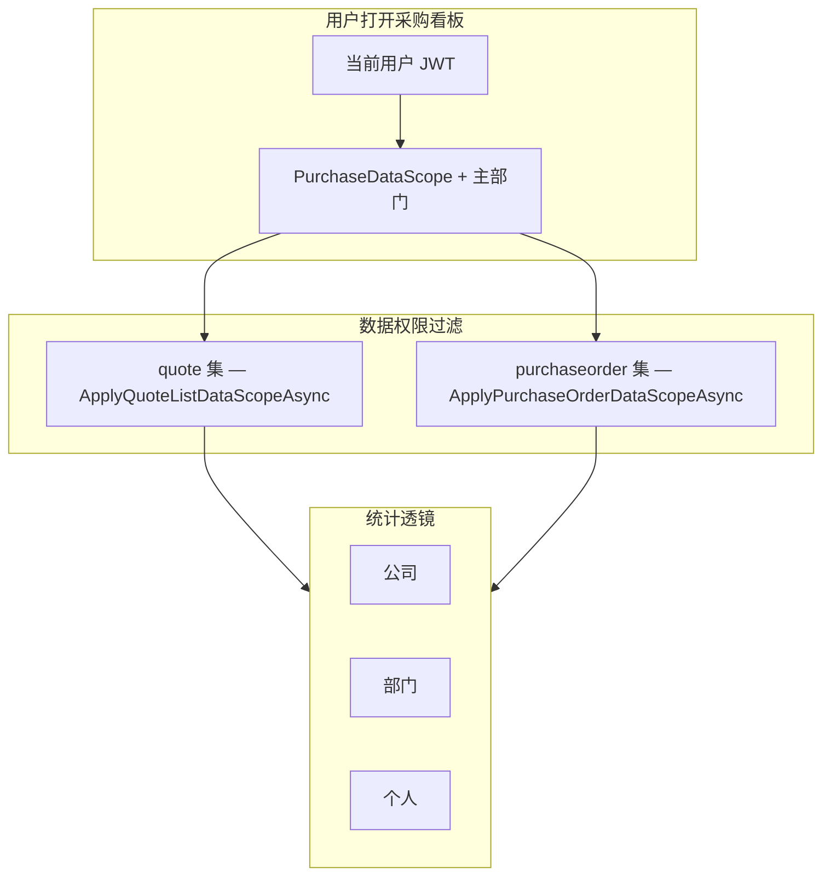

# 采购统计分析 — 实现方案（IMP）

> **状态**：一期已落地（2026-06）；**内容 Tab**（概况 / 供应商 / 报价 / 订单）已落地（2026-08）  
> **范围**：统计分析模块 — **采购方向**（对齐 [`数据看板总要求.md`](./数据看板总要求.md) §5.2、§3.6）  
> **总要求**：须符合 [`数据看板总要求.md`](./数据看板总要求.md)（角色权限、四类呈现、统计维度、跨域架构）  
> **对照模板**：[`销售统计.md`](./销售统计.md)（Scope Tab + 内容 Tab、API 分层、Scope 校验模式一致）  
> **列表页看板**（`/purchase-orders` 列表内「看板」按钮）：见 [`订单列表统计看板-设计与实现.md`](./订单列表统计看板-设计与实现.md) §5.2 — **已落地**。  
> **明细列表看板**（`/purchase-order-items`）：见 [`采购订单明细列表看板-设计与实现.md`](./采购订单明细列表看板-设计与实现.md) — **已落地**（订单 Tab `reportApproved`）。  
> **报价列表看板**（`/quotes`）：见 [`报价列表统计看板-设计与实现.md`](./报价列表统计看板-设计与实现.md) — **已落地**（报价 Tab `reportScope`）。

---

## 一、背景与现状

| 项 | 现状 |
| --- | --- |
| 菜单 | 侧栏「报表分析」→ **采购分析** `/reports/purchase` 已开放 |
| 数据基础 | `quote` / `quoteitem`、`purchaseorder` / `purchaseorderitem` / `purchaseorderitemextend` 已沉淀报价、成单、入库、付款进度 |
| 权限 | 采购侧已有 `PurchaseDataScope`（本人 / 本部门 / 本部门及下级 / 全部）；分析须**复用** `ApplyQuoteListDataScopeAsync`、`ApplyPurchaseOrderDataScopeAsync` |
| 看板层级 | 同一采购看板服务 **公司 / 部门 / 个人** 三个统计对象；**可见范围由数据权限封顶** |
| 金额字段 | 采购单头 `convert_total` = Σ 明细 `qty × convert_price`（**美元**）；历史数据须执行 backfill SQL（见 §十） |

**结论**：与销售看板共用「三层透镜 + 四类呈现 + 只读聚合 API」骨架；采购域额外处理 **报价列表权限** 与 **报价→采购转化** 链路。

---

## 二、模块定位与路由规划

```
报表分析（/reports）
├── 销售分析（/reports/sales）        ← 已落地，见 销售统计.md
├── 采购分析（/reports/purchase）     ← 本文
├── 物流分析（/reports/logistics）    ← 已落地，见 物流统计.md
└── 财务分析（/reports/finance）      ← 待编写
```

- 功能权限码：`analytics-purchase.read`（种子 SQL：`scripts/analytics_purchase_read_permission_postgresql.sql`）
- 销售身份（`IdentityType=1`）前端隐藏采购看板菜单项（`auth.ts`），避免无采购 Scope 用户误入

---

## 三、采购域指标清单（对齐总要求 §5.2）

呈现类：`[静]` 静态 Key:Value · `[趋]` 折线/柱状 · `[分]` 饼图 · `[待]` 待办 Key:Value  
统计维度：单据数 / 供应商数 / 金额数 / 比率（见总要求 §四）

### 3.1 报价（Quote）

| 指标 | 维度 | 呈现 | 一期 | 数据源 / 权限 |
| --- | --- | --- | --- | --- |
| 报价条目数 | 单据数 | 静、趋 | ✅ | `quoteitem`；先 `ApplyQuoteListDataScopeAsync` 得 quote 集，再计明细行 |
| 报价供应商数 | 供应商数 | 静、趋 | ✅ | 区间内 `quoteitem.vendor_id` 去重 |
| 报价→采购订单转化比率 | 比率 | 静、趋 | ✅ | 分子：已关联 PO 的报价行数；分母：同期报价行数（见 §4.3） |

### 3.2 采购订单 — 静态与趋势

| 指标 | 维度 | 呈现 | 一期 | 数据源 / 权限 |
| --- | --- | --- | --- | --- |
| 采购订单条目数 | 单据数 | 静、趋 | ✅ | `purchaseorderitem`；订单须过 `ApplyPurchaseOrderDataScopeAsync` |
| 采购订单供应商数 | 供应商数 | 静、趋 | ✅ | `purchaseorder.vendor_id` 去重 |
| 采购订单金额（成单已审核） | 金额数 | 静、趋 | ✅ | `status >= 10(审核通过)` 的 `convert_total`（USD） |
| 采购订单金额（已入库） | 金额数 | 静、趋 | ✅ | Σ `qty_receive_total × convert_price`（extend） |
| 采购订单金额（已付款） | 金额数 | 静、趋 | ✅ | `payment_amount_finish` → FromExtend → 折算美金（同销售已收款路径） |

### 3.3 采购订单 — 分解

| 指标 | 呈现 | 一期 | 说明 |
| --- | --- | --- | --- |
| 订单主状态比例 | 分 | ✅ | `orderStatus` 分组 |
| 币别金额构成 | 分 | ✅ | `currency`；Mask 时按订单数占比 |
| 全链路环节比例 | 分 | ✅ | `pipelineStage` 饼图（待入库→待付款→待进项开票→已完结） |
| 入库进度比例 | 分 | ✅ | `stockInProgress` 按明细行 |

### 3.4 采购订单 — 待办

| 指标 | 维度 | 呈现 | 一期 | 数据源 |
| --- | --- | --- | --- | --- |
| 应付款金额 | 金额数 | 待 | ✅ | `payment_amount_not` → FromExtend → 折算美金（活跃 PO 明细） |
| 待入库采购明细数 | 单据数 | 待 | ✅ | `stock_in_progress_status` ∈ {0, 1} 的明细行数 |

> **时间语义**：`snapshot` / 趋势中的静态指标 = **区间内**（`dateFrom`～`dateTo`）；`todo` = **截至查询截止日**的存量（不受区间起始日限制，与销售看板一致）。

### 3.5 排行与透镜（随 viewLevel 变化）— 概况 Tab

| viewLevel | 概况排行 | 呈现 |
| --- | --- | --- |
| 公司 | 部门采购额 Top10 | 表格（可下钻部门层） |
| 部门 | 部门内采购员 Top10 | 表格（可下钻个人层 / 双击进订单） |
| 个人 | （无） | 供应商排行已迁至「供应商」Tab |

### 3.6 供应商 Tab

| 指标 | 呈现 | API | 口径 |
| --- | --- | --- | --- |
| 成单供应商数 | 静 | `GET .../analytics/purchase/vendor` | 与概况「采购供应商数」同口径：周期内成单 `vendor_id` 去重 |
| 复采供应商数 | 静 | 同左 | 成单订单数 ≥ 2 的去重供应商 |
| 供应商身份 / 等级 / 行业 | 分 | 同左 | 成单 USD；Mask 时按订单数占比 |
| 供应商 Top10（金额 / 成单数 / 复采订单数） | 表 | 同左 | 复采订单数 = max(0, 成单数−1)；可下钻采购订单列表 |

- 筛选：与概况共用公司/部门/个人 + 日期（**非**列表页筛选）。
- 加载：进入「供应商」Tab 后再请求（lazy）。
- 前端：`PurchaseAnalyticsVendorPanel.vue`；概况不再展示「供应商贡献 Top10」。

### 3.7 报价 Tab（与 `/quotes` 列表看板同实现）

| 呈现 | 内容 | API |
| --- | --- | --- |
| Tag | 「报表」 | — |
| 静 | 报价供应商 / 有效报价 / 查无 / 报价率 / 响应 / 成单 | `GET .../analytics/purchase/quotes/dashboard` |
| 趋 | 供应商数 / 需求明细数 / 有效报价数（含 groupBy） | `.../quotes/trends` |
| 分 | 8 组分解 | `.../quotes/breakdowns` |
| 表 | 7 张 Top10 | `.../quotes/rankings` |

- **数据集**：`dataset=reportScope`（报表透镜 + **`quote.create_time`**；不硬过滤主状态）；与列表看板 `listFilter` 共用 `IQuoteListQuery`。
- 加载：进入「报价」Tab 后再请求（lazy）。
- 前端：复用 `QuoteListBoard.vue`（`mode=report`）。
- 对照：[`报价列表统计看板-设计与实现.md`](./报价列表统计看板-设计与实现.md)。

### 3.8 订单 Tab（与 `/purchase-order-items` 明细看板同实现）

| 呈现 | 内容 | API |
| --- | --- | --- |
| Tag | 「成单」 | — |
| 静 | 成单概览 / 在库 / 应付款 | `GET .../analytics/purchase/order-items/dashboard` |
| 趋 | 成单订单数 / 明细数 / 金额（含 groupBy） | `.../order-items/trends` |
| 分 | 明细主状态条图 + 进度/币别/品牌等饼图 | `.../order-items/breakdowns` |
| 表 | 6 张 Top10 | `.../order-items/rankings` |

- **数据集**：`dataset=reportApproved`（报表透镜 + 日期 + 成单）；与列表看板 `listFilter` 共用 `IPurchaseOrderItemListQuery`。
- 筛选：与概况共用公司/部门/个人 + 日期；**含趋势与 groupBy**。
- 加载：进入「订单」Tab 后再请求（lazy）。
- 前端：复用 `PurchaseOrderItemListBoard.vue`（`mode=report`）。
- 对照：[`采购订单明细列表看板-设计与实现.md`](./采购订单明细列表看板-设计与实现.md)。

### 3.9 延后（二期及以后）

| 主题 | 说明 |
| --- | --- |
| 对账端点 | 销售看板已有 `reconcile`；采购可对齐个人层 `convert_total` 与列表 |
| 待进项开票待办 KPI | extend 已有字段，一期未单独做待办卡片 |
| 库龄 / 交期类指标 | 归入物流或采购二期 |

---

## 四、统计口径（一期默认）

| 决策点 | **一期默认** | 说明 |
| --- | --- | --- |
| 金额口径 | **成单已审核**：PO 头 `convert_total`（USD） | 已入库、已付款见 extend 明细聚合 |
| 统计粒度 | 报价/PO **明细行**计数；金额为头或行聚合见上表 | — |
| 报价时间 | **报价明细 `create_time`**；缺失时回退 `quote.quote_date` / `quote.create_time` | 与 PO「创建日」口径不同，页头须提示 |
| 采购单时间 | **采购单创建日** `purchaseorder.create_time` | 趋势、排行、成单金额均按此过滤 |
| 订单范围 | 排除 `取消(-2)`、`审核失败(-1)` | `PurchaseAnalyticsDateFilter.ApplyAnalyticsStatusFilter` |
| 报价明细 | 排除 `status = 1`（已取消）；`is_deleted = false` | 0 = 有效 |
| 外币 / 折算美金 | **产品主口径**：采购订单明细 `convert_price`（折算美金单价）与订单头 `convert_total`（折算美金金额）。已入库/已付款/应付款等延伸金额用 `FromExtend`（`local × convert_price / price`）。**不以查询日财务汇率为主口径**；仅价比不可用时回落查询日财务参数汇率 | 币别饼图按原币分桶展示美元额或 Mask 时订单数 |

**一期产品文案建议**：「采购统计分析（采购单按创建日、报价按明细/报价日；美元额 convert_total）」— 金额取订单历史折算价（`convert_total` / `convert_price`）。

### 4.1 采购订单状态参考

| 值 | 含义 | 纳入 |
| --- | --- | --- |
| 1 | 新建 | ✅（未取消/未审核失败） |
| 2 | 待审核 | ✅ |
| 10 | 审核通过 | ✅；**成单已审核金额** 阈值 |
| 20+ | 后续业务态 | ✅ |
| -1 | 审核失败 | **排除** |
| -2 | 取消 | **排除** |

### 4.2 分阶段金额公式

| 阶段 | 公式（USD） | 数据源 |
| --- | --- | --- |
| 成单已审核 | Σ PO 头 `convert_total`（`status >= 10`） | `purchaseorder` |
| 已入库 | Σ `qty_receive_total × convert_price` | `purchaseorderitemextend` + 明细 `convert_price` |
| 已付款 | Σ `payment_amount_finish` | `purchaseorderitemextend` |

### 4.3 报价→采购转化

- **判定**：存在 `sellorderitemextend.quote_item_id`，且对应 `purchaseorderitem.sell_order_item_id` 关联到该 extend 行（经销链路 quote → SO item → PO item）。
- **比率**：`已转化报价行数 / 区间内报价行总数 × 100%`；分母为 0 时返回 `null`。

### 4.4 全链路分解（pipelineStage）

按 **明细行当前瓶颈** 互斥归类（`PurchaseAnalyticsPipelineClassifier`）：

| Key | 标签 | 判定顺序 |
| --- | --- | --- |
| `stock_in_pending` | 待入库 | `stock_in_progress_status < 2` |
| `payment_pending` | 待付款 | 入库已完成，且付款未完成或 `payment_amount_not > 0` |
| `invoice_pending` | 待进项开票 | 付款已完成，且开票未完成或 `purchase_invoice_to_be > 0` |
| `completed` | 已完结 | 以上均完成 |

---

## 五、三层看板对象（公司 / 部门 / 个人）与数据权限

### 5.1 设计原则

与销售看板 §5.1 相同：**权限是天花板、层级是透镜、同一页面、后端强校验、scopeContext 透明**。



### 5.2 三个层级对象的定义（采购方向）

| 层级 | 统计对象 | 聚合主键 | 典型 KPI / 排行 |
| --- | --- | --- | --- |
| **公司** | 权限内组织整体 | 无维度 | 总采购额、报价转化、部门排行 |
| **部门** | 采购相关部门 | 采购员 **主部门** | 部门排行、部门内采购员 Top N |
| **个人** | 采购员 | `purchaseorder.purchase_user_id`；报价侧还匹配 RFQ 明细 **分配采购员** | 个人 KPI、供应商 Top N |

**部门归属（PO）**：取 `purchase_user_id` 对应用户的主部门（`sys_user_department.is_primary = true`）。

**个人透镜（报价）**：除 `quote.purchase_user_id` 外，若报价关联 RFQ 明细，则 `assigned_purchaser_user_id1/2` 命中亦计入（与 `ApplyQuoteListDataScopeAsync` 一致）。

**未挂主部门 / 无采购员**：计入「未分配部门」桶（`UnassignedDepartmentId`）。

### 5.3 与 `PurchaseDataScope` 的映射

引用：`document/System/权限/权限-部门.md`、`DataPermissionService`。

| PurchaseDataScope | 含义 | 公司 Tab | 部门 Tab | 个人 Tab | 可选采购员下拉 |
| --- | --- | --- | --- | --- | --- |
| **0 全部** | 全公司采购数据 | ✅ 真·公司汇总 | ✅ | ✅ | ✅ |
| **3 本部门及下级** | 主部门子树 | ✅ 可见范围汇总 | ✅ 子树内部门 | ✅ | ✅ |
| **2 本部门** | 仅主部门 | ✅ 可见范围（本部门汇总） | ✅ 本部门透镜 | ✅ | ✅ |
| **1 自己** | 仅本人 | ✅ 可见范围（本人数据汇总） | ✅ 本人主部门透镜 | ✅ 默认本人 | ❌ |
| **4 禁止** | 无采购数据 | ❌ 整页 403 | ❌ | ❌ | ❌ |
| **SYS_ADMIN** | 超管 | ✅ | ✅ | ✅ | ✅ |

> **说明**：Scope∈{1,2,3} 时三层 Tab 均可点击；切换只换聚合透镜，数据池仍由 `PurchaseDataScope` 封顶。Scope≠0 时公司 Tab 文案为「可见范围」。

**采购助理跟单特例**（`UsePurchaseOrderAssistorOnlyScope`）：仅 **个人层**；报价 KPI 为 0，仅统计跟单可见 PO。

**`canSelectPurchaseUser`（API 字段）**：`IsSysAdmin` 或 `PurchaseDataScope ∈ {0,2,3}` 为 `true`；Scope=1/4 或跟单特例为 `false`。前端个人层下拉以该字段为准，勿仅依赖 `allowedPurchaseUsers.length`。

**业务员/采购员 ID 校验**：`allowedUserIds.Count > 0` 时才校验 `purchaseUserId ∈ allowedUserIds`；超管/Scope=0 空集合时不误拦（与销售看板 admin 修复一致）。

### 5.4 API 契约

| 参数 | 类型 | 说明 |
| --- | --- | --- |
| `viewLevel` | `company \| department \| personal` | 统计透镜 |
| `departmentId` | string? | 部门透镜；服务端校验 |
| `purchaseUserId` | string? | 个人透镜；Scope=1 时强制当前用户 |
| `dateFrom` / `dateTo` | date | 趋势与 snapshot 区间 |
| `groupBy` | `day \| week \| month` | 趋势粒度 |

**端点**（与销售对称；概况 + 内容 Tab）：

| 端点 | 说明 |
| --- | --- |
| `GET /api/v1/analytics/purchase/dashboard` | 概况：`scopeContext` + `snapshot` + `todo` + `rankings`（不含供应商 Top） |
| `GET /api/v1/analytics/purchase/trends` | 概况趋势 `trend[]` |
| `GET /api/v1/analytics/purchase/breakdowns` | 概况分解 `breakdown[]` |
| `GET /api/v1/analytics/purchase/vendor` | **供应商 Tab**（KPI + 身份/等级/行业 + Top10） |
| `GET /api/v1/analytics/purchase/quotes/{dashboard\|trends\|breakdowns\|rankings}` | **报价 Tab**（`dataset=reportScope`） |
| `GET /api/v1/analytics/purchase/order-items/{dashboard\|trends\|breakdowns\|rankings}` | **订单 Tab**（`dataset=reportApproved`） |

列表看板同源（`?dataset=`）：`/api/v1/quotes/analytics/*`（`listFilter`）、`/api/v1/purchase-orders/items/analytics/*`（`listFilter`）。

**`scopeContext` 主要字段**：`purchaseDataScope`、`viewLevel`、`scopeLabel`、`allowedViewLevels`、`allowedDepartments`、`allowedPurchaseUsers`、`canSelectPurchaseUser`、`dataFiltered`、`maskAmounts`、`resolvedPurchaseUserId`、`resolvedDepartmentId`。

### 5.5 后端实现要点（强制）

1. **报价明细查询**：`BuildScopedQuoteItemQueryAsync` — 先 **materialize** `ApplyQuoteListDataScopeAsync` 得到的 `quote.id` 列表，再 `Contains` 过滤明细；避免 EF 嵌套子查询翻译为空集。
2. **采购单查询**：`BuildPurchaseOrderQueryAsync` — 必须先 `ApplyPurchaseOrderDataScopeAsync`，再状态过滤、透镜过滤。
3. **层级校验**：`PurchaseAnalyticsScopeValidator.Validate`；非法 **403**。
4. **功能权限**：`analytics-purchase.read` 或 `SYS_ADMIN`；`PurchaseDataAccess=1` 允许只读看板。
5. **金额脱敏**：无 `purchase.amount.read` 或 `PurchaseSensitiveFieldMask511` 命中时 `maskAmounts=true`，金额类 snapshot/todo/趋势/排行返回 `null`。
6. **与列表对账**：同一用户、同一日期段，个人层 PO 金额合计应与其采购订单列表 `convert_total` 之和一致（抽样验收）。

### 5.6 前端交互

- 页面：`PurchaseAnalyticsPage.vue`；复用 `AnalyticsScopeTabs`（`dataScope="purchase"`、`i18nPrefix="purchaseAnalytics"`）。
- **双层 Tab**：① Scope（公司/部门/个人）+ 日期/人员筛选；② **内容 Tab**（概况 / 供应商 / 报价 / 订单），lazy 加载子面板。
- **概况**布局：待办 KPI → 静态 KPI → 趋势 + 分解饼图 → 排行（公司/部门层主键排行；供应商 Top 已迁至供应商 Tab）。
- **供应商**：`PurchaseAnalyticsVendorPanel.vue`（进入 Tab 后请求 `getVendor`）。
- **报价 / 订单**：复用 `QuoteListBoard.vue` / `PurchaseOrderItemListBoard.vue`（`mode=report`，Tag「报表」/「成单」；含趋势与 groupBy）。
- 个人层：`canSelectPurchaseUser === true` 时展示采购员下拉；选项来自 `scopeContext.allowedPurchaseUsers`。
- 钻取：`purchaseAnalyticsDrill.ts` → 报价列表、采购单列表、付款列表等（带 query 筛选）；供应商 Top → `buildVendorRankingDrillRoute`。

---

## 六、技术设计

### 6.1 后端分层

| 层 | 类型 / 路径 |
| --- | --- |
| Controller | `CRM.API/Controllers/PurchaseAnalyticsController.cs` |
| Service | `CRM.Core/Services/PurchaseAnalyticsService.cs` |
| Scope 校验 | `CRM.Core/Utilities/PurchaseAnalyticsScopeValidator.cs` |
| 聚合查询 | `CRM.Infrastructure/Analytics/PurchaseAnalyticsQuery.cs` |
| 全链路分类 | `CRM.Core/Utilities/PurchaseAnalyticsPipelineClassifier.cs` |
| DTO | `CRM.Core/Models/Analytics/PurchaseAnalyticsContracts.cs` |
| 接口 | `IPurchaseAnalyticsService`、`IPurchaseAnalyticsQuery` |

### 6.2 前端

| 项 | 路径 |
| --- | --- |
| 页面 | `CRM.Web/src/views/Reports/PurchaseAnalyticsPage.vue`（`contentTab`：overview / vendor / quote / order） |
| 供应商面板 | `CRM.Web/src/components/Analytics/PurchaseAnalyticsVendorPanel.vue` |
| 报价看板 | `CRM.Web/src/views/RFQ/QuoteListBoard.vue`（`mode=list\|report`） |
| 订单明细看板 | `CRM.Web/src/views/RFQ/PurchaseOrderItemListBoard.vue`（`mode=list\|report`） |
| API 客户端 | `CRM.Web/src/api/analytics/purchase.ts`（含 `getVendor` / `getQuotes*` / `getOrderItems*`） |
| 列表 dataset | `quoteListAnalytics.ts`、`purchaseOrderItemAnalytics.ts`（`dataset` 字段） |
| 钻取 | `CRM.Web/src/utils/purchaseAnalyticsDrill.ts` |
| 路由 | `CRM.Web/src/router/routes.ts` → `/reports/purchase` |
| 菜单 | `CRM.Web/src/layouts/AppLayout.vue` |
| i18n | `purchaseAnalytics.*`（含 `contentTabs` / `vendorTab` / `quoteTab` / `orderTab`） |

### 6.3 `dashboard` 响应结构示意

```json
{
  "scopeContext": {
    "purchaseDataScope": 0,
    "viewLevel": "company",
    "scopeLabel": "全公司",
    "canSelectPurchaseUser": true,
    "allowedPurchaseUsers": [],
    "maskAmounts": false,
    "dataFiltered": false
  },
  "snapshot": {
    "quoteItemCount": 0,
    "quoteVendorCount": 0,
    "quoteToPurchaseConversionRate": null,
    "purchaseOrderItemCount": 0,
    "purchaseOrderVendorCount": 0,
    "purchaseAmountApproved": 0,
    "purchaseAmountStockIn": 0,
    "purchaseAmountPaid": 0
  },
  "todo": {
    "payableAmount": 0,
    "pendingStockInItemCount": 0
  },
  "rankings": { }
}
```

---

## 七、一期 MVP 范围

### 7.1 做

1. 菜单与路由 `/reports/purchase`
2. 三层 Tab + `PurchaseDataScope` 过滤（§五）
3. 四类呈现：待办、静态、趋势、分解（含全链路饼图）
4. 指标：§三 全部一期项
5. API：`dashboard` + `trends` + `breakdowns`
6. 排行随 `viewLevel` 切换；列表钻取
7. 权限种子 SQL、`analytics-purchase.read`

### 7.2 不做（延后）

- 采购 reconcile API
- 待进项开票单独待办 KPI
- 物流 / 财务看板（各域独立 IMP）
- 数据预测（总要求 §七）

---

## 八、落地步骤与运维

| 步骤 | 产出 |
| --- | --- |
| ① 权限 | 执行 `scripts/analytics_purchase_read_permission_postgresql.sql` |
| ② 历史金额 | 执行 `scripts/backfill_purchaseorder_convert_total_usd_postgresql.sql`（PO 头 USD 汇总） |
| ③ 后端 | Controller + Service + Query + Validator |
| ④ 前端 | 页面、API、菜单、i18n、钻取 |
| ⑤ 联调 | Scope 0/1/2/3 + 超管；核对报价 KPI 与 PO KPI |
| ⑥ 部署 | **重启 CRM.API** 使 Infrastructure 层变更生效 |

---

## 九、已知问题与实现备忘

| 主题 | 说明 |
| --- | --- |
| 报价 KPI 为 0 | 常见原因：API 未重启；或 EF 子查询未 materialize（已通过 `BuildScopedQuoteItemQueryAsync` 修复） |
| 页头日期提示 | 报价指标与 PO 指标 **日期字段不同**（§4）；UI subtitle 应区分说明 |
| 销售身份菜单 | 前端隐藏采购看板入口，不表示后端拒绝（若误配权限仍须后端 Scope 拦截） |

---

## 十、主要代码与文档索引

| 用途 | 路径 |
| --- | --- |
| **数据看板总要求** | `document/IMP/数据看板/数据看板总要求.md` |
| **销售看板 IMP（对照）** | `document/IMP/数据看板/销售统计.md` |
| **采购订单列表看板** | `document/IMP/数据看板/订单列表统计看板-设计与实现.md` §5.2；API `/api/v1/purchase-orders/analytics/*` |
| **采购订单明细列表看板** | `document/IMP/数据看板/采购订单明细列表看板-设计与实现.md`；API `/api/v1/purchase-orders/items/analytics/*`（`listFilter` / 订单 Tab `reportApproved`） |
| **报价列表看板** | `document/IMP/数据看板/报价列表统计看板-设计与实现.md`；API `/api/v1/quotes/analytics/*`（`listFilter` / 报价 Tab `reportScope`） |
| dataset 常量 | `CRM.Core/Constants/QuoteAnalyticsDatasets.cs`、`PurchaseOrderItemAnalyticsDatasets.cs` |
| 报价列表数据范围 | `DataPermissionService.ApplyQuoteListDataScopeAsync` |
| 采购单数据范围 | `DataPermissionService.ApplyPurchaseOrderDataScopeAsync` |
| 部门 Scope 定义 | `document/System/权限/权限-部门.md` |
| 采购助理特例 | `BusinessDepartmentRules.UsePurchaseOrderAssistorOnlyScope` |
| PO convert_total backfill | `scripts/backfill_purchaseorder_convert_total_usd_postgresql.sql` |
| 看板权限种子 | `scripts/analytics_purchase_read_permission_postgresql.sql` |

---

## 十一、修订记录

| 日期 | 说明 |
| --- | --- |
| 2026-06-03 | 初稿：采购看板一期 IMP（对齐总要求 §5.2、销售看板骨架、落地代码索引与口径） |
| 2026-07-13 | 补充采购订单明细列表看板落地文档与 API 索引 |
| 2026-07-13 | 整理采购订单明细列表看板设计需求与实现方案定稿 |
| 2026-08-01 | §3.5–3.8 内容 Tab：概况/供应商/报价/订单；§5.4–5.6、§6.2 同步 API 与前端；报价 `reportScope`（`quote.create_time`）、订单 `reportApproved` |
| 2026-08-11 | 成单/已入库趋势单位改为「单位：折算美元（USD）」；已付款/应付趋势标明原币未折算 |
| 2026-08-11 | 待办应付、概况已付款、已付款/应付趋势均改为 FromExtend 折算美金主数字（对齐销售应收趋势） |
| 2026-08-11 | §四外币：产品确认折算美金主口径为订单 `convert_total`/`convert_price`（历史成交），取代「查询日财务汇率」 |
