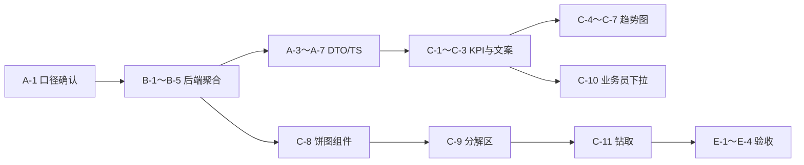

# 销售分析看板 — 二期任务拆分

> **对照文档**：[`销售统计.md`](./销售统计.md)（一期 IMP）、[`数据看板总要求.md`](./数据看板总要求.md)  
> **页面**：`/reports/sales`（`SalesAnalyticsPage.vue`）  
> **一期状态**：已落地 dashboard / trends / breakdowns 三端点 + 三层 Tab + 数据权限过滤（2026-06 备份提交 `516cc06` 前后）  
> **二期目标**：补齐产品需求与一期 IMP 中标注为「二期」的指标，统一静态/待办口径，完善趋势与分解呈现。  
> **M1 状态（2026-06-03）**：Epic A～C 核心项已落地；详见 [`销售统计.md`](./销售统计.md) §三 与 §7.2 回写。

---

## 一、一期与需求差距摘要

| 类别 | 一期现状 | 二期要补 |
|------|----------|----------|
| 静态 KPI | 区间内汇总；仅「成单已审核」金额 | 分阶段金额（已出库、已收款）；静态/待办口径分离 |
| 趋势 | 前端仅 2 图（金额、条目数） | 需求条目、转化率、应收走势、（可选）客户数 |
| 分解 | 主状态 + 出库进度 + 币别；**条形图** | 全链路环节（采购/入库/出库/收款/开票）；**饼图** |
| 待办 | 应收款、待出库条目 | 待开票金额 |
| 交互 | 排行钻取 | 个人层业务员下拉；待办/排行跳转列表 |
| 呈现规范 | 条形占比 | 对齐总要求：分解用饼图/环图 |

---

## 二、二期里程碑

| 里程碑 | 范围 | 建议工期 |
|--------|------|----------|
| **M1 — 指标补齐（P0）** | 分阶段金额、全链路分解、待开票、静态口径 | 1～1.5 周 |
| **M2 — 趋势与图表（P1）** | 趋势图补全、饼图组件、应收趋势 | 1 周 |
| **M3 — 交互与验收（P1）** | 业务员选择、列表钻取、对账扩展 | 0.5～1 周 |

**合计粗估**：2.5～3.5 周（含 Scope 0/1/2/3 联调与对账）。

---

## 三、任务清单（按模块）

### Epic A — 统计口径与 API 契约（M1 前置）

| ID | 任务 | 类型 | 依赖 | 产出 |
|----|------|------|------|------|
| A-1 | **拍板二期金额口径**（写入 `销售统计.md` §四） | 产品 | — | 已确认表：已出库额、已收款额、待开票额计算公式 |
| A-2 | **区分 `snapshot` vs `todo` 时间语义** | 后端+文档 | A-1 | `snapshot` = 区间内（`dateFrom`～`dateTo`）；`todo` = 截至 `dateTo` 日末（或当前时刻）存量 |
| A-3 | 扩展 `SalesAnalyticsSnapshotDto` | 后端 | A-1 | 新增字段见 §四.1 |
| A-4 | 扩展 `SalesAnalyticsTrendPointDto` | 后端 | A-1 | 新增字段见 §四.2 |
| A-5 | 扩展 `SalesAnalyticsTodoDto` | 后端 | A-1 | `pendingInvoiceAmount` |
| A-6 | 扩展 `SalesAnalyticsBreakdownGroupDto` | 后端 | A-1 | 新增分组 `pipelineStage`（全链路） |
| A-7 | 更新 `CRM.Web/src/api/analytics/sales.ts` 类型 | 前端 | A-3～A-6 | TS 接口与一期兼容 |

**A-1 口径建议（与 `SellOrderItemExtend` 对齐）**：

| 指标 | 推荐公式（明细行聚合，本位币） | 数据源 |
|------|-------------------------------|--------|
| 已出库金额 | Σ 明细 `QtyStockOutActual × 销售单价`（或 extend 已有出库金额字段若有） | `sellorderitemextend` |
| 已收款金额 | Σ `receipt_amount_finish` | `sellorderitemextend` |
| 待开票金额（待办） | Σ `invoice_amount_not`（活跃订单明细） | `sellorderitemextend` |
| 应收趋势桶 | Σ `receipt_amount_not` 按 **订单创建日** 或 **应收账龄日**（二选一，默认创建日） | 待 A-1 确认 |

---

### Epic B — 后端聚合（M1）

| ID | 任务 | 文件 | 说明 |
|----|------|------|------|
| B-1 | `BuildSnapshotAsync` 增加 `SalesAmountStockOut`、`SalesAmountReceived` | `SalesAnalyticsQuery.cs` | 仅 `status >= Approved` 明细；尊重 `MaskAmounts` |
| B-2 | `GetTrendsAsync` 增加分阶段金额序列 | 同上 | `salesAmountStockOut`、`salesAmountReceived` 按 `groupBy` 分桶 |
| B-3 | `GetTrendsAsync` 增加 `receivableAmount` 趋势桶 | 同上 | 与 A-1 时间维度一致 |
| B-4 | `BuildTodoAsync` 增加 `PendingInvoiceAmount` | 同上 | Σ `invoice_amount_not` |
| B-5 | **全链路分解** `pipelineStage` | 同上 | 按 extend 字段分桶（见 §四.3） |
| B-6 | 修正 `orderStatus` 分解在 `MaskAmounts` 时用 count、币别用 amount 的一致性 | 同上 | ✅ 币别 Mask 时改订单数 |
| B-7 | `BuildSnapshotForAssistorOnlyAsync` 对齐 B-1（出库/收款可为跟单单据） | 同上 | RFQ 仍可为 0 |
| B-8 | 单元/集成：个人层金额与列表 `convert_total` / extend 抽样对账 | `SalesAnalyticsReconciliationService` | 扩展 reconcile 报告字段 |

**B-5 全链路分解建议分桶**（`groupKey: pipelineStage`，按**明细行数**占比，金额副表二期可选）：

| Key | 标签 | 判定（示例） |
|-----|------|--------------|
| `purchase_pending` | 待采购 | `purchase_progress_status` 待采购 |
| `purchase_done` | 采购中/已采购 | 采购进度进行中 |
| `stock_in_pending` | 待入库 | 入库进度未完结 |
| `stock_out_pending` | 待出库 | `stock_out_progress_status` ∈ {0,1} |
| `stock_out_done` | 已出库 | `stock_out_progress_status` = 2 |
| `receipt_pending` | 待收款 | `receipt_amount_not` > 0 |
| `receipt_done` | 已收款 | `receipt_amount_finish` ≥ 应收 |
| `invoice_pending` | 待开票 | `invoice_amount_not` > 0 |
| `invoice_done` | 已开票 | `invoice_amount_finish` 已满 |

> 实现前须对照 `SellOrderItemExtend` 各 `*ProgressStatus` 枚举与 `document/EBS/销售/SellOrderItemExtend统计字段文档.md`，避免与业务列表口径不一致。

---

### Epic C — 前端页面（M1 + M2）

| ID | 任务 | 文件 | 说明 |
|----|------|------|------|
| C-1 | 静态 KPI 增加「已出库金额」「已收款金额」卡片 | `SalesAnalyticsPage.vue` | `snapshotKpis` |
| C-2 | 待办 KPI 增加「待开票金额」 | 同上 | `todoKpis` |
| C-3 | 页头 `metricHint` 区分「统计概览=区间内」「待办=截至查询日」 | 同上 + `zh-CN.ts` / `en-US.ts` |
| C-4 | 趋势图：需求条目数 | 同上 | 复用 `AnalyticsTrendChart`，`trends.rfqItemCount` |
| C-5 | 趋势图：转化率 | 同上 | `rfqToSalesConversionRate` |
| C-6 | 趋势图：应收金额走势 | 同上 | 新字段 `receivableAmount` |
| C-7 | 趋势图（可选）：已出库/已收款金额 | 同上 | 与 B-2 同步 |
| C-8 | **饼图组件** `AnalyticsBreakdownPieChart.vue` | 新组件 | ECharts pie；或增强 `AnalyticsBreakdownChart` 支持 `mode=pie\|bar` |
| C-9 | 分解区改用饼图；新增「全链路环节」分组 | `SalesAnalyticsPage.vue` | 对应 `pipelineStage` |
| C-10 | **个人层业务员下拉** | 同上 + `AnalyticsScopeTabs` 或 toolbar | Scope 0/3 且 `viewLevel=personal` 时；选项来自 API 或 `allowedUserIds` |
| C-11 | 排行/待办 **钻取跳转** | 同上 | 应收→`/finance/receivables`；待出库→销售订单列表带筛选 query |
| C-12 | `MaskAmounts` 时隐藏金额类 KPI/趋势/饼图金额轴 | 同上 | 与一期 `scopeContext.maskAmounts` 一致 |
| C-13 | 趋势：销售客户数 / 需求客户数 | 同上 | ✅ 周期内 customer_id 去重 |

---

### Epic D — 权限与校验（贯穿）

| ID | 任务 | 说明 |
|----|------|------|
| D-1 | 新增指标均走既有 `BuildSellOrderQueryAsync` / `BuildRfqItemQueryAsync` | 不绕过 DataScope |
| D-2 | `salesUserId` 下拉选项须经 `SalesAnalyticsScopeValidator.BuildAllowedSalesUserIdsAsync` | 防越权 |
| D-3 | 财务敏感：应收/收款类指标遵守 `MaskAmounts`（`SaleDataScope=4` 等） | 与 `SaleSensitiveFieldMask521` 策略一致 |

---

### Epic E — 测试与验收（M3）

| ID | 任务 | 说明 |
|----|------|------|
| E-1 | 扩展 `GET /analytics/sales/reconcile` 校验新 snapshot 字段 | 管理员对账 |
| E-2 | 手工用例：Scope 0/1/2/3 + 助理跟单各 1 账号 | 见 §六 |
| E-3 | 前端 smoke：`vue-tsc` + 看板加载三接口 | CI |
| E-4 | 性能：日期段 1 年 + 公司层 breakdown 响应 < 3s（P95） | 必要时加索引或缓存（二期末） |

---

## 四、API 字段变更一览

### 4.1 `snapshot` 新增

```json
{
  "salesAmountStockOut": 0,
  "salesAmountReceived": 0
}
```

### 4.2 `trends[]` 新增

```json
{
  "salesAmountStockOut": 0,
  "salesAmountReceived": 0,
  "receivableAmount": 0,
  "rfqCustomerCount": 0,
  "salesOrderCustomerCount": 0
}
```

（`rfqItemCount`、`rfqToSalesConversionRate` 一期后端已有，二期补前端展示；C-13 补客户数趋势。）

### 4.3 `todo` 新增

```json
{
  "pendingInvoiceAmount": 0
}
```

### 4.4 `breakdowns[]` 新增分组

```json
{
  "groupKey": "pipelineStage",
  "groupLabel": "业务环节执行（明细行）",
  "items": [{ "key": "...", "label": "...", "value": 0, "ratio": 0 }]
}
```

**兼容性**：新字段可空；旧前端忽略新字段。无 breaking change。

---

## 五、与 `销售统计.md` §三对照表（二期更新目标）

| §三 指标 | 一期 IMP 列 | 一期实际 | 二期任务 ID |
|----------|-------------|----------|-------------|
| 销售订单金额（已出库） | 二期 | ❌ | A-1, B-1, B-2, C-1, C-7 |
| 销售订单金额（已收款） | 二期 | ❌ | A-1, B-1, B-2, C-1, C-7 |
| 各环节执行状况（采购/入库/出库/收款/开票） | 一期 ✅ | ⚠️ 仅主状态+出库 | A-1, B-5, C-8, C-9 |
| 币别构成 | 一期 ✅ | ✅ 饼图 | C-8, C-9 |
| 待开票金额 | 二期 | ❌ | B-4, C-2 |
| 需求条目/转化率 **趋势** | 静、趋 ✅ | ⚠️ 后端有、前端无 | C-4, C-5 |
| 销售客户数 **趋势** | 静、趋 ✅ | ✅ | C-13 |
| 需求客户数 **趋势** | 静 | ✅ | C-13 |
| 应收金额 **趋势** | 需求示例 | ❌ | A-1, B-3, C-6 |
| 静态「到当前时刻」 | 总要求 | ⚠️ 概览=区间内 | A-2, C-3 |
| 个人层业务员选择 | §5.6 钻取 | ✅ | C-10 |
| 排行/待办钻取列表 | §九-5 | ✅ | C-11 |

**仍属三期（本期不做）**：报价漏斗、毛利、PN+Brand 排行、跨公司对比、部门目标完成率、数据预测。

---

## 六、验收标准（二期 Done Definition）

### 6.1 功能

- [ ] 公司/部门/个人三层下，静态区展示 **已审核 / 已出库 / 已收款** 三档金额（`MaskAmounts` 时仅展示条目类指标）。
- [ ] 待办区展示：**应收款、待出库明细数、待开票金额**；且 **不受** `dateFrom` 限制（仅截至 `dateTo` 或当前）。
- [ ] 趋势区至少 4 图：成单金额、订单条目、需求条目、转化率；**应收走势** 有独立图或可与金额同图双轴（产品择一）。
- [ ] 分解区：**币别** + **全链路环节** 以 **饼图** 展示；保留占比合计 100%。
- [ ] Scope 0/3 个人层可选业务员；越权 `salesUserId` 返回 403。
- [ ] 与 `销售统计.md` §5.5：个人层销售额与列表 `convert_total` 抽样一致（±0.01）。

### 6.2 非功能

- [ ] 三接口在权限过滤后与一期性能持平。
- [ ] i18n：`zh-CN` / `en-US` 补齐新 KPI 与图标题。
- [ ] 帮助文档 `help/pages/报表分析_MENU_REPORT_ANALYSIS.md` 更新二期指标说明。

---

## 七、推荐实施顺序（单迭代内）



1. **Day 1-2**：A-1 产品确认 + B-1/B-4/B-5 后端  
2. **Day 3-4**：B-2/B-3 + API 类型 + C-1/C-2/C-3  
3. **Day 5-6**：C-8/C-9 饼图与全链路分解  
4. **Day 7-8**：C-4～C-7 趋势补全  
5. **Day 9-10**：C-10/C-11 + E 对账与多 Scope 联调  

---

## 八、修订记录

| 日期 | 说明 |
|------|------|
| 2026-06-03 | 初稿：对照一期落地差距与 `销售统计.md` §三/§七 二期范围拆分 |
| 2026-06-03 | M1 落地状态标注 |
