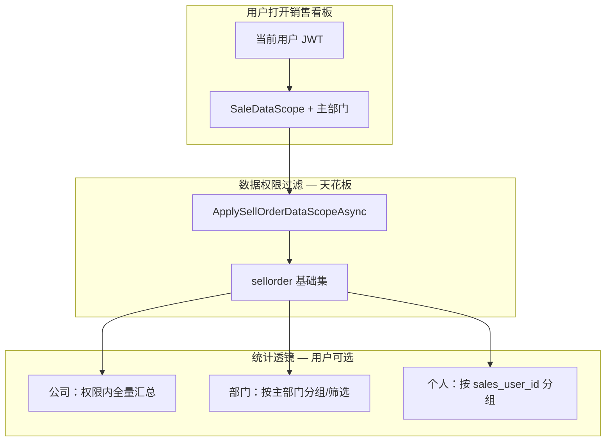

# 销售统计分析 — 实现方案（IMP）

> **状态**：一期已落地；**二期 M1 已落地**（分阶段金额、全链路饼图、待开票、应收趋势、业务员下拉）；详见 [`销售统计-二期任务拆分.md`](./销售统计-二期任务拆分.md)  
> **范围**：统计分析模块 — **销售方向**（一期 + 二期）  
> **总要求**：须符合 [`数据看板总要求.md`](./数据看板总要求.md)（角色权限、四类呈现、统计维度、跨域架构）  
> **关联**：侧栏菜单「报表分析」当前为占位（`handleUnimplemented`），本方案为其首期落地内容。  
> **列表页看板**（`/sales-orders` 列表内「看板」按钮，筛选联动）：见 [`订单列表统计看板-设计与实现.md`](./订单列表统计看板-设计与实现.md) §5.1 — **已落地**，与本文 `/reports/sales` **独立**。  
> **明细列表看板**（`/sales-order-items`）：见 [`销售订单明细列表看板-设计与实现.md`](./销售订单明细列表看板-设计与实现.md) — **已落地**。  
> **需求明细列表看板**（`/rfq-items`）：见 [`需求列表统计看板-设计与实现.md`](./需求列表统计看板-设计与实现.md) — **已落地**。

---

## 一、背景与现状

| 项 | 现状 |
| --- | --- |
| 菜单 | 侧栏已有「报表分析」，点击暂无路由与页面 |
| 单证打印 | 销售订单、出库 Invoice/Packing 等**单据级报表**已具备，非汇总分析 |
| 数据基础 | `sellorder`、`sellorderitem`、`sellorderitemextend` 已沉淀金额、进度、收款、开票、利润等（见 `document/EBS/销售/SellOrderItemExtend统计字段文档.md`） |
| 权限 | 销售侧已有 `SaleDataScope`（本人 / 本部门 / 本部门及下级 / 全部），分析须**复用同一数据范围** |
| 看板层级 | 同一销售看板须分别服务 **公司、部门、个人** 三个统计对象；**可见范围由数据权限封顶** |

**结论**：不必从零建数仓；首期重点是**定义统计口径 + 三层聚合视角 + 带权限过滤的只读 API + 看板页**，并挂到「报表分析」菜单。

---

## 二、模块定位与路由规划

```
报表分析（/reports）
├── 销售分析（/reports/sales）        ← 一期 + 二期 M1（本文）
├── 采购分析（/reports/purchase）     ← 已落地，见 采购统计.md
├── 库存分析（/reports/inventory）    ← 后续
└── 财务分析（/reports/finance）      ← 后续
```

- 将 `AppLayout` 中「报表分析」由占位改为可进入子模块；**销售分析、采购分析**均已开放。
- 帮助文档：`help/pages/报表分析_MENU_REPORT_ANALYSIS.md` 可在上线后补充子页链接。

---

## 三、销售域指标清单（对齐总要求 §五.1）

呈现类：`[静]` 静态 Key:Value · `[趋]` 折线/柱状 · `[分]` 饼图 · `[待]` 待办 Key:Value  
统计维度：单据数 / 客户数 / 金额数 / 比率（见总要求 §四）

### 3.1 需求（RFQ）

| 指标 | 维度 | 呈现 | 一期 | 数据源 / 权限 |
| --- | --- | --- | --- | --- |
| 需求条目数 | 单据数 | 静、趋 | ✅ | `rfqitem`；`ApplyRfqMainListDataScopeAsync` |
| 需求客户数 | 客户数 | 静、趋 | ✅ | 静 ✅；趋 C-13（周期去重） |
| 需求→销售订单转化比率 | 比率 | 静、趋 | ✅ | 静 ✅；趋 ✅（二期 C-5） |

### 3.2 销售订单 — 静态与趋势

| 指标 | 维度 | 呈现 | 一期 | 数据源 / 权限 |
| --- | --- | --- | --- | --- |
| 销售订单条目数 | 单据数 | 静、趋 | ✅ | `sellorderitem`；订单须过 `ApplySellOrderDataScopeAsync` |
| 销售订单客户数 | 客户数 | 静、趋 | ✅ | 静 ✅；趋 C-13 |
| 销售订单金额（成单已审核） | 金额数 | 静、趋 | ✅ | `status >= Approved` 的 `convert_total`（USD）汇总 |
| 销售订单金额（已出库） | 金额数 | 静、趋 | ✅ | Σ `qty_stock_out_actual × convert_price`（二期 B-1/B-2） |
| 销售订单金额（已收款） | 金额数 | 静、趋 | ✅ | Σ `receipt_amount_finish`（二期 B-1/B-2） |

### 3.3 销售订单 — 分解

| 指标 | 呈现 | 一期 | 说明 |
| --- | --- | --- | --- |
| 各环节执行状况比例 | 分 | ✅ | 全链路饼图 `pipelineStage`（二期 B-5/C-8） |
| 币别金额构成 | 分 | ✅ | 饼图；Mask 时按订单数占比（B-6） |

### 3.4 销售订单 — 待办

| 指标 | 维度 | 呈现 | 一期 | 数据源 |
| --- | --- | --- | --- | --- |
| 应收款金额 | 金额数 | 待 | ✅ | `receipt_amount_not` 汇总 / `finance_receivable` |
| 待出库订单条目数 | 单据数 | 待 | ✅ | `stock_out_progress_status` ∈ {待出库, 部分出库} 的明细行数 |
| 待开票金额 | 金额数 | 待 | ✅ | Σ `invoice_amount_not`（二期 B-4） |

### 3.5 排行与透镜（随 viewLevel 变化）

| viewLevel | 静态/趋势附加维度 | 呈现 |
| --- | --- | --- |
| 公司 | 部门销售额排行 | 表格 |
| 部门 | 部门内业务员排行 | 表格 |
| 个人 | 客户贡献排行 | 表格 |

### 3.6 延后（三期）

| 主题 | 说明 |
| --- | --- |
| 报价→销售漏斗 | `quote` / `sellorderitem.quote_id` |
| 毛利分析 | `ProfitExpected`、`QuoteProfitExpected` |
| PN+Brand 维度 | 物料销量/额排行 |

---

## 四、统计口径（一期默认 + 可扩展）

以下为**必须先拍板**的指标定义；一期建议在 UI 写死默认，二期支持口径切换。

| 决策点 | **一期推荐默认** | 备选（二期） |
| --- | --- | --- |
| 金额口径 | **下单额**：`sellorder.convert_total`（**美元**，各行 `qty × convert_price` 之和） | 出库额、已收款额、已开票额（**二期 M1 已落地**） |
| 统计粒度 | **订单头**为主；明细钻取为二级能力 | 全程按明细行 |
| 时间维度 | **订单创建日期** `create_time` | 交货日、出库日、收款日 |
| 订单范围 | 排除 `取消(-2)`、`审核失败(-1)`；包含新建～完成全链路 | 仅「审核通过及以后」 |
| 软删 | 一律 `is_deleted = false` | — |
| 外币 | 跨币别汇总统一用 `convert_total`（USD）；币别饼图按订单头原币分组展示各原币订单的美元下单额 | — |

**一期产品文案建议**：「销售统计分析（按订单创建、美元下单额 convert_total）」— 列表汇总与看板均使用 `convert_total`，原币行金额见订单 `total`。

**历史数据**：若 `convert_total` 为空或不准，须执行 `scripts/backfill_sellorder_convert_total_usd_postgresql.sql`。

### 4.1 销售订单状态参考

| 值 | 含义 | 一期是否纳入 |
| --- | --- | --- |
| 1 | 新建 | 待确认（见 §八） |
| 2 | 待审核 | 待确认 |
| 10 | 审核通过 | 纳入 |
| 20 | 进行中 | 纳入 |
| 100 | 完成 | 纳入 |
| -1 | 审核失败 | **排除** |
| -2 | 取消 | **排除** |

---

## 五、三层看板对象（公司 / 部门 / 个人）与数据权限

### 5.1 设计原则

| 原则 | 说明 |
| --- | --- |
| **权限是天花板** | 看板统计的数据集合 ≤ 用户在业务列表中能看到的销售订单集合（与 `ApplySellOrderDataScopeAsync` 一致） |
| **层级是透镜** | 在「允许看到的数据」之内，用 **公司 / 部门 / 个人** 切换聚合维度与排行粒度 |
| **同一套页面** | 三个层级共用 `/reports/sales` 一个页面，通过 Tab / 分段器切换，不拆三个路由 |
| **后端强校验** | 禁止仅靠前端隐藏 Tab；服务端根据 `SaleDataScope` 拒绝越权 `viewLevel` 或 `departmentId` |
| **可复用骨架** | 采购/库存/财务看板后续沿用「三层对象 + 对应 DataScope」同一模式 |



### 5.2 三个层级对象的定义（销售方向）

| 层级 | 统计对象 | 聚合主键 | 典型 KPI / 排行 | 用户理解 |
| --- | --- | --- | --- | --- |
| **公司** | 权限范围内的「组织整体」 | 无维度（全量 sum） | 总销售额、总订单数、趋势、状态/币别分布 | 管理层看全盘（在其权限内） |
| **部门** | 商务部各子部门 | `sys_user` 主部门 → `sys_department` | 部门销售额排行、部门趋势对比、部门内人数均单 | 部长 / 总监看团队 |
| **个人** | 业务员 | `sellorder.sales_user_id`（含助理 `assistor` 规则见下） | 业务员 Top N、个人趋势、个人客户贡献 | 销售看自己或下属明细 |

**部门归属规则（一期）**：

- 订单计入部门：取 **`sales_user_id` 对应用户的主部门**（`sys_user_department.is_primary = true`）。
- 与列表权限一致：订单是否进入统计池，先过 `ApplySellOrderDataScopeAsync`（含 `Assistor == 当前用户` 的助理可见规则，见 `BusinessDepartmentRules`）。
- **未挂主部门 / 无业务员** 的订单：计入「未分配部门」桶（公司/部门视图展示，个人视图不展示）。

**命名注意**：`SaleDataScope = 0（全部）` 时的「公司」= 真·全公司；`SaleDataScope = 2/3` 时的「公司」Tab 文案应显示为 **「可见范围汇总」**，避免用户误以为看到了全集团数据。

### 5.3 与 `SaleDataScope` 的映射（谁能看哪一层）

引用：`document/System/权限/权限-部门.md` §二、`DataPermissionService.ApplySellOrderDataScopeAsync`。

| SaleDataScope | 含义 | 公司 Tab | 部门 Tab | 个人 Tab | 数据池边界 |
| --- | --- | --- | --- | --- | --- |
| **0 全部** | 全公司销售数据 | ✅ 真·公司汇总 | ✅ 全部部门排行 | ✅ 全部业务员排行 | 无业务员维度过滤 |
| **3 本部门及下级** | 主部门子树 | ✅ **子树汇总**（文案：可见范围） | ✅ 子树内各部门 | ✅ 子树内各业务员 | `GetAllowedUserIds(includeChildren:true)` |
| **2 本部门** | 仅主部门 | ✅ **本部门汇总** | ✅ 仅一个部门（或隐藏部门排行） | ✅ 本部门业务员排行 | `GetAllowedUserIds(includeChildren:false)` |
| **1 自己** | 仅本人 | ❌ 隐藏或等同个人 | ❌ 隐藏 | ✅ **仅本人**（默认选中） | `sales_user_id == 我` 或 `assistor == 我` |
| **4 禁止** | 无销售数据 | ❌ 整页不可访问 | ❌ | ❌ | 空集 |
| **SYS_ADMIN** | 超管 | ✅ 全部 | ✅ 全部 | ✅ 全部 | 同 Scope=0 |

**商务部销售助理特例**（`IdentityType=4` 且 `SaleDataScope=4`）：列表仅见 `assistor == 自己` 的订单；看板**仅开放个人层**，且 KPI 仅统计助理跟单订单（与 `UseSellOrderAssistorOnlyScope` 一致）。

### 5.4 API 契约补充（权限 + 层级）

在 §六 基础 API 上增加统一查询参数：

| 参数 | 类型 | 说明 |
| --- | --- | --- |
| `viewLevel` | `company \| department \| personal` | 统计透镜；服务端按 §5.3 校验是否允许 |
| `departmentId` | string? | 仅 `viewLevel=department` 且用户 Scope∈{0,3} 时可传；须在服务端校验属于「允许部门子树」 |
| `salesUserId` | string? | 仅 `viewLevel=personal` 且用户有权限查看该业务员时可用；Scope=1 时忽略并强制为当前用户 |
| `dateFrom` / `dateTo` | date | 同前 |
| `groupBy` | `day \| week \| month` | 趋势粒度 |

**响应增加 `scopeContext`（透明告知用户在看什么）**：

```json
{
  "scopeContext": {
    "saleDataScope": 3,
    "viewLevel": "department",
    "scopeLabel": "商务部及下级",
    "primaryDepartmentId": "…",
    "primaryDepartmentName": "商务部",
    "allowedDepartmentIds": ["…"],
    "dataFiltered": true
  },
  "kpi": { },
  "trend": [ ],
  "rankings": { }
}
```

**排行随 `viewLevel` 变化**：

| viewLevel | rankings 主表 | 次表（可选） |
| --- | --- | --- |
| `company` | 部门 Top N（Scope≥2 时若仅单部门则降级展示） | 客户 Top N |
| `department` | 所选部门下 **业务员** Top N | 客户 Top N |
| `personal` | 客户 Top N（当前业务员） | — |

### 5.5 后端实现要点（强制）

1. **基础查询**：`IQueryable<SellOrder>` → **必须先** `ApplySellOrderDataScopeAsync(userId, query)`，再 `is_deleted = false`、状态过滤、日期过滤。
2. **部门维度**：`sellorder` JOIN `user` ON `sales_user_id` JOIN `sys_user_department`（primary）JOIN `sys_department`；禁止用订单 `create_by_user_id` 代替业务员归属。
3. **层级校验**：`SalesAnalyticsScopeValidator`（Core）根据 `UserPermissionSummaryDto` 判断 `viewLevel` / `departmentId` / `salesUserId` 合法性；非法返回 **403**。`allowedUserIds.Count > 0` 时才校验 `salesUserId` 成员关系（超管/Scope=0 不误拦）。
4. **功能权限**：除 DataScope 外，须具备 `analytics-sales.read`（或 `SYS_ADMIN`）；`SaleDataAccess=1（只读）` **允许**看板只读访问。
5. **与列表对账**：同一用户、同一日期段，看板「个人层」销售额合计应与其销售订单列表可筛出订单的 `convert_total` 之和一致（抽样验收）。

### 5.6 前端交互（三层 Tab）

```
┌──────────────────────────────────────────────────────────────────┐
│ 销售分析  [公司] [部门] [个人]   ← 按 SaleDataScope 动态显隐/禁用   │
│ 日期 [2026-01-01 至 2026-06-12]  [部门▼]（仅部门层且 Scope 0/3）   │
├──────────────────────────────────────────────────────────────────┤
│ scopeContext：当前可见「商务部及下级」· 部门视图 · 下单额(USD)    │
├──────────┬──────────┬──────────┬──────────┤
│ KPI …    │          │          │          │
├──────────────────────────────────────────────────────────────────┤
│ 趋势图   │  分布图  │  排行榜（随 viewLevel 切换列）              │
└──────────────────────────────────────────────────────────────────┘
```

| 交互 | 规则 |
| --- | --- |
| 默认 Tab | Scope=1 → **个人**；Scope=2/3 → **部门**；Scope=0 / Admin → **公司** |
| 公司 Tab 文案 | Scope=0 显示「公司」；Scope=2/3 显示「可见范围」 |
| 部门下拉 | 仅 Scope 0/3 展示；Scope=2 固定本部门，不展示下拉 |
| 越权 Tab | 不渲染或 `disabled` + tooltip「当前数据范围不可用」 |
| 钻取 | 部门行 → 切到部门层并选中该部门；业务员行 → 切到个人层 |

### 5.7 一期 MVP 与三层的范围对齐

| 层级 | 一期是否实现 |
| --- | --- |
| 个人 | ✅ KPI + 趋势 + 客户 Top10 |
| 部门 | ✅ KPI + 部门排行 + 部门内业务员 Top10（Scope 允许时） |
| 公司 | ✅ KPI + 趋势 + 部门排行（Scope=0/3 为真·多部门；Scope=2 等同部门汇总） |

延后：跨公司对比、部门目标完成率、自定义部门树勾选。

### 5.8 待确认（三层相关）

| # | 问题 | 建议 |
| --- | --- | --- |
| A | Scope=2 用户是否显示「公司」Tab | 建议 **不显示**，仅「本部门 + 个人」 |
| B | 部门排行是否含下级部门 | Scope=3 **含**；Scope=2 **仅本部门一条** |
| C | 助理跟单订单计入谁的个人业绩 | 建议计在 **销售订单业务员**，助理仅在 Assistor 规则下**可见**不计入助理个人 KPI（或单列「跟单」— 二期） |
| D | 未分配部门订单 | 公司视图单独「未分配」一行 |

---

## 六、技术设计

### 6.1 后端（对齐总要求 §6.2 API 分层）

| 层 | 设计 |
| --- | --- |
| API | `GET /api/v1/analytics/sales/dashboard` — `scopeContext` + **静态** `snapshot` + **待办** `todo` + 排行<br>`GET /api/v1/analytics/sales/trends` — **趋势** `trend[]`<br>`GET /api/v1/analytics/sales/breakdowns` — **分解** `breakdown[]`（环节、币别等） |
| Controller | `CRM.API/Controllers/SalesAnalyticsController.cs` |
| Service | `CRM.Core/Services/SalesAnalyticsService.cs` |
| 查询 | `SalesAnalyticsQuery`（Infrastructure），只读聚合 SQL |
| 权限 | RFQ / 销售订单分别 `ApplyRfq*`、`ApplySellOrderDataScopeAsync` 后再聚合；`SalesAnalyticsScopeValidator` |
| 权限码 | `analytics-sales.read`（`scripts/analytics_sales_read_permission_postgresql.sql`） |
| 性能 | 一期实时聚合；预测与日汇总见总要求 §七 |

**`dashboard` 响应结构示意**：

```json
{
  "scopeContext": { },
  "snapshot": {
    "rfqItemCount": 0,
    "rfqCustomerCount": 0,
    "rfqToSalesConversionRate": 0,
    "salesOrderItemCount": 0,
    "salesOrderCustomerCount": 0,
    "salesAmountApproved": 0,
    "salesAmountStockOut": null,
    "salesAmountReceived": null
  },
  "todo": {
    "receivableAmount": 0,
    "pendingStockOutItemCount": 0,
    "pendingInvoiceAmount": null
  },
  "rankings": { }
}
```

**`trends` 字段**：`rfqItemCount`、`salesOrderItemCount`、`salesAmountApproved`、`rfqToSalesConversionRate` 等（按 `groupBy`）。

**`breakdowns` 分组**：`pipelineStatus`（环节执行）、`currency`（币别构成）。

### 6.2 前端（对齐总要求 §3.5 布局）

| 项 | 设计 |
| --- | --- |
| 页面 | `CRM.Web/src/views/Reports/SalesAnalyticsPage.vue` |
| API 客户端 | `CRM.Web/src/api/analytics/sales.ts` |
| 钻取 | `CRM.Web/src/utils/salesAnalyticsDrill.ts`（或页面内联路由） |
| 路由 | `/reports/sales` |
| 布局顺序 | ① Tab（公司/部门/个人）② 待办 KPI ③ 静态 KPI ④ 趋势图 + 分解饼图 ⑤ 排行表 |
| 组件 | 复用总要求 §6.4：`AnalyticsScopeTabs`、`AnalyticsKpiGrid`、`AnalyticsTrendChart`、`AnalyticsBreakdownChart` |
| 规范 | 列表搜索栏规范；ECharts 折线/柱状/饼图 |
| 钻取 | 待办/排行 → 销售订单、需求、应收列表（带 query 筛选） |

### 6.3 页面信息结构（草图）

见 §5.6（已含三层 Tab 与 `scopeContext`）。

---

## 七、一期 MVP 范围

### 7.1 做

1. 菜单与路由 `/reports/sales`
2. 三层 Tab + `SaleDataScope` 过滤（§五）
3. **四类呈现**：待办 KPI、静态 KPI、趋势图、分解饼图（§三）
4. 指标：需求条目/客户数、转化率、销售订单条目/客户数、成单已审核金额、环节/币别分解、应收与待出库待办
5. API：`dashboard` + `trends` + `breakdowns` 三端点
6. 排行表随 `viewLevel` 切换

### 7.2 不做（明确延后）

- ~~销售分阶段金额：已出库、已收款~~ → **二期 M1 已落地**（见 [二期任务拆分](./销售统计-二期任务拆分.md)）
- ~~待开票、全链路分解饼图、应收趋势~~ → **二期 M1 已落地**
- 利润、报价漏斗、数据预测（见总要求 §七）→ **三期**
- 财务看板（各域独立 IMP）；**采购看板** → 见 [`采购统计.md`](./采购统计.md)（已落地）；**物流看板** → 见 [`物流统计.md`](./物流统计.md)（已落地）

### 7.3 工期粗估

约 **3～4 周**（含三层权限联调与样例数据对账）。

---

## 八、落地步骤

| 步骤 | 产出 |
| --- | --- |
| ① 产品确认口径 | 更新本文 §四、§八 为「已确认」 |
| ② 后端 | `SalesAnalyticsController` + `ISalesAnalyticsQuery` + `SalesAnalyticsScopeValidator` |
| ③ 前端 | `SalesAnalyticsPage.vue`（三层 Tab）、API `analytics/sales.ts`、菜单与路由 |
| ④ 权限 | `analytics-sales.read` 种子数据；与 `SaleDataScope` 对账用例 |
| ⑤ 联调 | 按 Scope=0/1/2/3 四类账号抽样对数 |
| ⑥ 二期 | L2 履约回款、多口径切换 — 任务清单见 [销售统计-二期任务拆分.md](./销售统计-二期任务拆分.md) |

---

## 九、待产品确认项

| # | 问题 | 方案建议 |
| --- | --- | --- |
| 1 | 一期金额口径 | 默认「订单创建日 + 美元下单额（`convert_total`）」 |
| 2 | 订单状态范围 | 排除取消/审核失败；新建/待审核是否纳入待决 |
| 3 | 三层与 Scope 映射 | 采用 §5.3 表；Scope=2 **不展示**公司 Tab |
| 4 | 排行维度 | 一期仅部门/业务员/客户（随 viewLevel 切换） |
| 5 | 钻取 | 排行是否跳转销售订单/明细列表并带筛选 |
| 6 | 图表库 | ECharts 或一期仅表格 |
| 7 | 助理跟单业绩归属 | 见 §5.8-C |

---

## 十、主要代码与文档索引

| 用途 | 路径 |
| --- | --- |
| **数据看板总要求** | `document/IMP/数据看板/数据看板总要求.md` |
| **采购看板 IMP** | `document/IMP/数据看板/采购统计.md` |
| **销售看板二期任务** | `document/IMP/数据看板/销售统计-二期任务拆分.md` |
| **销售订单列表看板** | `document/IMP/数据看板/订单列表统计看板-设计与实现.md` §5.1；API `/api/v1/sales-orders/analytics/*` |
| **销售订单明细列表看板** | `document/IMP/数据看板/销售订单明细列表看板-设计与实现.md`；API `/api/v1/sales-orders/items/analytics/*` |
| **需求明细列表看板** | `document/IMP/数据看板/需求列表统计看板-设计与实现.md`；API `/api/v1/rfqs/items/analytics/*` |
| Controller | `CRM.API/Controllers/SalesAnalyticsController.cs` |
| Service / Validator | `CRM.Core/Services/SalesAnalyticsService.cs`、`SalesAnalyticsScopeValidator.cs` |
| 聚合查询 | `CRM.Infrastructure/Analytics/SalesAnalyticsQuery.cs` |
| DTO | `CRM.Core/Models/Analytics/SalesAnalyticsContracts.cs` |
| 销售订单主表 | `CRM.Core/Models/Sales/SellOrder.cs` |
| 需求主表/明细 | `CRM.Core/Models/RFQ/RFQ.cs`、`RFQItem` |
| 销售明细扩展统计 | `CRM.Core/Models/Sales/SellOrderItemExtend.cs` |
| 扩展字段说明 | `document/EBS/销售/SellOrderItemExtend统计字段文档.md` |
| 销售数据范围过滤 | `CRM.Core/Services/DataPermissionService.cs` → `ApplySellOrderDataScopeAsync` |
| 部门 Scope 定义 | `document/System/权限/权限-部门.md` |
| 销售助理特例 | `CRM.Core/Utilities/BusinessDepartmentRules.cs` |
| 菜单 | `CRM.Web/src/layouts/AppLayout.vue` |
| convert_total backfill | `scripts/backfill_sellorder_convert_total_usd_postgresql.sql` |
| 看板权限种子 | `scripts/analytics_sales_read_permission_postgresql.sql` |
| 强制删除/报表规范（参考 API 风格） | `document/实现方案/强制删除_API契约与错误码.md` |

---

## 十一、修订记录

| 日期 | 说明 |
| --- | --- |
| 2026-06-12 | 初稿：销售方向统计分析方案（方案讨论沉淀） |
| 2026-06-12 | 补充：公司/部门/个人三层看板 + `SaleDataScope` 数据权限映射与 API 透镜 |
| 2026-06-12 | 对齐总要求：四类呈现、销售域指标清单、dashboard/trends/breakdowns API |
| 2026-06-03 | 一期落地状态回写 §三；新增 [销售统计-二期任务拆分.md](./销售统计-二期任务拆分.md) |
| 2026-06-03 | 二期 M1 落地回写；USD `convert_total` backfill 说明；admin `allowedUserIds` 校验规则；代码路径索引；采购看板交叉引用 |
| 2026-07-13 | 销售订单明细列表看板定稿；§十 补充 API `/api/v1/sales-orders/items/analytics/*` |
