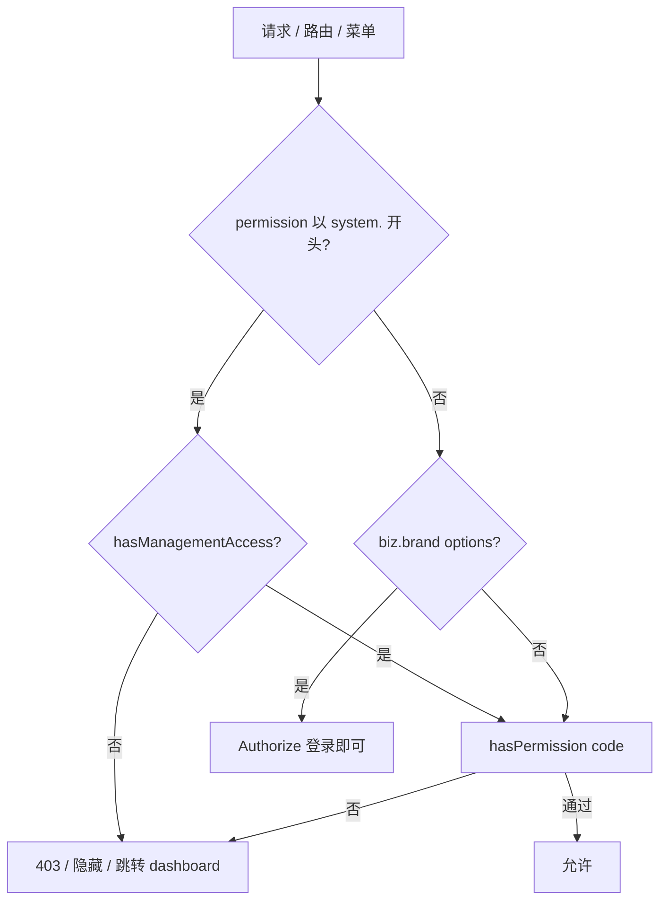

# 管理角色分级与权限体系 PRD

**文档版本：** v1.1  
**编写日期：** 2026-06-03  
**状态：** 已定稿（一期已落地，见 [管理角色三级-设计与实现](../System/管理角色三级-设计与实现.md)）  
**关联文档：** [RBAC权限系统PRD](./RBAC权限系统PRD.md)、[部门组织角色编码](../System/部门组织角色编码.md)、[权限-部门](../System/权限/权限-部门.md)

---

## 一、背景与目标

在现有 **「部门驱动 + 组织角色（DEPT_*）+ 数据范围」** 模型之上，新增 **管理角色分级**，解决：

1. 平台管理员（Manager）与系统管理员（Admin）职责分离，且 Admin 账号不可被下级维护；
2. 各业务方向系统管理员（DepartManager）仅维护 **本域系统参数** 与（可手工配置的）**业务主数据菜单**，**不扩业务单据数据范围**；
3. 普通员工在业务表单中可使用主数据 **下拉选项**，但不可进入主数据维护页；
4. 普通员工即使被误配 `system.*.read`，也 **不可** 见系统管理菜单、不可进入相关页面；
5. 运维可通过 **角色编辑 UI 按域批量勾选权限**（方式 C），降低 `SYS_MGR_*` 与主菜单的手工配置成本。

---

## 二、两套正交维度

| 维度 | 编码示例 | 职责 |
|------|----------|------|
| **管理角色** | `SYS_ADMIN`、`SYS_MANAGER`、`SYS_MGR_*` | 系统管理菜单、平台参数、账号维护（按本 PRD 边界） |
| **组织角色** | `DEPT_DIRECTOR`、`DEPT_MANAGER`、`DEPT_EMPLOYEE` | 业务单据 **行级数据可见范围**（`DataPermissionService`） |
| **部门身份** | `IdentityType` 1–6 | 业务方向与菜单剥离策略（见 [权限-部门](../System/权限/权限-部门.md)） |

**原则：** 管理角色与组织角色 **可组合**；持有 `SYS_MGR_FINANCE` **不** 自动获得 `FinanceDataScope=0`，业务数据仍按主部门 + `DEPT_*` 过滤。

### 2.1 普通员工（本文术语）

> 持有 `DEPT_EMPLOYEE`，且 **不** 持有任一管理角色：`SYS_ADMIN` | `SYS_MANAGER` | `SYS_MGR_*`。

总监/经理若 **无** 管理角色，对系统管理门禁与普通员工 **相同**（见 §五）。

---

## 三、管理角色分级

### 3.1 角色定义

| 层级 | RoleCode | 中文名 | 职责摘要 |
|------|----------|--------|----------|
| L1 | `SYS_ADMIN` | 系统管理员（Admin） | 全系统最高权限；`IsSysAdmin=true` |
| L2 | `SYS_MANAGER` | 平台管理员（Manager） | 除角色/权限/Debug/Admin 账号外，平台级管理能力；业务数据全量 bypass（`HasBizDataBypass`） |
| L3 | `SYS_MGR_HR` | 人事系统管理员 | 员工 + 部门；可创建 Manager |
| L3 | `SYS_MGR_SALES` | 销售系统管理员 | 销售域系统参数 + 可手工配销售域主数据菜单 |
| L3 | `SYS_MGR_PURCHASE` | 采购系统管理员 | 采购域系统参数 + 可手工配采购域主数据菜单 |
| L3 | `SYS_MGR_LOGISTICS` | 物流系统管理员 | 物流域系统参数 + 可手工配物流域主数据菜单 |
| L3 | `SYS_MGR_FINANCE` | 财务系统管理员 | 财务域系统参数 + 可手工配财务域主数据菜单 |

**一人多域：** 允许；例如同时持有 `SYS_MGR_PURCHASE` + `SYS_MGR_FINANCE`，权限取 **并集**。

**命名禁止：** 勿将 DepartManager 称为 `DEPT_MANAGER`（与组织角色「部门经理」混淆）。

### 3.2 能力矩阵（定稿）

| 能力 | Admin | Manager | HR DepartManager | 其他 DepartManager |
|------|:-----:|:-------:|:----------------:|:------------------:|
| 角色管理 | ✅ | ❌ | ❌ | ❌ |
| 权限管理 | ✅ | ❌ | ❌ | ❌ |
| 员工管理 | ✅ | ✅* | ✅* | ❌ |
| 部门管理 | ✅ | ✅ | ✅ | ❌ |
| 用户配置 | ✅ | ✅ | ❌ | ❌ |
| 公司信息 | ✅ | ✅ | ❌ | ❌ |
| 数据字典（全局） | ✅ | ✅ | ❌ | ❌ |
| 操作日志 | ✅ | ✅ | ❌ | ❌ |
| 登录日志 | ✅ | ✅ | ❌ | ❌ |
| 模拟登录 | ✅ | ✅ | ❌ | ❌ |
| 强制删除 | ✅ | ✅ | ❌ | ❌ |
| Debug 页 | ✅ | ❌ | ❌ | ❌ |
| 授予/撤销 `SYS_ADMIN` | ✅ | ❌ | ❌ | ❌ |
| 创建 `SYS_MANAGER` | ✅ | ❌ | ✅ | ❌ |
| 本域 `system.params.*` | ✅ | ✅ | ❌ | ✅ |
| 业务主数据菜单（如品牌管理） | ✅ | ✅ | ❌ | 手工配置 |
| 业务数据全量 bypass（`HasBizDataBypass`） | ✅ | ✅ | ❌ | ❌ |

\* 不可见/不可改 **Admin** 账号；Manager **不能** 编辑/删除/改密 **其他 Manager**（仅 Admin + HR 可维护 Manager 账号）。

**`HasBizDataBypass` 口径（与实现一致）：**

- **不是**角色编辑里可勾选的权限码，而是 `GET /api/v1/auth/permission-summary` 的计算标志。
- **置 true：** `SYS_ADMIN`、`SYS_MANAGER`，以及一期落地的 `SYS_BIZ_MANAGER`（与 `hasManagementAccess` 同期）。
- **仍为 false：** 普通员工、仅 `DEPT_*`、L3 `SYS_MGR_*`（域管理员**不**扩业务单据数据范围，与 §一目标 2 一致）。
- **放开：** 行级不再按主部门 `*DataScope` 收窄；侧栏不受 `IdentityType` / 隐藏客户·供应商 / `*DataScope=4` 藏菜单；业务权限码在前端 `hasPermission` 与 API `RequirePermission`（非 `system.*`）放行。
- **不放开：** `system.*` 仍走 §五双重门槛；角色/权限/Debug 仍仅 Admin。

### 3.3 账号隔离与赋权规则（后端硬约束）

| 账号类型 | 识别 | 可见 | 可维护 |
|----------|------|------|--------|
| Admin | 含 `SYS_ADMIN` | 仅 Admin | 仅 Admin |
| Manager | 含 `SYS_MANAGER`、无 `SYS_ADMIN` | Admin、Manager、HR | Admin、HR（Manager 不可互管） |
| 普通员工 | 无上述管理角色 | 有员工管理权限者 | 按操作者权限 |

**角色分配：**

| 操作者 | 可分配 |
|--------|--------|
| Admin | 全部角色 |
| Manager | `DEPT_*`、业务扩展角色、`SYS_MGR_*`（**不含** `SYS_ADMIN`、`SYS_MANAGER`） |
| HR DepartManager | `DEPT_*`、业务扩展角色、**`SYS_MANAGER`**（**不含** `SYS_ADMIN`、各 `SYS_MGR_*`） |
| 其他 DepartManager | 不可维护账号 |

---

## 四、权限分层模型

### 4.1 四类权限前缀

| 层级 | 前缀 | 控制对象 | 普通员工默认 |
|------|------|----------|--------------|
| 业务功能 | `customer.read`、`rfq.read`、`sales-order.read`… | 业务菜单与业务 API | 按 `DEPT_*` 种子 |
| 业务主数据维护 | `biz.brand.read`、`biz.brand.write`… | 「品牌管理」等主数据 **列表/详情/写** | **不授予** |
| 业务表单辅助 | `biz.brand.options`（或登录即可，见 §4.2） | 仅下拉/搜索 **options** | **可用** |
| 系统管理 | `system.*` | 组织/参数/日志/平台能力 | **须管理身份**（§五） |

### 4.2 品牌权限（示例：业务主数据拆分）

| PermissionCode | 用途 | 普通员工 | 品牌管理页 | API |
|----------------|------|:--------:|:----------:|-----|
| **`biz.brand.options`** | RFQ/订单等表单选品牌 | ✅ | ❌ | `GET /api/v1/biz-brands/options` |
| **`biz.brand.read`** | 列表、详情 | ❌ | ✅ | `GET /api/v1/biz-brands`、`GET …/{id}` |
| **`biz.brand.write`** | 新建/编辑/审核/删除 | ❌ | ✅ | `POST/PUT/DELETE …` |

**options 授权策略（定稿）：** 推荐 **`[Authorize]` 登录即可**，不依赖 `biz.brand.read`；列表/详情/写操作必须单独鉴权。若审计要求权限表可追溯，可改为显式 `biz.brand.options` 并写入 `DEPT_EMPLOYEE` 种子。

**禁止：** 使用 `biz.brand.read` 保护 `options` 接口（会导致普通员工无法选品牌）。

**前端：**

- 侧栏「品牌管理」：`hasPermission('biz.brand.read')`
- 路由 `/biz/brands`：`meta.permission: 'biz.brand.read'`
- `BizBrandSelect`：仅调用 `options`，不调用列表 API

---

## 五、系统管理双重门槛

访问任一 **`system.*`** 资源须 **同时** 满足：

1. `hasPermission('system.xxx…')`；
2. **`hasManagementAccess === true`**。

```text
hasManagementAccess =
  IsSysAdmin
  OR RoleCodes 含 SYS_MANAGER
  OR RoleCodes 含任一 SYS_MGR_{DOMAIN}
```

| 场景 | 结果 |
|------|------|
| 普通员工仅有 `customer.read` | 正常业务菜单；**无** 系统管理 |
| 普通员工被误配 `system.org.users.read` | **无** 系统管理菜单；API **403** |
| `SYS_MGR_PURCHASE` + `system.params.purchase.read` | 仅采购参数等相关子菜单 |

### 5.1 permission-summary 扩展字段

```typescript
{
  isSysAdmin: boolean
  isSysManager: boolean
  isBizManager: boolean         // 一期：SYS_BIZ_MANAGER
  sysManagerDomains: string[]   // ['HR','PURCHASE','FINANCE', ...]
  hasManagementAccess: boolean  // 上述 OR
  hasBizDataBypass: boolean     // 业务数据行级全量；一期与 hasManagementAccess 同期
  permissionCodes: string[]
}
```

### 5.2 前端门禁

```typescript
function canAccessSystemPermission(code: string): boolean {
  if (!code.startsWith('system.')) return hasPermission(code)
  return hasManagementAccess && hasPermission(code)
}
```

- 系统侧栏三组（组织管理 / 参数管理 / 系统日志）：使用 `canAccessSystemPermission` 或 `hasManagementAccess && hasAnySystemPermission(...)`。
- 路由守卫：`meta.permission` 以 `system.` 开头时走 `canAccessSystemPermission`。
- 角色/权限页：额外要求 `isSysAdmin`（Manager 不可见）。

### 5.3 后端门禁（纵深防御）

1. **授权属性（推荐）：** 凡 `system.*` 的 Action，先校验 `HasManagementAccess`，再 `RequirePermission`。
2. **汇总过滤：** `GetUserPermissionSummaryAsync` 对 `!HasManagementAccess` 用户从 `PermissionCodes` **剥离全部 `system.*`**（防前端误展示；**不能替代** API 校验）。

### 5.4 平台能力与 IsSysAdmin 解耦

| 能力 | 目标权限 / 标志 | 持有者 |
|------|-----------------|--------|
| 模拟登录 | `system.platform.impersonate` | Admin、Manager |
| 强制删除 | `system.platform.force-delete` | Admin、Manager |
| 业务数据全量 bypass | `HasBizDataBypass` | Admin、Manager（及一期 `SYS_BIZ_MANAGER`） |

Manager **不得** 设置 `IsSysAdmin=true`。业务数据全量由 **`HasBizDataBypass`** 表达，与 `IsSysAdmin` 解耦：平台管理员看全量业务单据、不受主部门藏菜单，但角色/权限/Debug 仍仅 Admin。

---

## 六、权限码清单（拆分 `rbac.manage`）

### 6.1 平台组织

| PermissionCode | Admin | Manager | HR |
|----------------|:-----:|:-------:|:--:|
| `system.org.users.read` | ✅ | ✅ | ✅ |
| `system.org.users.write` | ✅ | ✅ | ✅ |
| `system.org.users.assign-manager` | ✅ | ❌ | ✅ |
| `system.org.users.reset-password` | ✅ | ✅ | ✅ |
| `system.org.departments.read` | ✅ | ✅ | ✅ |
| `system.org.departments.write` | ✅ | ✅ | ✅ |
| `system.org.user-config.read` | ✅ | ✅ | ❌ |
| `system.org.user-config.write` | ✅ | ✅ | ❌ |

### 6.2 角色/权限（仅 Admin）

| PermissionCode |
|----------------|
| `system.rbac.roles.read` / `.write` |
| `system.rbac.permissions.read` / `.write` |

### 6.3 系统参数

| PermissionCode | Admin | Manager | 域 DepartManager |
|----------------|:-----:|:-------:|:----------------:|
| `system.params.company.read/write` | ✅ | ✅ | ❌ |
| `system.params.dict.read/write` | ✅ | ✅ | ❌ |
| `system.params.sales.read/write` | ✅ | ✅ | Sales |
| `system.params.purchase.read/write` | ✅ | ✅ | Purchase |
| `system.params.logistics.read/write` | ✅ | ✅ | Logistics |
| `system.params.finance.read/write` | ✅ | ✅ | Finance |

### 6.4 日志与平台

| PermissionCode | Admin | Manager |
|----------------|:-----:|:-------:|
| `system.logs.operation.read` | ✅ | ✅ |
| `system.logs.export.read` | ✅ | ✅ |
| `system.logs.login.read` | ✅ | ✅ |
| `system.platform.impersonate` | ✅ | ✅ |
| `system.platform.force-delete` | ✅ | ✅ |

### 6.5 业务主数据（示例）

| PermissionCode | 说明 | 默认归属 |
|----------------|------|----------|
| `biz.brand.options` | 下拉（可选；或登录即可） | 全员 / DEPT_EMPLOYEE 种子 |
| `biz.brand.read` | 品牌列表/详情 | 手工配给 Admin/Manager/DepartManager |
| `biz.brand.write` | 品牌维护 | 同上 |

### 6.6 兼容别名

| PermissionCode | 说明 |
|----------------|------|
| `rbac.manage` | **超集别名**（等价 Admin 全部 `system.*`）；系统上线后由 Admin **手工** 赋给指定账号；新功能不再单独依赖此码 |

**种子策略：** `DEPT_*` 角色 **永不** 包含 `system.*`；`SYS_MGR_*` 默认仅含对应 `system.params.{domain}.*`。

---

## 七、菜单 / 路由映射

### 7.1 组织管理（侧栏 systemManagement）

| 菜单 | 路由 | 权限 |
|------|------|------|
| 员工管理 | `/system/users` | `system.org.users.read` |
| 部门管理 | `/system/departments` | `system.org.departments.read` |
| 角色管理 | `/system/roles` | `system.rbac.roles.read` |
| 权限管理 | `/system/permissions` | `system.rbac.permissions.read` |
| 用户配置 | `/system/user-config` | `system.org.user-config.read` |

### 7.2 参数管理（侧栏 paramManagement）

| 菜单 | 路由 | 权限 |
|------|------|------|
| 公司信息 | `/system/company-info` | `system.params.company.read` |
| 数据字典 | `/system/dict-items` | `system.params.dict.read` |
| 采购参数 | `/system/purchase-params/**` | `system.params.purchase.read` |
| 财务参数 | `/system/finance-params/**` | `system.params.finance.read` |
| 销售/物流参数 | （待建路由） | `system.params.sales/logistics.read` |

### 7.3 系统日志（侧栏 systemLogs）

| 菜单 | 路由 | 权限 |
|------|------|------|
| 登录日志 | `/system/login-logs` | `system.logs.login.read` |
| 操作日志 | `/system/operation-logs` | `system.logs.operation.read` |
| 导出日志 | `/system/export-logs` | `system.logs.export.read` |

### 7.4 业务管理

| 菜单 | 路由 | 权限 |
|------|------|------|
| 品牌管理 | `/biz/brands` | `biz.brand.read` |

### 7.5 Debug

| 路由 | 条件 |
|------|------|
| `/debug/**` | `meta.sysAdminOnly` + `IsSysAdmin` |

**所有 `system.*` 菜单项：** 除权限码外，必须满足 `hasManagementAccess`（§五）。

---

## 八、方式 C：按域批量配置（角色编辑 UI）

### 8.1 目标

运维在 **角色管理 → 编辑角色** 时，可按 **业务域** 一键勾选该域下的系统参数 + 业务主数据菜单权限，无需逐条查找；底层仍写入 `sys_role_permission`，**不引入** 独立菜单配置表（首期）。

### 8.2 权限元数据（`sys_permission` 扩展）

在权限实体上增加（或通过 `Description` JSON 约定，**实现期统一为显式字段**）：

| 字段 | 类型 | 说明 | 示例 |
|------|------|------|------|
| `DomainTag` | string? | 业务域标签 | `HR` / `SALES` / `PURCHASE` / `LOGISTICS` / `FINANCE` / `PLATFORM` |
| `MenuGroup` | string? | 侧栏分组 | `systemManagement` / `paramManagement` / `systemLogs` / `businessManagement` |
| `PermissionKind` | string? | 权限种类 | `system` / `biz-master` / `biz-options` / `business` |

**域与 RoleCode 对应：**

| DomainTag | 典型 RoleCode | 批量勾选包（默认） |
|-----------|---------------|-------------------|
| `PLATFORM` | `SYS_MANAGER` | 除 `system.rbac.*` 外全部 `system.*` + 可选 `biz.*` |
| `HR` | `SYS_MGR_HR` | `system.org.users.*`、`system.org.departments.*`、`assign-manager` |
| `SALES` | `SYS_MGR_SALES` | `system.params.sales.*` + DomainTag=SALES 的 `biz.*` |
| `PURCHASE` | `SYS_MGR_PURCHASE` | `system.params.purchase.*` + DomainTag=PURCHASE 的 `biz.*` |
| `LOGISTICS` | `SYS_MGR_LOGISTICS` | `system.params.logistics.*` + DomainTag=LOGISTICS 的 `biz.*` |
| `FINANCE` | `SYS_MGR_FINANCE` | `system.params.finance.*` + DomainTag=FINANCE 的 `biz.*` |

### 8.3 角色编辑 UI 交互

1. **按域 Tab / 折叠面板：** 展示「人事域」「采购域」「销售域」… 各域下权限树。
2. **一键按钮：** 「勾选本域全部系统参数」「勾选本域全部主数据菜单」（仅列出 `PermissionKind=biz-master` 且 `DomainTag` 匹配项）。
3. **跨域只读提示：** 编辑 `SYS_MGR_PURCHASE` 时，其他域权限灰显；Admin 编辑任意角色时可跨域。
4. **保存校验：** 非 Admin 操作者不能为角色勾选 `system.rbac.*`；HR 角色编辑页不能勾选 `SYS_MGR_*` 域包（只能勾 HR 域 + assign-manager 相关）。

### 8.4 手工给 DepartManager 开「品牌管理」

1. Admin → 角色管理 → 编辑 `SYS_MGR_PURCHASE`；
2. 在 **采购域** 面板点击「勾选本域主数据菜单」，或单独勾选 `biz.brand.read`、`biz.brand.write`；
3. 保存；用户重新登录。

**仅某一用户需要时：** 另建附属角色（如 `BIZ_BRAND_MAINTAINER`）仅含 `biz.brand.*`，与用户已有的 `SYS_MGR_PURCHASE` 并存。

---

## 九、鉴权流程（总览）



---

## 十、迁移与运维

| 项 | 说明 |
|----|------|
| 现有 `rbac.manage` | 保留为超集别名；**系统完成后由 Admin 手工** 配置给指定账号，不做自动批量迁移 |
| 现有 `DEPT_*` 种子 | 继续 **不含** `rbac.manage` / `system.*` |
| 新权限上线 | 提供 SQL 种子插入 `sys_permission`（含 DomainTag/MenuGroup）及可选 `sys_role_permission` 模板 |
| 品牌模块 | 当前无功能权限；上线本 PRD 时同步补 API/路由/侧栏绑定 |

---

## 十一、实施分期

| 阶段 | 交付 |
|------|------|
| **P0** | 管理角色种子；`system.*` / `biz.brand.*` 权限种子；`hasManagementAccess`；系统 API 双重门槛；Admin/Manager 账号隔离 |
| **P0** | 品牌 options 与 list/detail 分离鉴权；`/biz/brands` 绑 `biz.brand.read` |
| **P1** | 路由/侧栏/`RequirePermission` 从 `rbac.manage` 迁至 `system.*`；模拟登录/强删改权限驱动 |
| **P1** | `permission-summary` 剥离非管理身份的 `system.*` |
| **P2** | 角色编辑 UI：DomainTag 展示 + **方式 C 按域批量勾选** |
| **P2** | `UserEdit` 赋权 UI（Manager / HR 规则） |

---

## 十二、验收用例

| # | 账号 | 操作 | 期望 |
|---|------|------|------|
| 1 | 普通员工 | RFQ 选品牌（options） | 200 |
| 2 | 普通员工 | 访问 `/biz/brands` | 跳转 dashboard |
| 3 | 普通员工 | `GET /biz-brands` | 403 |
| 4 | 普通员工（误配 `system.org.users.read`） | 系统管理侧栏 | 不可见 |
| 5 | 普通员工（误配） | 员工列表 API | 403 |
| 6 | Manager | 操作日志 + 登录日志 | 可见 |
| 7 | Manager | 角色/权限管理 | 不可见 |
| 8 | Manager | 编辑另一 Manager | 403 |
| 9 | HR DepartManager | 创建 SYS_MANAGER 账号 | 成功 |
| 10 | HR DepartManager | 创建 SYS_ADMIN | 403 |
| 11 | SYS_MGR_PURCHASE + biz.brand.read | 品牌列表 | 200；采购单仍按 DEPT 数据范围 |
| 12 | Admin | 角色页「勾选采购域全部主数据」 | 写入 sys_role_permission |
| 13 | Manager（主部门销售、`SaleDataScope=1`） | 采购订单列表 / 报关菜单 | 可见；业务列表全量；不被部门身份重定向 `/dashboard` |

---

## 十三、版本历史

| 版本 | 日期 | 说明 |
|------|------|------|
| v1.0 | 2026-06-03 | 初版：管理角色分级、权限分层、系统双重门槛、品牌拆分、方式 C 按域批量配置、定稿答复汇总 |
| v1.1 | 2026-08-17 | §3.2 / §5.4：业务数据全量 bypass 与实现对齐——平台管理员（`SYS_MANAGER`）及一期 `SYS_BIZ_MANAGER` 置 `HasBizDataBypass`；L3 域管理员仍不扩业务数据范围 |
