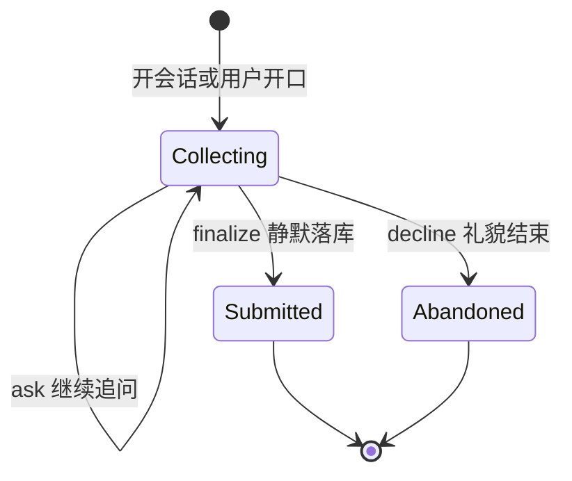

# AI 用户反馈助手 — 设计与实现

**状态：** 已实现（首期可联调；需执行 `scripts/ensure_ai_assistant_feedback_postgresql.sql`）  
**关联：** [AI 模块架构与实现](./AI模块架构与实现.md)、[AI模块PRD](../PRD/AI模块PRD.md)  
**测试对照：** [AI用户反馈助手-测试对照说明](../QA/系统/AI用户反馈助手-测试对照说明.md)  
**权限脚本（实现时）：** `scripts/ensure_ai_assistant_feedback_postgresql.sql`（建表 + 场景/权限种子，路径以实现为准）  
**UI 规范：** [扩展面板.工作台规范](../PRD/规范/UI规范/扩展面板.工作台规范.md)

本文描述 FrontCRM 中 **顶栏 AI 助手（首期技能：问题/建议反馈）** 与 **运维「用户反馈」管理页** 的产品口径、数据模型、API 与实现索引。

---

## 1. 业务定位

| 概念 | 说明 |
|------|------|
| **用户入口** | 顶栏 **「AI 助手」** 聊天抽屉（与铃铛「消息通知」占位分离） |
| **交互** | **自然语言多轮**；信息不足时 AI **主动追问**；齐套后 **静默精炼落库** |
| **不做** | 表单一次提交；向用户念精炼稿并要求说「好」；承诺解决日期 |
| **结束话术** | 「已记录并通知开发团队」——「通知」= 工单进入运维列表（本期无邮件/企微） |
| **运维入口** | 主菜单 **「运维」→「用户反馈」**（`/ops/user-feedback`） |
| **开发者所见** | AI **精炼字段**（标题/类型/摘要/单号/复现）；原始会话可展开 |
| **LLM** | Kimi（Moonshot），复用现有 `OpenAiCompatibleAiLlmProvider` |
| **扩展** | 同一助手会话层预留技能路由（二期如对话询价）；首期仅 `feedback` |

---

## 2. 产品规则定稿

### 2.1 问题 vs 改进建议

同一入口、同一张 `user_feedback`，用 **`category`** 区分：

| 值 | 含义 | 追问侧重 |
|----|------|----------|
| `bug` | 缺陷/问题 | 现象、单号、复现、截图 |
| `suggestion` | 改进建议 | 痛点与期望；单号/复现可弱化 |
| `other` | 其它 | 兜底 |

- 欢迎区可选 chip：「反馈问题」「提改进建议」（非强制表单）。  
- AI 识别意图；不确定时问：「这是系统故障，还是功能改进建议？」  
- 运维详情可改 `category`。

### 2.2 对话状态与动作



每轮模型输出 JSON（用户只看 `assistantMessage`）：

```json
{
  "assistantMessage": "自然语言追问或结束语",
  "intent": "feedback|off_topic",
  "conversationAction": "ask|finalize|decline|reject_offtopic",
  "slots": {
    "category": "bug|suggestion|other|null",
    "title": "string|null",
    "summary": "string|null",
    "bizRef": "string|null",
    "reproSteps": "string|null"
  },
  "missingSlots": ["bizRef"],
  "turnIndex": 3
}
```

| conversationAction | 后端 | 用户话术要点 |
|--------------------|------|----------------|
| `ask` | 只存消息 | 一次 ideally 问 1～2 点 |
| `finalize` | 校验槽位 → `SubmitFeedbackAsync` 写工单 → 会话 `submitted` | 「已记录并通知开发团队」；**不**念摘要；**不**要确认；**不**承诺日期 |
| `decline` | 会话 `abandoned`；**不写**正式工单 | 信息不足时礼貌结束 |
| `reject_offtopic` | 只存消息；累计跑题次数 | 说明仅支持反馈/建议；引导回到正题；**不陪聊** |

**落库方式：** 结构化 JSON + 服务端方法；**不使用** LLM Tool Calling（如 `submit_feedback`）。二期多工具 Agent 再议。

### 2.3 齐套与放弃

**可 finalize：**

- `category` + 非空精炼 `summary`  
- **`bizRef`**：路由已有业务 Id 则自动填入。**仅 `bug` 在无路由 Id 时必须追问单号**；用户明确「没有/不知道」时可空并在 summary 注明。**`suggestion` / `other` 不强制单号**（有则记录，无则跳过）  
- bug：尽量有 `reproSteps`；用户说不清时可在 summary 注明「复现步骤不详」  
- `title` 由 AI 在 finalize 时生成；截图可选  

**可 decline（护栏）：** 用户有效回合 ≥ **6** 且关键槽仍缺，或用户拒绝补充 → 允许/强制 `decline`，防止无限追问。

**话术禁区：** 禁止具体解决日期、工作日承诺、保证修好等。

### 2.4 上下文自动采集

| 信息 | 自动？ | 说明 |
|------|--------|------|
| 用户账号 | 是 | JWT → `submit_user_id` |
| 当前页面 | 是 | `route.name` + `fullPath` |
| 业务 Id | 能采则采 | `params` / 常见 `query` → JSON；并填 `bizRef` |
| 无业务 Id | bug 必问单号；建议类不追问 | 见 §2.3 |
| 异常 ErrorId | 本期否 | 可贴报错文案/截图 |

### 2.5 截图

- **Ctrl+V 粘贴**（剪贴板）为主，选择文件兜底。  
- 复用 `upload_document`，`BizType = Feedback`。  
- 磁盘路径惯例：`UploadFile/Feedback/{BizId}/...`（与现有 `FileStorageService` 一致，不另起存储根）。  
- 实现建议：会话中 `BizId = sessionId`；finalize 后附件关联到 `user_feedback.id`（或详情按 session 查图，二选一实现时写死一种）。

### 2.6 防止随意闲聊（定稿）

助手**不是**通用聊天机器人；仅处理与本系统相关的 **问题反馈 / 改进建议**（二期再开放其它技能）。防闲聊采用 **Prompt 约束 + 结构化意图 + 服务端护栏**，不依赖人工审核。

| 手段 | 做法 |
|------|------|
| **定位文案** | 欢迎语写明：本助手用于反馈问题与提建议，不提供闲聊、百科、写作等 |
| **快捷 chip** | 默认引导「反馈问题 / 提改进建议」，降低跑题开场 |
| **意图识别** | JSON 的 `intent`：`feedback` \| `off_topic`（二期再加 `quote` 等） |
| **拒答动作** | `conversationAction = reject_offtopic`：礼貌说明职责范围，引导改用 chip 或描述系统问题；**不写工单**；会话可保持 `open` 以便用户改口 |
| **连续跑题** | 同一会话连续 **≥ 3** 次 `off_topic` → 后端礼貌结束会话（`abandoned`），提示可重新打开助手专门反馈问题 |
| **禁止陪聊** | System Prompt：禁止讲笑话、角色扮演、解题、写公文、闲聊天气等；即使用户要求「随便聊聊」也只做拒答与引导 |
| **配额（可选加强）** | 复用/挂靠 AI 日配额或助手专用日限额（如每用户每天 N 次 messages），防刷；实现时与 `daily_quota_limit` 策略对齐 |
| **不落库闲聊** | `reject_offtopic` / 强制结束 **不创建** `user_feedback` |

```text
用户：今天天气怎么样？
AI：  我是系统反馈助手，只能帮您反馈使用中的问题或改进建议。
     您可以直接点「反馈问题」，或简单描述遇到了什么情况。

用户：那给我讲个笑话吧
AI：  仍不在我的服务范围内。若系统有故障或您有功能建议，欢迎说明。

用户：（第三次跑题）
AI：  看起来这次不是系统问题反馈。我先结束本轮对话；
     若您遇到故障或有改进建议，可重新打开助手再告诉我。
```

**边界：** 用户先闲聊再进入正题 → 允许转回 `feedback`（跑题计数清零或中断连续计数）。已进入反馈槽位追问中的正常补充，不算闲聊。连续跑题以 **连续** 计：中间一旦进入有效反馈回合，计数重置。

---

## 3. 运维「用户反馈」页

### 3.1 菜单与权限

| 项 | 定稿 |
|----|------|
| 菜单组 | 主菜单 **「运维」** |
| 菜单项 | **「用户反馈」** |
| 路由 | `/ops/user-feedback` |
| 权限 | `biz.feedback.admin`（sysadmin 默认；可授角色） |
| 可见性 | 无权限不显示该组/项 |

### 3.2 列表与详情

- 列表：标题、类型、摘要、业务单号、提交人、提交时间、是否需处理、是否完成、完成日期。  
- 筛选：类型；待处理 / 已完成 / 不需要处理。  
- 详情：精炼字段、截图、页面 URL、路由上下文；可编辑处理字段与 `category`；折叠原始对话。

### 3.3 处理标识（运维可改）

| 字段 | 类型 | 默认 | 说明 |
|------|------|------|------|
| `needsHandling` | bool | true | 是否需要处理 |
| `isHandled` | bool | false | 是否完成处理 |
| `completedDate` | date? | null | 完成日期；勾选完成时可默认当天 |
| `handleRemark` | string? | null | 备注 |

- `isHandled = true` 时建议必填 `completedDate`。  
- `needsHandling = false`：可不做；可一并标完成并填完成日，备注写原因。

---

## 4. 数据模型

### 4.1 新建表（3）

#### `ai_assistant_session`

| 列 | 说明 |
|----|------|
| id, user_id, active_skill, status | `open` / `submitted` / `abandoned` |
| page_url, route_name, route_params_json, route_query_json | 上下文 |
| user_agent, create_time, modify_time | |

#### `ai_assistant_message`

| 列 | 说明 |
|----|------|
| id, session_id, role, content | role: user/assistant/system |
| attachment_document_id, create_time | 可选截图 |

#### `user_feedback`

| 列 | 说明 |
|----|------|
| id, session_id, category, title, summary, biz_ref, repro_steps | 精炼主数据 |
| page_url, route_name, route_params_json, route_query_json | 上下文 |
| submit_user_id | 提交人 |
| needs_handling, is_handled, completed_date, handle_remark | 运维 |
| create_time, modify_time, modify_by_user_id | |

### 4.2 复用

| 已有 | 用途 |
|------|------|
| `upload_document` | 截图 |
| `ai_provider` / `ai_scenario` / `ai_prompt_template` | 种子场景 `assistant.feedback.collect`（名称以实现为准），挂 Moonshot；**缓存关闭** |
| `ai_invocation_log` | 每轮调用审计（可选），非工单台 |
| RBAC 权限表 | `biz.feedback.admin`；登录用户可开会话（如 `biz.feedback.submit` 或登录即可，实现时定） |

### 4.3 本期不建

询价表、站内通知表、独立建议表。

---

## 5. API

### 5.1 助手（用户侧）

| 方法 | 说明 |
|------|------|
| `POST /api/v1/ai-assistant/sessions` | 开会话；入参带页面上下文；返回欢迎语 + sessionId |
| `POST /api/v1/ai-assistant/sessions/{id}/messages` | 文本和/或图片；拼 history 调场景；按 action 落库或继续 |

无 `confirm` 接口。

业务页也可 **跳过对话、直写工单**：`IAiAssistantService.SubmitDirectFeedbackAsync`（会话直接 `submitted`）。当前接入：**我的邮箱**「申请公司邮箱」`POST /api/v1/me/mailboxes/apply-company`（见 [个人邮箱与公司邮箱设置](./系统/个人邮箱与公司邮箱设置-设计与实现.md) §2.10）。该类入口 **不** 要求 `biz.feedback.submit`，工单仍进运维「用户反馈」。

### 5.2 运维

| 方法 | 说明 |
|------|------|
| `GET /api/v1/feedback/admin` | 分页 + 筛选 |
| `GET /api/v1/feedback/admin/{id}` | 详情；可选 `includeMessages=true` |
| `PATCH /api/v1/feedback/admin/{id}` | 处理字段、可选改 category |

---

## 6. 前端实现要点

| 项 | 路径/说明（实现时） |
|----|---------------------|
| 顶栏入口 | `AppLayout.vue` |
| 聊天抽屉 | `components/AiAssistant/AiAssistantDrawer.vue`（名称可调整） |
| API | `api/aiAssistant.ts`、`api/feedback.ts` |
| 运维页 | `views/Ops/UserFeedbackList.vue`（或 `System/FeedbackAdminPage.vue`） |
| 路由 | `routes.ts` → `/ops/user-feedback` |
| 菜单 | `AppLayout` 新增 `openGroups.ops`、「运维」组 |
| i18n | `aiAssistant.*`、`userFeedback.*`、`layout.menu.ops` |

会话 `submitted`/`abandoned` 后禁用输入或提示新开会话。

---

## 7. 后端实现要点

| 项 | 说明 |
|----|------|
| 场景码 | `assistant.feedback.collect`（写入 `AiCodes` + SQL 种子） |
| 编排 | 助手服务组装多轮 `messages` 调 Provider/Orchestrator；解析 JSON；护栏（回合数、齐套、禁承诺可在 Prompt + 后处理） |
| Mock | Mock Provider 返回可测的 ask/finalize 序列 |
| 精炼 | finalize 时写入 title/summary/bizRef/reproSteps；**开发者列表只展示这些字段** |

与现有单轮业务 `ai/invoke` 场景并存：助手走专用 API，内部可复用 LLM 调用链，**不必**把多轮 history 塞进旧业务 invoke 契约（除非实现时扩展 Orchestrator 支持多轮 messages）。

---

## 8. 实现顺序建议

1. DDL + 实体 + DbContext + ensure 脚本  
2. 助手服务 + Controller + 场景种子（Mock 可测）  
3. 顶栏聊天 UI（粘贴图、chip）  
4. 运维菜单与处理页  
5. Moonshot 联调与 Prompt 打磨  
6. QA 对照验收；help 用户说明（业务语言）  

---

## 9. 明确不做（本期）

- 用户确认精炼稿  
- 承诺解决日期  
- 邮件 / 企微 / 钉钉推送  
- SSE 流式输出  
- 询价技能业务闭环  
- RAG / 知识库答疑  
- 统一前端异常 ErrorId 采集  

---

## 10. 修订记录

| 日期 | 说明 |
|------|------|
| 2026-07-20 | 设计定稿：多轮助手、静默精炼、运维菜单与处理字段、三表 DDL、问题/建议 category |
| 2026-07-20 | 增补 §2.6 防闲聊：`reject_offtopic`、连续跑题结束会话 |
| 2026-07-20 | 连续跑题阈值改为 **≥ 3** 次后礼貌终止会话 |
| 2026-08-24 | 增加直写工单 `SubmitDirectFeedbackAsync`；邮箱申请公司邮箱复用用户反馈列表 |

---

*文档遵循 [文档生成规范](./文档生成规范.md)。*
