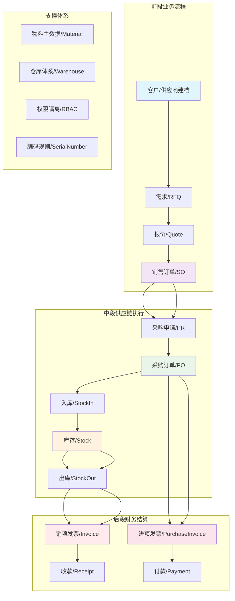
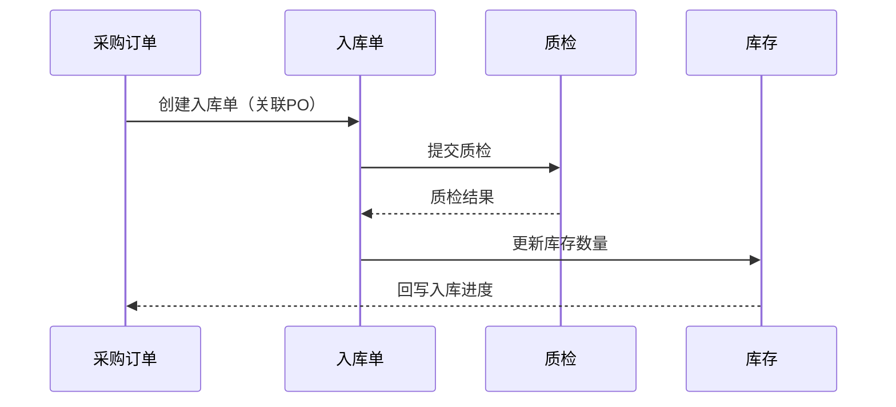
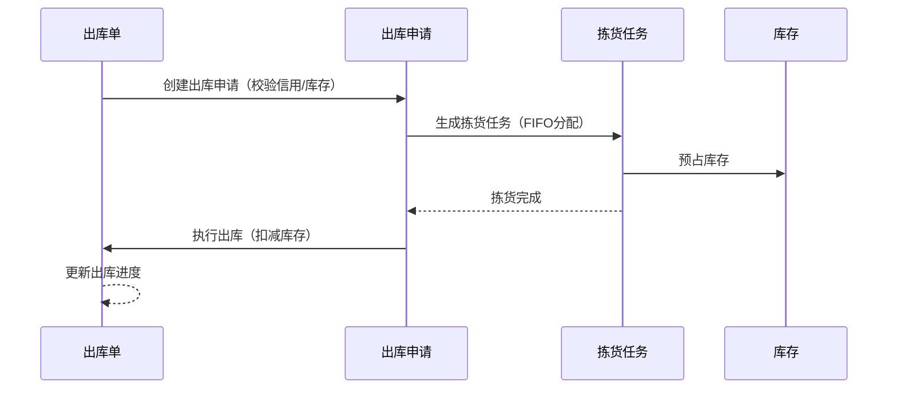
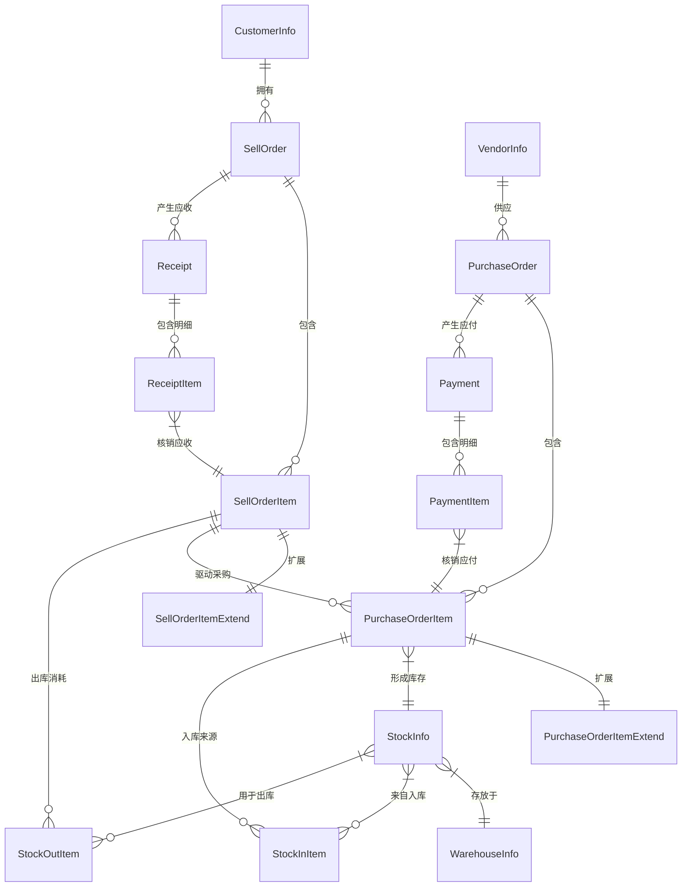

# 业务逻辑与数据关系文档

**文档版本：** v1.0  
**生成日期：** 2026年4月11日  
**项目名称：** FrontCRM_CSharp（AI智销系统）  
**适用对象：** 业务分析师、产品经理、后端开发工程师、测试工程师、数据工程师

---

## 一、业务领域概述

### 1.1 系统定位与核心价值

FrontCRM_CSharp 是一个面向**中小型企业的智能进销存管理系统**，深度融合了客户关系管理（CRM）、供应链管理（SCM）与财务管理（Finance）三大核心领域。系统旨在实现从**商机挖掘 → 销售订单 → 采购执行 → 库存管理 → 财务结算**的全链路数字化闭环，提升企业运营效率与数据决策能力。

**核心价值主张：**
- **以销定采**：销售订单驱动采购，降低库存积压风险
- **业财一体**：业务单据自动生成财务应收/应付，确保账实相符
- **数据穿透**：从客户到供应商，从订单到库存，全链路数据可追溯
- **智能风控**：客户信用额度、库存预警、采购价格监控等多维度风险控制

### 1.2 核心业务领域



### 1.3 关键业务特性

| 特性 | 说明 | 业务价值 |
|------|------|----------|
| **客户信用管理** | 客户建档时设定信用额度，销售订单创建/出库时校验剩余额度 | 控制坏账风险，保障资金安全 |
| **以销定采模式** | 采购订单明细通过 `SellOrderItemId` 关联销售订单明细 | 减少盲目采购，提高库存周转率 |
| **批次成本追溯** | 库存记录关联采购单价，出库时按FIFO计算成本 | 精准核算毛利，支持成本分析 |
| **多维度利润计算** | 报价利润、采购利润、出库利润三层口径 | 支持业务决策与财务分析不同视角 |
| **财务单据核销** | 收款核销应收、付款核销应付，支持分次核销 | 灵活应对实际业务场景 |

---

## 二、核心业务对象模型

### 2.1 业务对象分类

| 类别 | 核心对象 | 关键属性 | 业务含义 |
|------|----------|----------|----------|
| **主数据** | `CustomerInfo` | `CustomerCode`、`OfficialName`、`CreditLine`、`CreditLineRemain`、`Status` | 客户档案，包含信用额度管理 |
| | `VendorInfo` | `Code`、`OfficialName`、`PaymentMethod`、`Status` | 供应商档案，支持多种结算方式 |
| | `MaterialInfo` | `MaterialCode`、`MaterialName`、`CategoryId`、`BrandId` | 物料/商品主数据，支持分类管理 |
| | `WarehouseInfo` | `WarehouseCode`、`WarehouseName`、`Type` | 仓库主数据，支持多仓管理 |
| **销售域** | `SellOrder` | `SellOrderCode`、`CustomerId`、`Status`、`Total` | 销售订单主表，状态机驱动 |
| | `SellOrderItem` | `SellOrderItemCode`、`MaterialId`、`Qty`、`Price` | 销售订单明细，关联物料 |
| | `SellOrderItemExtend` | `QtyAlreadyPurchased`、`QtyStockOutActual`、`ProfitOutBizUsd` | 销售明细扩展，跟踪采购/出库进度与利润 |
| **采购域** | `PurchaseOrder` | `PurchaseOrderCode`、`VendorId`、`Status`、`Type` | 采购订单主表，类型分客单/备货/样品 |
| | `PurchaseOrderItem` | `PurchaseOrderItemCode`、`SellOrderItemId`、`Qty`、`Cost` | 采购订单明细，关键关联销售明细 |
| | `PurchaseOrderItemExtend` | `QtyReceiveTotal`、`PaymentAmountFinish`、`InvoiceProgressStatus` | 采购明细扩展，跟踪入库/付款/发票进度 |
| **库存域** | `StockInfo` | `MaterialId`、`WarehouseId`、`Qty`、`QtyRepertoryAvailable` | 库存主档，多数量维度管理 |
| | `StockIn` | `StockInCode`、`PurchaseOrderId`、`WarehouseId`、`Status` | 入库单，关联采购订单 |
| | `StockOut` | `StockOutCode`、`SellOrderId`、`WarehouseId`、`Status` | 出库单，关联销售订单 |
| **财务域** | `Receipt` | `ReceiptCode`、`CustomerId`、`SellOrderId`、`Status` | 收款单，关联客户与销售订单 |
| | `Payment` | `PaymentCode`、`VendorId`、`PurchaseOrderId`、`Status` | 付款单，关联供应商与采购订单 |
| | `Invoice` | `InvoiceNo`、`InvoiceType`、`OrderType`、`Status` | 发票主表，分进项/销项 |

### 2.2 关键业务属性详解

#### 2.2.1 客户信用控制

```csharp
// CustomerInfo.cs 关键字段
public class CustomerInfo : BaseGuidEntity
{
    public string CustomerCode { get; set; }          // 客户编码，如 CUS00001
    public string OfficialName { get; set; }          // 公司全称
    public decimal? CreditLine { get; set; }          // 信用额度（元）
    public decimal? CreditLineRemain { get; set; }    // 剩余信用额度（元）
    public short Status { get; set; } = 1;           // 状态：1=新建，2=待审核，10=已审核
    public string? SalesUserId { get; set; }         // 归属业务员
}
```

**业务规则：**
- 信用额度在客户建档时由财务/销售主管设定
- 销售订单创建时检查 `CreditLineRemain`，若订单金额超过剩余额度需特殊审批
- 出库完成后，应收金额占用信用额度；收款核销后释放额度

#### 2.2.2 销售订单状态机

```csharp
// SellOrderMainStatus.cs 枚举定义
public enum SellOrderMainStatus : short
{
    New = 1,           // 新建
    PendingAudit = 2,  // 待审核
    Approved = 10,     // 审核通过
    InProgress = 20,   // 进行中（已申请出库）
    Completed = 100,   // 完成
    AuditFailed = -1,  // 审核失败
    Cancelled = -2     // 取消
}
```

**状态流转规则：**
- `New → PendingAudit`：提交审核
- `PendingAudit → Approved/AuditFailed`：审核通过/驳回
- `Approved → InProgress`：申请出库
- `InProgress → Completed`：全部出库完成

#### 2.2.3 采购订单类型与状态

```csharp
// PurchaseOrder.cs 关键字段与注释
/// <summary>
/// 订单类型 1=客单采购 2=备货采购 3=样品采购。
/// 客单：由销售明细/采购申请链路生成且明细带销售行关联；
/// 备货：无销售明细关联的直采；
/// 样品：无销售关联时可选 3。
/// </summary>
public short Type { get; set; } = 1;

/// <summary>
/// 订单状态 1=新建 2=待审核 10=审核通过 20=待确认 30=已确认 50=进行中 100=采购完成 -1=审核失败 -2=取消
/// </summary>
public short Status { get; set; } = 1;
```

**类型区分业务意义：**
- **客单采购**：严格按销售订单驱动，采购明细必须关联 `SellOrderItemId`
- **备货采购**：预测性采购，不关联具体销售订单，用于补充安全库存
- **样品采购**：小批量测试采购，成本计入费用而非库存成本

### 2.3 扩展表设计模式

系统采用**主表 + 扩展表**设计模式，将核心业务属性与统计/进度属性分离：

| 主表 | 扩展表 | 扩展表承载内容 |
|------|--------|----------------|
| `SellOrderItem` | `SellOrderItemExtend` | 采购进度、出库进度、收款进度、开票进度、利润计算 |
| `PurchaseOrderItem` | `PurchaseOrderItemExtend` | 入库进度、付款进度、发票进度、采购进度 |

**设计优势：**
1. **核心表稳定**：主表仅包含业务交易必需字段，结构稳定
2. **扩展灵活**：进度跟踪、统计计算等需求变化不影响核心业务逻辑
3. **性能优化**：高频查询主表字段少，低频统计查询走扩展表

---

## 三、单据体系与状态流转

### 3.1 单据编码规范

系统通过 `SysSerialNumber` 表统一管理所有业务单据的流水号，确保全局唯一性与连续性：

| 模块代码 | 前缀 | 示例 | 业务含义 |
|----------|------|------|----------|
| `Customer` | CUS | CUS00001 | 客户编码 |
| `SalesOrder` | SO | SO202500001 | 销售订单号 |
| `PurchaseOrder` | PO | PO202500001 | 采购订单号 |
| `StockIn` | STI | STI202500001 | 入库单号 |
| `StockOut` | STO | STO202500001 | 出库单号 |
| `Receipt` | REC | REC202500001 | 收款单号 |
| `Payment` | PAY | PAY202500001 | 付款单号 |
| `InputInvoice` | INVI | INVI202500001 | 进项发票号 |
| `OutputInvoice` | INVO | INVO202500001 | 销项发票号 |

**生成规则：**
- 服务端统一生成，忽略客户端传入的单号
- 格式：`前缀 + 年月（6位）+ 流水号（5位）`
- 线程安全：通过数据库锁或分布式锁确保并发安全

### 3.2 核心单据状态机

#### 3.2.1 财务单据状态

```csharp
// 收款单状态
public enum ReceiptStatus
{
    草稿 = 0,
    待审核 = 1,
    已审核 = 2,
    已收款 = 3,
    已取消 = 4
}

// 付款单状态  
public enum PaymentStatus
{
    草稿 = 0,
    待审核 = 1,
    已审核 = 2,
    已付款 = 3,
    已取消 = 4
}

// 发票状态
public enum InvoiceStatus
{
    待认证 = 0,
    已认证 = 1,
    已作废 = 2,
    已红冲 = 3
}
```

#### 3.2.2 库存单据状态

**入库单状态：**
- `0`：新建
- `1`：待质检
- `2`：质检通过
- `3`：已入库
- `-1`：质检失败
- `-2`：取消

**出库单状态：**
- `0`：新建
- `1`：拣货中
- `2`：已拣货
- `3`：已出库
- `-1`：异常
- `-2`：取消

### 3.3 状态同步机制

#### 3.3.1 采购订单与明细状态同步

```csharp
// PurchaseOrderService.ShouldSyncOrderAndItemStatus 逻辑
private bool ShouldSyncOrderAndItemStatus(short targetStatus)
{
    // 当目标状态为 1/2/10/20/30 时，明细状态与主单同步
    return targetStatus == 1  // 新建
        || targetStatus == 2  // 待审核
        || targetStatus == 10 // 审核通过
        || targetStatus == 20 // 待确认
        || targetStatus == 30; // 已确认
}
```

**业务意义：** 在采购订单的**前半段生命周期**（从新建到已确认），明细状态与主单保持一致，确保整体审批一致性；进入执行阶段（进行中、完成）后，明细可按实际进度独立更新。

#### 3.3.2 销售订单进度状态

销售订单通过多个进度字段跟踪各环节完成情况：

| 进度字段 | 计算逻辑 | 更新时机 |
|----------|----------|----------|
| `PurchaseProgressStatus` | 已采购数量 / 销售数量 | 采购订单确认时更新 |
| `StockOutProgressStatus` | 已出库数量 / 销售数量 | 出库单完成时更新 |
| `ReceiptProgressStatus` | 已收款金额 / 应收金额 | 收款单核销时更新 |
| `InvoiceProgressStatus` | 已开票金额 / 应开票金额 | 发票创建时更新 |

---

## 四、库存管理核心逻辑

### 4.1 库存模型设计

#### 4.1.1 库存数量维度

```csharp
// StockInfo.cs 关键字段
public class StockInfo : BaseGuidEntity
{
    public decimal Qty { get; set; }                     // 总入库数量
    public decimal QtyStockOut { get; set; }             // 已出库数量
    public decimal QtyRepertory { get; set; }            // 当前库存 = Qty - QtyStockOut
    public decimal QtyRepertoryAvailable { get; set; }   // 可用库存 = QtyRepertory - 预占数量
    
    // 追溯字段
    public string? PurchaseOrderItemCode { get; set; }   // 关联采购订单明细
    public string? SellOrderItemCode { get; set; }       // 关联销售订单明细
    public DateTime? ProductionDate { get; set; }        // 生产日期，用于FIFO
}
```

**数量关系公式：**
```
当前库存 = 总入库 - 已出库
可用库存 = 当前库存 - 预占数量（已分配未出库）
```

#### 4.1.2 库存成本追溯

库存成本采用**批次成本法**，每个库存批次记录采购单价：

```csharp
// 库存成本关联路径
StockInfo.PurchaseOrderItemCode 
    → PurchaseOrderItem.Id 
    → PurchaseOrderItem.Cost (采购单价)
```

**出库成本计算规则：**
- 出库时按 **FIFO（先进先出）** 原则扣减库存批次
- 成本取批次对应的采购订单明细单价
- 支持多币种，按入库时汇率折算为本位币成本

### 4.2 库存出入库流程

#### 4.2.1 采购入库流程



**关键业务规则：**
1. 入库单可关联采购订单，自动带出采购明细与单价
2. 支持**到货通知 → 质检 → 入库**三段式流程
3. 入库后更新 `PurchaseOrderItemExtend.QtyReceiveTotal`
4. 库存批次记录采购单价，用于后续成本计算

#### 4.2.2 销售出库流程



**关键业务规则：**
1. **出库申请前提**：销售订单状态≥已审核(10)且未完成(100)
2. **库存分配**：按FIFO原则分配，优先分配与销售明细关联的采购批次
3. **信用检查**：出库时校验客户剩余信用额度
4. **成本计算**：出库时按批次采购单价计算成本，更新销售利润

### 4.3 库存分配策略（FIFO实现）

```csharp
// InventoryCenterService.OrderFifo 方法
static IEnumerable<StockInfo> OrderFifo(IEnumerable<StockInfo> q) =>
    q.OrderBy(s => s.ProductionDate ?? s.CreateTime)
      .ThenBy(s => s.CreateTime);
```

**分配优先级：**
1. **生产日期优先**：有生产日期的按生产日期排序
2. **创建时间次之**：无生产日期按库存创建时间排序
3. **关联批次优先**：优先分配与销售明细关联的采购批次
4. **备货批次补充**：关联批次不足时用备货库存补充

---

## 五、财务关联与核销逻辑

### 5.1 业财关联模型

#### 5.1.1 销售侧财务关联

```
销售订单 → 出库完成 → 生成应收 → 销项发票 → 收款核销
    ↓           ↓           ↓          ↓          ↓
SellOrder  StockOut  ReceiptToBe  Invoice   ReceiptVerify
```

**关键字段关联：**
- `SellOrderItemExtend.ReceiptAmount`：应收金额
- `Receipt.SellOrderId`：收款单关联销售订单
- `Invoice.OrderType = "SellOrder"`：销项发票关联销售订单

#### 5.1.2 采购侧财务关联

```
采购订单 → 入库完成 → 生成应付 → 进项发票 → 付款核销
    ↓           ↓           ↓          ↓          ↓
PurchaseOrder  StockIn  PaymentToBe  PurchaseInvoice  PaymentVerify
```

**关键字段关联：**
- `PurchaseOrderItemExtend.PaymentAmount`：应付金额
- `Payment.PurchaseOrderId`：付款单关联采购订单
- `Invoice.OrderType = "PurchaseOrder"`：进项发票关联采购订单

### 5.2 核销机制

#### 5.2.1 收款核销

```csharp
// FinanceReceiptService.VerifyReceiptItemAsync 逻辑
public async Task VerifyReceiptItemAsync(string receiptItemId, decimal verifyAmount)
{
    // 校验：核销金额 > 0 且 ≤ 待核销金额
    if (verifyAmount <= 0 || verifyAmount > receiptItem.VerificationToBe)
        throw new BusinessException("核销金额无效");
    
    // 更新核销进度
    receiptItem.VerificationDone += verifyAmount;
    
    // 同步销售订单收款状态
    await SyncSellOrderReceiptStatusAsync(receiptItem.SellOrderItemId);
}
```

**核销规则：**
1. **分次核销**：同一销售订单允许多次收款、分次核销
2. **金额累计**：累计核销金额 ≤ 应收金额
3. **状态同步**：根据核销进度更新 `SellOrderItemExtend.ReceiptProgressStatus`

#### 5.2.2 付款核销

**核销规则：**
1. **按采购明细核销**：付款单明细关联采购订单明细
2. **多付款单累计**：同一采购明细允许多张付款单核销
3. **进度聚合**：按采购明细聚合核销金额，计算 `PurchaseOrderItemExtend.PaymentProgressStatus`

### 5.3 利润计算口径

系统支持三层利润计算，满足业务与财务不同视角：

| 利润类型 | 计算基准 | 更新时机 | 业务用途 |
|----------|----------|----------|----------|
| **报价利润** | 销售价格 vs 报价成本 | 销售订单创建时 | 销售决策支持 |
| **采购利润** | 销售价格 vs 采购成本 | 采购订单确认时 | 采购绩效评估 |
| **出库利润** | 销售价格 vs 出库批次成本 | 出库完成时 | 实际毛利核算 |

**计算公式：**
```csharp
// 出库利润计算（业务USD口径）
decimal profitOutBizUsd = (sellPriceUsd - batchCostUsd) * outQty;

// 销售明细扩展表记录
public class SellOrderItemExtend
{
    public decimal QuoteProfitExpected { get; set; }      // 报价预期利润
    public decimal PurchaseProfitExpected { get; set; }   // 采购预期利润  
    public decimal ProfitOutBizUsd { get; set; }          // 出库利润（业务USD）
    public decimal ProfitOutFinUsd { get; set; }          // 出库利润（财务USD）
}
```

---

## 六、权限隔离与数据范围

### 6.1 RBAC三层权限模型

系统采用**部门-角色-权限**三层模型，实现细粒度访问控制：

```mermaid
graph TB
    subgraph "权限维度"
        A[部门维度] --> D[数据归属部门]
        B[角色维度] --> E[功能权限集合]
        C[数据维度] --> F[数据可见范围]
    end
    
    subgraph "用户权限合成"
        G[用户] --> H[所属部门]
        G --> I[分配角色]
        H + I --> J[实际权限]
    end
    
    subgraph "数据过滤"
        K[业务数据] --> L[部门字段]
        K --> M[创建人字段]
        J --> N[数据范围过滤器]
        L + M --> N
        N --> O[最终可见数据]
    end
```

### 6.2 数据范围控制策略

#### 6.2.1 销售数据范围

```csharp
// DataPermissionService.FilterCustomersAsync 逻辑
public IQueryable<CustomerInfo> FilterCustomersAsync(IQueryable<CustomerInfo> query, string userId)
{
    var userRange = GetUserDataRange(userId, DataRangeType.Sales);
    
    return userRange switch
    {
        DataRange.All => query,                    // 0:全部数据
        DataRange.Self => query.Where(c => c.SalesUserId == userId), // 1:本人数据
        DataRange.Department => query.Where(c => c.DepartmentId == userDeptId), // 2:本部门
        DataRange.DepartmentWithChildren => query.Where(c => deptTree.Contains(c.DepartmentId)), // 3:含子部门
        _ => query.Where(c => false)               // 4:无权限
    };
}
```

#### 6.2.2 采购数据范围

**控制字段：** `PurchaseOrder.PurchaseUserId`、`PurchaseOrder.PurchaseGroupId`

**分配逻辑：**
- RFQ明细通过轮询算法分配采购员（`AssignedPurchaserUserId1/2`）
- 采购订单创建时继承RFQ明细的采购员分配
- 数据过滤时按采购员或采购组进行范围控制

### 6.3 特殊权限处理

| 场景 | 权限规则 | 实现方式 |
|------|----------|----------|
| **系统管理员** | 不受数据范围限制，查看全部数据 | `DataPermissionService.IsSysAdmin` 检查 |
| **跨部门协作** | 临时授权查看他人数据 | 通过共享链接或临时权限表实现 |
| **历史数据追溯** | 已归档数据权限放宽 | 按时间范围或归档标记特殊处理 |

---

## 七、数据关系图谱

### 7.1 核心ER关系图



### 7.2 关键外键关联

| 关联关系 | 主表字段 | 从表字段 | 关联类型 | 业务含义 |
|----------|----------|----------|----------|----------|
| **销售-采购** | `SellOrderItem.Id` | `PurchaseOrderItem.SellOrderItemId` | 一对多 | 以销定采核心链路 |
| **采购-库存** | `PurchaseOrderItem.Id` | `StockInfo.PurchaseOrderItemCode` | 一对多 | 库存来源追溯 |
| **销售-库存** | `SellOrderItem.Id` | `StockInfo.SellOrderItemCode` | 一对多 | 库存去向追溯 |
| **销售-收款** | `SellOrder.Id` | `Receipt.SellOrderId` | 一对多 | 应收账务关联 |
| **采购-付款** | `PurchaseOrder.Id` | `Payment.PurchaseOrderId` | 一对多 | 应付账务关联 |
| **订单-扩展** | `SellOrderItem.Id` | `SellOrderItemExtend.Id` | 一对一 | 进度统计扩展 |

### 7.3 数据流与状态同步

#### 7.3.1 销售订单生命周期数据流

```
创建销售订单 → 生成采购申请 → 创建采购订单 → 入库 → 出库 → 收款开票
    ↓               ↓               ↓          ↓       ↓       ↓
SellOrderItem   PurchaseRequisition   PurchaseOrder   StockIn   StockOut   Receipt/Invoice
    ↓               ↓               ↓          ↓       ↓       ↓
SellOrderItemExtend.QtyNotPurchase   PurchaseOrderItemExtend.QtyReceiveTotal   SellOrderItemExtend.QtyStockOutActual
```

#### 7.3.2 财务状态同步机制

```csharp
// 收款进度同步逻辑
private async Task SyncSellOrderReceiptStatusAsync(string sellOrderItemId)
{
    var extend = await _sellOrderItemExtendRepo.GetAsync(sellOrderItemId);
    var totalReceivable = extend.ReceiptAmount;  // 应收总额
    var received = extend.ReceiptAmountFinish;   // 已收总额
    
    // 计算进度状态：0=未收，1=部分，2=完成
    short status = 0;
    if (received > 0 && received < totalReceivable)
        status = 1;
    else if (received >= totalReceivable && totalReceivable > 0)
        status = 2;
        
    extend.ReceiptProgressStatus = status;
    await _sellOrderItemExtendRepo.UpdateAsync(extend);
}
```

### 7.4 数据一致性保障

#### 7.4.1 事务边界设计

| 业务操作 | 事务范围 | 一致性要求 |
|----------|----------|----------|
| 创建销售订单 | 主表 + 明细表 + 扩展表 | 原子性：全部成功或全部失败 |
| 采购入库 | 入库单 + 库存更新 + 采购进度更新 | 强一致性：数量与状态同步更新 |
| 收款核销 | 收款单 + 应收更新 + 信用额度释放 | 财务数据严格一致 |

#### 7.4.2 并发控制策略

1. **乐观锁**：关键业务表使用 `Version` 字段或 `UpdateTime` 检查
2. **悲观锁**：流水号生成、库存分配使用数据库行锁
3. **幂等设计**：财务核销、状态更新支持幂等操作，避免重复执行

---

## 八、附录

### 8.1 相关文档索引

| 文档主题 | 文件路径 | 内容概要 |
|----------|----------|----------|
| 业务规则总览 | `document/System/业务规则总览.md` | 各模块核心业务规则汇总 |
| 收付款与发票业务逻辑 | `document/EBS/财务/收付款与发票业务逻辑.md` | 财务模块详细业务流程 |
| 销售订单扩展字段 | `document/EBS/销售/SellOrderItemExtend统计字段文档.md` | 销售明细扩展字段详解 |
| 采购订单扩展字段 | `document/EBS/采购/PurchaseOrderItemExtend统计字段文档.md` | 采购明细扩展字段详解 |
| 用户角色与数据隔离 | `document/EBS/用户角色与数据隔离实现文档.md` | 权限系统详细设计 |

### 8.2 关键枚举值参考

#### 8.2.1 通用状态枚举

| 枚举名 | 值 | 含义 | 适用对象 |
|--------|----|------|----------|
| `CustomerInfo.Status` | 1 | 新建 | 客户、供应商 |
| | 2 | 待审核 | 客户、供应商 |
| | 10 | 已审核 | 客户、供应商 |
| | -1 | 审核失败 | 客户、供应商 |

#### 8.2.2 财务状态枚举

| 枚举名 | 值 | 含义 |
|--------|----|------|
| `ReceiptStatus` | 0 | 草稿 |
| | 1 | 待审核 |
| | 2 | 已审核 |
| | 3 | 已收款 |
| | 4 | 已取消 |
| `PaymentStatus` | 0 | 草稿 |
| | 1 | 待审核 |
| | 2 | 已审核 |
| | 3 | 已付款 |
| | 4 | 已取消 |

### 8.3 数据模型变更历史

| 版本 | 日期 | 变更内容 | 影响范围 |
|------|------|----------|----------|
| v1.0 | 2026-04-11 | 初始版本，基于代码库分析生成 | 全系统 |
| | | 包含7大核心章节：业务领域、对象模型、单据体系、库存管理、财务关联、权限隔离、数据关系 | |

---

*文档生成于 2026年4月11日，基于 FrontCRM_CSharp 代码库深度分析。*  
*业务逻辑会随需求演进不断优化，请关注代码库变更与业务规则文档更新。*