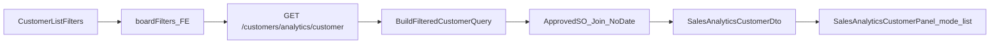

# 客户列表看板 — 设计与实现

**状态：** 已上线  
**页面：** `/customerlist`（`CustomerList`，搜索栏「看板 / 列表」）  
**API：** `GET /api/v1/customers/analytics/customer`  
**UI 对照：** 销售分析「客户」Tab（[`SalesAnalyticsCustomerPanel`](../../../CRM.Web/src/components/Analytics/SalesAnalyticsCustomerPanel.vue)）  
**帮助（业务用户）：** [客户列表 · 看板](../../../help/pages/客户列表看板_MENU_CUSTOMER_HOME_BOARD.md)  
**关联：** [客户列表-左栏检索](./客户列表-左栏检索-设计与实现.md)、[客户列表-筛选页签模式](./客户列表-筛选页签模式-设计与实现.md)、对称实现 [供应商列表看板](../供应商/供应商列表看板-设计与实现.md)

---

## 1. 需求设计

### 1.1 目标

在客户列表搜索栏增加 **看板 / 列表** 切换。看板面板布局与指标 **参考** `/reports/sales` →「客户」Tab；**数据集合** 来自当前搜索栏（含左栏 preset / 收藏）筛出的客户全集，而非报表公司/部门/个人透镜 + 订单日期窗。

### 1.2 产品口径（定稿）

| 项 | 说明 |
|----|------|
| 客户宇宙 | 与列表同源 listFilter：`CustomerQueryRequest`（关键词、状态、等级、类型、行业、结算币、业务员、客户创建日、`quickFilter`、收藏等）+ `ApplyCustomerListDataScopeAsync` |
| 订单宇宙 | 上述客户的 **全部已审核** 销售订单；**不限订单 CreateTime** |
| 成单定义 | 主单 `Status >= Approved`，并排除取消 / 审核失败（与 `SalesAnalyticsDateFilter.ApplyAnalyticsStatusFilter` + 成单条件一致） |
| 金额 | `ConvertTotal`（USD）；Mask 时饼图/排名走订单笔数（销售 521） |
| 列表「创建日」 | 只筛客户 `CreateTime`，**不**当作订单时间窗 |
| 下钻 | 排行点击 → 销售订单列表，带 `customerId`（及名称）；**不带**订单起止日 |

### 1.3 面板（与销售分析客户 Tab 同构）

| 区块 | 内容 |
|------|------|
| KPI | 成单客户数（去重）；复购客户数（成单订单张数 ≥ 2） |
| 饼图 | 客户类型 / 等级 / 行业（有金额权：成单 USD 占比；Mask：订单数占比） |
| 排行 Top10 | 成单金额、成单数、复购订单数（复购订单数 = max(0, 成单数 − 1)） |

### 1.4 与报表客户 Tab 的差异

| | 客户列表看板 | 销售分析 · 客户 |
|--|-------------|----------------|
| 入口 | `/customerlist` 搜索栏切换 | `/reports/sales` 内容 Tab |
| 主体集合 | 列表筛选出的 **客户** | 报表 scope 下周期内 **已审核订单** 再归客户 |
| 订单日期 | **不限** | 顶部 `dateFrom` / `dateTo` |
| Scope 透镜 | 无公司/部门/个人切换（跟列表数据权限） | 公司 / 部门 / 个人 |

### 1.5 非目标

- 不改 `/reports/sales` 客户 Tab 语义。
- 看板内不另加订单日期控件。
- 不做多 Tab 销售分析页嵌入列表。

---

## 2. 数据流

---

## 3. 实现方法

### 3.1 后端

| 层 | 路径 / 符号 |
|----|-------------|
| 接口 | `ICustomerListQuery.GetListAnalyticsCustomerAsync` |
| 筛选复用 | `CustomerListQuery.BuildFilteredCustomerQueryAsync`（与分页列表同源，避免两套 filter） |
| 聚合 | `CustomerListAnalyticsQuery.GetListAnalyticsCustomerAsync`：筛选客户 Join 销售订单数据范围 + 已审核；无日期条件；公式对齐 `SalesAnalyticsQuery.GetCustomerAsync` |
| 控制器 | `CustomersController`：`GET api/v1/customers/analytics/customer`；查询参数对齐 `GetCustomers`；`customer.read`；`SaleMaskHttp` → `maskAmounts` |
| 返回 | `SalesAnalyticsCustomerDto`（`ScopeContext.MaskAmounts` 即可，无需完整报表 Scope） |

**查询参数（与列表一致）：** `searchTerm`、`customerType`、`customerLevel`、`industry`、`currency`、`region`、`salesUserId`、`createdFrom`/`createdTo`、`status`/`isActive`、`favoriteOnly`/`favoriteIds`、`quickFilter`。

### 3.2 前端

| 层 | 路径 / 符号 |
|----|-------------|
| 列表页 | `CustomerList.vue`：`viewMode`、`toggleViewMode`、`boardFilters`；看板 `v-if` / 列表 `v-show`；看板模式下跳过列表分页请求 |
| 薄封装 | `CustomerListBoard.vue` → Panel `mode="list"` |
| 面板 | `SalesAnalyticsCustomerPanel`：`mode: 'list' \| 'report'`；list 调 `customerListAnalyticsApi.getCustomer`；report 仍走 `salesAnalyticsApi.getCustomer` |
| API | `CRM.Web/src/api/customerListAnalytics.ts`（等级字符串经 `mapCustomerLevelToInt`） |
| 收藏 | list 模式请求前若 `favoriteOnly`，前端拉收藏 ID 再传 `favoriteIds` |
| 帮助覆盖 | `useListBoardHelpOverride('pages/客户列表看板_MENU_CUSTOMER_HOME_BOARD.md', viewMode)` |
| i18n | `customerList.filters.boardView/listView`、`customerList.board.hint/loadFailed` |

### 3.3 帮助与文档

- 业务帮助：`help/pages/客户列表看板_MENU_CUSTOMER_HOME_BOARD.md`（口径表 + TOC）；主帮助 [客户](../../../help/pages/客户_MENU_CUSTOMER_HOME.md) 链入看板说明。
- 销售分析帮助「客户」节交叉链到列表看板。
- `npm`/构建前 `scripts/sync-help.mjs` 同步至 `CRM.Web/public/help/`。

---

## 4. 验收要点

1. 搜索栏可见「看板」；切换后展示 KPI / 三饼图 / 三排行，再切「列表」回表格。  
2. 改筛选（含左栏 preset、结算币页签、收藏）后看板随 `boardFilters` 刷新，集合与列表一致（全量匹配，非当前页）。  
3. 列表创建日只影响客户集合；成单统计含历史全部已审核订单。  
4. 无销售金额权限时金额列隐藏/占比改笔数。  
5. 排行下钻进销售订单列表带客户、不带订单日期；无 `sales-order.read` 时提示无权限。  
6. 看板模式下右侧帮助切换为独立看板文档。
