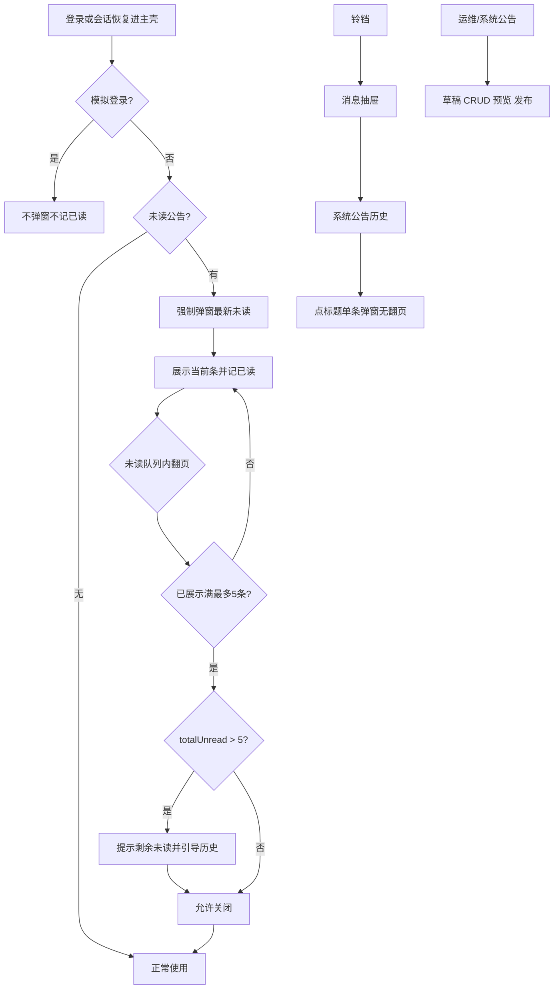

# 系统公告 — 设计与实现

> **状态：** 一期已实现（管理 CRUD/预览/发布 + 登录强制弹窗 + 铃铛历史 + 已读）  
> **关联页面：**  
> - 管理：`/ops/system-announcements`（运维管理 · 系统公告，仅 SuperAdmin）  
> - 用户：顶栏铃铛抽屉 ·「系统公告」Tab；登录后强制公告弹窗  
> **关联：** 静态版本页 `/release-notes` **两套并存**（本功能「版本更新」类型仅为标签，不替代静态页）  
> **QA：** 待补充 `document/QA/系统/系统公告-测试对照说明.md`  
> **帮助：** 实现后摘录至 `help/pages/`（业务语言，见帮助规范）  
> **权限脚本：** 管理端使用 `meta.sysAdminOnly`（与 Debug / 公司邮箱同类）；若需菜单种子/ensure SQL，实现时补充 `scripts/ensure_sys_announcement_*.sql`

---

## 1. 目标与非目标

### 1.1 目标

1. **强制必看**  
   SuperAdmin 发布系统公告后，当前租户可登录用户在登录/会话进入主壳时，若存在未读公告，弹出强制公告窗（不可点遮罩/Esc 关闭）。

2. **管理后台**  
   运维管理菜单组下「系统公告」：创建、编辑、删除、预览、发布；仅 SuperAdmin 可见可进。

3. **历史与入口**  
   顶栏铃铛打开右侧消息抽屉（对齐 AI 助手抽屉）：Tab「系统消息」（一期空态）+「系统公告」（历史列表）；角标 = 当前用户未读公告数。

4. **富文本**  
   公告正文 Markdown：链接可点、可插图；前端渲染后做 XSS 消毒。

### 1.2 非目标（一期不做）

| 项 | 说明 |
|----|------|
| 已发布撤回/下架 | 仅草稿 → 发布；已发布不可编辑、不可删除 |
| 阅读统计/未读名单 | 二期；一期不提供「已读 N / 未读 M」管理端统计 |
| 系统消息业务内容 | Tab 保留空态「敬请期待」 |
| 替代 `/release-notes` | 两套并存 |
| 多站点/超级管理后台下发 | 另议；本版为租户站内公告 |
| 邮件/企微等站外触达 | 不做 |
| 公告正文 i18n | 管理员写什么显示什么；壳子文案走前端 i18n |

---

## 2. 产品定稿规则

### 2.1 公告字段

| 字段 | 规则 |
|------|------|
| 标题 | 必填，最长 **100** 字符 |
| 类型 | 必选；编码见下；**默认「平台通知」** |
| 正文 | Markdown，最长 **50KB**；支持标题/列表/链接/图片等常见语法 |
| 状态 | `draft`（草稿）/ `published`（已发布） |

**类型**

| 展示名 | 编码建议 | 说明 |
|--------|----------|------|
| 平台通知 | `platform_notice` | 默认 |
| 版本更新 | `version_update` | 仅标签；与静态 `/release-notes` 并存 |

### 2.2 生命周期

```
草稿 →（发布，二次确认）→ 已发布
草稿可：编辑 / 删除 / 预览
已发布：不可编辑、不可删除、不可撤回
```

- 发布时写入 `published_at`、`published_by`。  
- 发布确认文案须提示：**发布后不可编辑/删除**。

### 2.3 已读模型

**只落「已读」行，未读用差集计算。**

- 表：`sys_announcement_read`（`announcement_id` + `user_id` 唯一，`read_at`）。  
- **已读时机（方案 A）：展示该条即记已读**（强制弹窗翻到该条、或历史点开该条弹窗时调用已读接口）。  
- **已读用户** = 已读表中该公告的用户。  
- **未读** = 目标受众中无已读行的用户；用户侧「我的未读」= 已发布且当前用户无已读行。  
- **不**在发布时给全员预插「待读」行。

**管理端预览：** 绝不写已读（本地用同一套弹窗组件看效果即可）。

**历史点已读公告：** 仍弹窗只读、无翻页；**不再**调已读接口。

### 2.4 受众与模拟登录

| 项 | 规则 |
|----|------|
| 受众 | 当前租户**可登录用户**（与登录接口一致：停用/删除等不能登录的不算） |
| 模拟登录 | **不显示**系统公告弹窗；**不写入**被模拟用户的已读；保证真实用户本人必看 |
| 新入职 | 发布后入职：无已读行 → 会进入未读（一期不按「发布时在职快照」裁剪受众） |

### 2.5 登录强制弹窗

| 项 | 规则 |
|----|------|
| 触发 | 密码登录 / 微信登录 / 冷启动会话恢复进入主壳后；**模拟登录跳过** |
| 条件 | 存在未读已发布公告 |
| 内容 | 默认展示**最新**未读；`published_at` **降序** |
| 翻页 | 仅在未读队列内翻页；**最多展示最新 5 条未读** |
| 更多未读 | `totalUnread > 5` 时提示剩余条数，并引导前往系统公告历史（开铃铛抽屉并切到「系统公告」Tab） |
| 关窗 | **仅当**弹窗内这批（≤5）均已展示（已读）后，才可点「关闭」；**禁止**点遮罩 / Esc 关闭 |
| 引导 | 弹窗内提供前往「系统公告历史」的链接 |

### 2.6 铃铛与历史

| 项 | 规则 |
|----|------|
| 交互 | 点击顶栏铃铛 → 右侧滑出抽屉（参考 AI 助手 `el-drawer` rtl） |
| Tab | **系统消息**（一期空态）\| **系统公告** |
| 角标 | = 当前用户**未读公告数**（系统消息不计入） |
| 列表 | 已发布公告；**最新在前**；每条独立面板：标题、发布日期、是否已阅读 |
| 点标题 | 打开公告弹窗，正文为该条；**隐藏翻页**；未读则展示即记已读，已读则不调已读接口 |

### 2.7 管理端「系统公告」页

| 项 | 规则 |
|----|------|
| 菜单位置 | 主菜单 **运维管理** 组内新增「系统公告」 |
| 权限 | **仅 SuperAdmin** 菜单可见、路由可进（`sysAdminOnly`） |
| 能力 | 创建、编辑、删除（仅草稿）、**预览**、发布 |
| 预览 | 使用与用户侧**同一套公告弹窗**展示效果；不写已读 |
| 列表 | 默认 **全部（草稿+已发布）**；支持按状态筛选 |
| 编辑器 | **Markdown 文本框** + 下方/右侧预览 + 插图上传（非重型所见即所得） |

### 2.8 Markdown / 图片 / 安全

| 项 | 规则 |
|----|------|
| 渲染 | 前端 `marked`（或现有等价）→ **XSS 消毒**（如 DOMPurify）→ `v-html` |
| 链接 | 可点击；建议 `target="_blank"` + `rel="noopener noreferrer"` |
| 图片 | 上传走现有 `documents/upload`，`bizType = SYS_ANNOUNCEMENT`，鉴权读链；正文插入 `` |
| 上传限制 | 沿用现有文档上传类型/大小策略 |

### 2.9 与版本日志关系

- `/release-notes` 静态页保持不变。  
- 公告类型「版本更新」仅作筛选/展示标签，**不**自动同步或替代静态版本页。

---

## 3. 数据模型（建议）

### 3.1 `sys_announcement`

| 列 | 类型建议 | 说明 |
|----|----------|------|
| id | uuid PK | |
| title | varchar(100) | |
| type | varchar(32) | `platform_notice` / `version_update` |
| body_md | text | Markdown；应用层校验 ≤ 50KB |
| status | varchar(16) | `draft` / `published` |
| published_at | timestamptz NULL | 发布时写入 |
| published_by | uuid/varchar NULL | 发布人 |
| created_at / created_by | | |
| updated_at / updated_by | | 仅草稿更新 |
| is_deleted | bool | 若项目惯例软删；**已发布禁止删**（含软删接口拒绝） |

索引建议：`(status, published_at DESC)` 用于用户列表与未读预览。

### 3.2 `sys_announcement_read`

| 列 | 类型建议 | 说明 |
|----|----------|------|
| id | uuid PK | 或复合主键 |
| announcement_id | uuid | FK → 公告 |
| user_id | uuid | |
| read_at | timestamptz | 首次展示写入 |
| 唯一约束 | (announcement_id, user_id) | |

写入：`INSERT ... ON CONFLICT DO NOTHING`（幂等）。

---

## 4. API 草图

### 4.1 管理（仅 SuperAdmin）

| 方法 | 路径建议 | 说明 |
|------|----------|------|
| GET | `/api/v1/ops/announcements` | 列表；query：`status` 可选 |
| POST | `/api/v1/ops/announcements` | 新建草稿 |
| GET | `/api/v1/ops/announcements/{id}` | 详情（含草稿正文） |
| PUT | `/api/v1/ops/announcements/{id}` | 仅 draft |
| DELETE | `/api/v1/ops/announcements/{id}` | 仅 draft |
| POST | `/api/v1/ops/announcements/{id}/publish` | draft → published |
| POST | 现有 documents upload | `bizType=SYS_ANNOUNCEMENT`，`bizId` 可用公告 id 或临时 id |

非 SA：403 或与项目 SA 页一致的隐身策略（实现时与 Debug/公司邮箱对齐，推荐明确 403）。

### 4.2 用户（可登录用户；模拟登录见 §2.4）

| 方法 | 路径建议 | 说明 |
|------|----------|------|
| GET | `/api/v1/me/announcements/unread-summary` | `{ totalUnread }` 供铃铛角标 |
| GET | `/api/v1/me/announcements/unread-preview?limit=5` | 最新未读最多 5 条 + `totalUnread`；供强制弹窗 |
| GET | `/api/v1/me/announcements` | 历史列表（标题、类型、published_at、isRead）；最新在前 |
| GET | `/api/v1/me/announcements/{id}` | 单条正文（仅已发布） |
| POST | `/api/v1/me/announcements/{id}/read` | 展示即已读；幂等 |

**模拟登录：** 前端不调未读预览/不弹窗；后端若检测到模拟会话，读接口可拒绝写已读（双保险，实现时二选一或并用）。

---

## 5. 前端实现要点

### 5.1 路由与菜单

- 路由：`ops/system-announcements`，`meta: { requiresAuth: true, sysAdminOnly: true, title: '系统公告' }`。  
- `AppLayout` 运维管理组：增加菜单项，**仅 `authStore.user?.isSysAdmin`（或等价）可见**。  
- `RoleEdit` 等菜单分组若维护 ops 列表，同步登记（即使 SA 旁路权限码，保持信息架构一致）。

### 5.2 组件复用

| 组件 | 职责 |
|------|------|
| `SystemAnnouncementModal` | 强制弹窗 / 历史单条 / 管理预览；props：`mode: 'force' \| 'single' \| 'preview'`，是否显示翻页、是否允许关闭、是否调用已读 API |
| `SystemMessageDrawer` | 铃铛抽屉；Tabs：系统消息空态 + 系统公告历史列表 |
| 管理页列表+表单 | Markdown 编辑 + 预览区 + 上传插图 |

强制弹窗：`close-on-click-modal=false`，`close-on-press-escape=false`，无右上角关闭直至可关。

### 5.3 触发时机

1. 主壳挂载且已认证、**非模拟登录** → 拉 `unread-preview` → 有则打开强制弹窗。  
2. 覆盖：`applyAuthPayload` 后进入壳、微信登录进壳、刷新冷启动（`App.vue` / `AppLayout` 统一入口，避免漏路径）。  
3. 角标：进入壳与抽屉打开时刷新 `unread-summary`；标记已读后本地递减或重拉。

### 5.4 XSS

新增共享工具（如 `sanitizeAnnouncementHtml`）：`DOMPurify.sanitize(marked.parse(md))`，强制弹窗与历史/管理预览共用。

---

## 6. 后端实现要点

1. EF 实体 + 迁移；`apply_migrations.sql` 同步增量段（若项目惯例）。  
2. 发布：事务内校验 draft → 置 published + 时间/人。  
3. 用户查询：仅 `status=published`；未读 = NOT EXISTS 已读行。  
4. 排序：一律 `published_at DESC`（空 published 不应出现在用户接口）。  
5. 字段校验：标题 ≤100、正文 ≤50KB、类型枚举、默认 `platform_notice`。  
6. 图片：扩展 documents 白名单允许 `SYS_ANNOUNCEMENT`；读链鉴权与现有附件一致。

---

## 7. 流程示意



---

## 8. 分期

| 期 | 内容 |
|----|------|
| **一期（本文）** | 表 + SA 管理 CRUD/预览/发布 + 登录强制弹窗（≤5）+ 铃铛抽屉历史 + Markdown/图/链 + XSS 消毒 + 已读 + 角标 |
| **二期（另议）** | 阅读统计/未读名单、撤回下架、系统消息业务、站外触达、多站点下发 |

---

## 9. 实现任务清单（开发用）

1. DDL / EF：`sys_announcement`、`sys_announcement_read`；`apply_migrations.sql` 段。  
2. 后端 Ops + Me API；模拟登录写已读防护。  
3. documents：`SYS_ANNOUNCEMENT` bizType。  
4. 前端：消毒工具、公告弹窗、消息抽屉、管理页、菜单/路由、登录后触发、角标。  
5. i18n 壳子文案（中/英）。  
6. QA 对照说明（另文）。  
7. 帮助页摘录（另文，业务语言）。

---

## 10. 修订记录

| 日期 | 说明 |
|------|------|
| 2026-08-10 | 初稿：按产品讨论定稿（已读=展示即记、强制弹窗≤5、禁遮罩/Esc、不撤回、预览不写已读、模拟登录跳过、Markdown 编辑器 A、角标=未读公告数、字段上限、与 release-notes 并存等） |
| 2026-08-10 | **一期实现**：`sys_announcement` / `sys_announcement_read`、Ops/Me API、模拟登录 JWT claim `impersonator`、铃铛抽屉、强制弹窗、管理页、DOMPurify |
