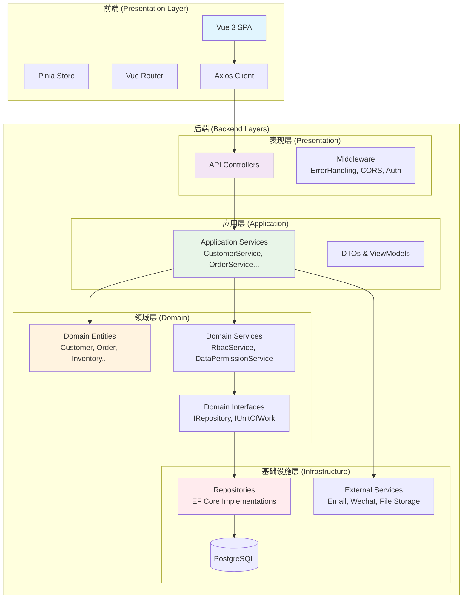
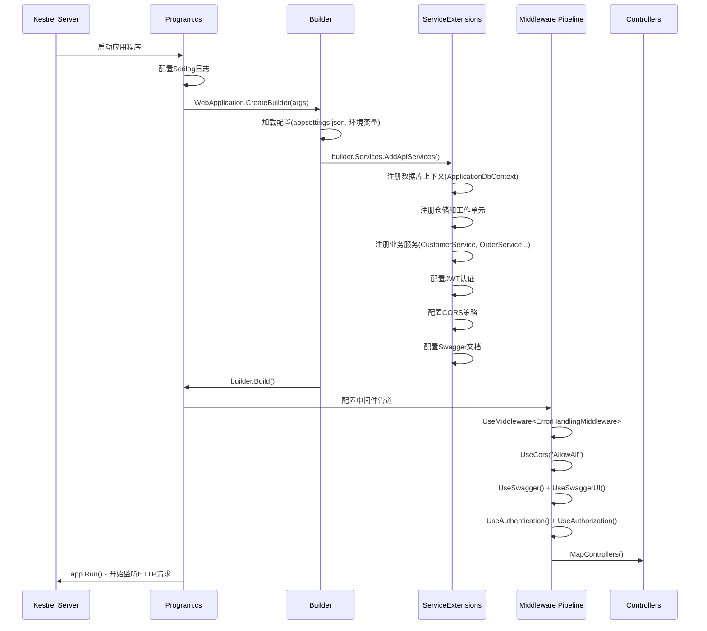
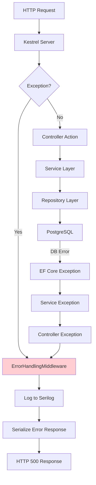
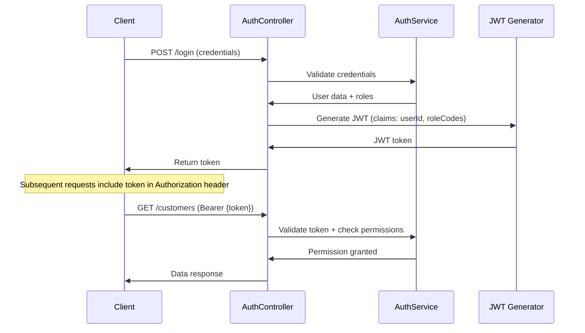

# 系统架构与底层运行机制文档

**文档版本：** v1.0  
**生成日期：** 2026年4月10日  
**项目名称：** FrontCRM_CSharp（AI智销系统）  
**技术栈：** .NET 9.0 + Vue 3 + TypeScript + PostgreSQL  
**适用对象：** 系统架构师、后端开发工程师、前端开发工程师、DevOps工程师、技术负责人

---

## 一、引言（Introduction）

### 1.1 背景与目的
**业务背景：** FrontCRM_CSharp 是一个面向中小型企业的智能进销存管理系统，旨在整合销售、采购、库存、财务等核心业务流程，实现数据驱动的业务决策和自动化工作流。

**文档目的：** 本文档旨在全面描述系统的**技术架构**与**底层运行机制**，为开发团队提供统一的技术理解，为新成员提供快速上手指南，并为系统演进提供架构决策依据。

**核心目标：**
- 阐明系统分层架构与模块职责
- 描述关键技术栈选型与配置
- 解释核心运行机制（启动、配置、依赖注入、异常处理、日志）
- 说明部署环境与容器化方案
- 记录已知技术问题与待决策项

### 1.2 读者对象
- **系统架构师**：了解整体架构设计、技术选型理由、扩展性考虑
- **后端开发工程师**：掌握服务注册、数据访问、API设计、异常处理
- **前端开发工程师**：理解前端技术栈、状态管理、API调用规范
- **DevOps工程师**：熟悉部署环境、容器配置、健康检查、监控指标
- **技术负责人**：评估技术债务、规划架构演进、制定开发规范

### 1.3 变更历史
| 版本 | 日期 | 作者 | 变更说明 |
|------|------|------|----------|
| v1.0 | 2026-04-10 | AI助手 | 初始版本，基于代码库分析生成完整架构文档 |

---

## 二、系统概览（System Overview）

### 2.1 业务背景与核心功能
**业务领域：** 进销存管理（Sales, Purchase, Inventory, Finance）

**核心功能模块：**
- **客户管理**：客户信息、联系人、地址、银行账户、联系历史
- **供应商管理**：供应商信息、联系人、地址、银行账户
- **需求管理（RFQ）**：客户发布采购需求，包含物料明细
- **报价管理**：供应商对RFQ进行报价
- **销售订单**：基于报价生成销售合同
- **采购订单**：基于需求生成采购合同
- **库存管理**：物料主数据、库存记录、入库/出库操作
- **财务管理**：收款、付款、进项发票、销项发票、汇率管理
- **权限管理（RBAC）**：基于部门、角色、权限的三维访问控制
- **文档管理**：文件上传、预览、缩略图生成

### 2.2 系统边界与集成点
**内部边界：**
- 前端SPA（Vue 3）与后端API（.NET 9.0）分离
- 后端采用分层架构（Presentation → Application → Domain → Infrastructure）

**外部集成：**
- **数据库**：PostgreSQL（关系型数据存储）
- **认证**：JWT（JSON Web Token）无状态认证
- **文件存储**：本地文件系统（可扩展至云存储）
- **邮件服务**：SMTP（通过MailKit集成）
- **微信登录**：OAuth2.0（预留接口）
- **第三方API**：汇率查询、物流跟踪（预留扩展点）

### 2.3 架构原则与约束
**设计原则：**
1. **分层清晰**：遵循Clean Architecture/Onion Architecture，明确各层职责
2. **依赖倒置**：高层模块不依赖低层模块，均依赖抽象接口
3. **领域驱动**：核心业务逻辑集中在Domain层，独立于基础设施
4. **API优先**：RESTful API设计，版本控制（/api/v1/）
5. **配置外化**：所有环境相关配置通过配置文件或环境变量管理

**技术约束：**
- 后端必须使用.NET 9.0+（已采用）
- 数据库必须支持事务和JSONB（PostgreSQL 15+）
- 前端必须支持现代浏览器（Chrome 90+, Firefox 88+, Edge 90+）
- 部署必须支持容器化（Docker 20.10+）

---

## 三、技术栈与基础设施（Technology Stack & Infrastructure）

### 3.1 后端技术栈（Backend）
| 组件 | 版本 | 用途 | 备注 |
|------|------|------|------|
| **.NET Runtime** | 9.0.0 | 应用程序运行时 | 跨平台支持 |
| **ASP.NET Core** | 9.0.11 | Web API框架 | 提供HTTP管道、中间件、依赖注入 |
| **Entity Framework Core** | 9.0.11 | ORM框架 | 数据库访问、迁移、LINQ查询 |
| **Npgsql.EntityFrameworkCore.PostgreSQL** | 9.0.3 | PostgreSQL提供程序 | EF Core与PostgreSQL连接 |
| **Serilog** | 10.0.0 | 结构化日志记录 | 控制台、文件输出，支持日志级别过滤 |
| **BCrypt.Net-Next** | 4.1.0 | 密码哈希 | 用户密码安全存储 |
| **System.IdentityModel.Tokens.Jwt** | 8.8.0 | JWT处理 | 生成和验证JWT令牌 |
| **MailKit** | 4.14.1 | 邮件发送 | SMTP客户端，支持SSL/TLS |
| **Swashbuckle.AspNetCore** | 7.2.0 | Swagger/OpenAPI文档 | 自动生成API文档，集成UI |

### 3.2 前端技术栈（Frontend）
| 组件 | 版本 | 用途 | 备注 |
|------|------|------|------|
| **Vue.js** | 3.5.13 | 前端框架 | 渐进式JavaScript框架 |
| **TypeScript** | ~5.7.3 | 类型化JavaScript | 提供静态类型检查 |
| **Vite** | 6.1.0 | 构建工具与开发服务器 | 快速冷启动、热模块替换 |
| **Pinia** | 2.3.0 | 状态管理 | Vue官方推荐的状态管理库 |
| **Element Plus** | 2.9.1 | UI组件库 | 基于Vue 3的桌面端组件库 |
| **Vue Router** | 4.5.0 | 路由管理 | 单页面应用路由 |
| **Axios** | 1.7.9 | HTTP客户端 | Promise-based API调用 |
| **Vue I18n** | 11.3.0 | 国际化 | 多语言支持 |
| **Vitest** | 4.1.0 | 测试框架 | Vite原生测试框架，支持单元测试 |

### 3.3 数据库（Database）
| 组件 | 版本 | 用途 | 关键特性 |
|------|------|------|----------|
| **PostgreSQL** | 15.0+ | 主数据存储 | 支持JSONB、全文搜索、分区表、窗口函数 |
| **数据库驱动** | Npgsql 9.0.3 | .NET连接驱动 | 异步操作、连接池、预处理语句 |

**数据库选型理由：**
- **事务完整性**：ACID支持，确保财务数据一致性
- **JSONB支持**：灵活存储半结构化数据（如扩展字段）
- **地理空间支持**：PostGIS扩展可用于物流追踪（预留）
- **成熟生态**：丰富的工具链和社区支持

### 3.4 第三方服务与工具（Third-party Services & Tools）
| 服务/工具 | 用途 | 集成状态 |
|-----------|------|----------|
| **微信开放平台** | 用户扫码登录、消息推送 | 预留接口，已定义服务契约 |
| **SMTP服务器** | 邮件通知（订单确认、密码重置） | 已集成（MailKit） |
| **文件存储** | 文档上传、预览 | 本地文件系统，可扩展至云存储 |
| **日志聚合** | 集中式日志分析 | 预留（可通过Serilog Sink扩展至ELK/Seq） |

### 3.5 开发工具与环境（Development Tools）
| 工具 | 用途 | 备注 |
|------|------|------|
| **Visual Studio / VS Code** | 代码编辑、调试 | 推荐VS Code + C#扩展 |
| **Git** | 版本控制 | 分支策略：Git Flow变体 |
| **Docker Desktop** | 容器化开发环境 | 用于本地多服务编排 |
| **Postman / Insomnia** | API测试 | 用于调试RESTful端点 |
| **pgAdmin / DBeaver** | 数据库管理 | 可视化SQL查询和数据浏览 |

---

## 四、模块架构与职责划分（Module Architecture & Responsibilities）

### 4.1 分层架构图


### 4.2 各层职责说明

#### 4.2.1 前端层（Presentation Layer - Frontend）
**技术栈：** Vue 3 + TypeScript + Pinia + Element Plus

**核心职责：**
- 提供用户界面（UI）和用户体验（UX）
- 管理客户端状态（Pinia Store）
- 处理路由导航（Vue Router）
- 调用后端API（Axios）
- 表单验证、数据绑定、组件通信
- 国际化（Vue I18n）
- 权限控制（v-permission指令）

**关键目录：**
- `CRM.Web/src/views/` - 页面组件
- `CRM.Web/src/components/` - 可复用组件
- `CRM.Web/src/stores/` - Pinia状态管理
- `CRM.Web/src/api/` - API客户端封装
- `CRM.Web/src/utils/permission.ts` - 权限工具函数

#### 4.2.2 后端表现层（Presentation Layer - Backend）
**技术栈：** ASP.NET Core Web API

**核心职责：**
- 接收HTTP请求，返回HTTP响应
- 请求验证（模型绑定、数据注解）
- 路由分发（Attribute Routing）
- 身份认证与授权（JWT Middleware）
- 跨域资源共享（CORS）
- 全局异常处理（ErrorHandlingMiddleware）
- API版本控制（/api/v1/前缀）
- Swagger文档生成

**关键文件：**
- `CRM.API/Controllers/*.cs` - API控制器
- `CRM.API/Middlewares/*.cs` - 自定义中间件
- `CRM.API/Extensions/ServiceExtensions.cs` - 服务注册扩展
- `CRM.API/Program.cs` - 应用程序入口点

#### 4.2.3 应用层（Application Layer）
**技术栈：** .NET 9.0 + 依赖注入

**核心职责：**
- 协调领域对象完成用例
- 事务管理（Unit of Work）
- DTO（Data Transfer Object）定义与映射
- 业务逻辑验证（简单规则）
- 调用领域服务和基础设施服务
- 处理跨聚合的业务流程

**关键目录：**
- `CRM.Core/Services/*.cs` - 应用服务实现
- `CRM.Core/Interfaces/*.cs` - 服务接口定义
- `CRM.Core/Models/DTOs/*.cs` - 数据传输对象

#### 4.2.4 领域层（Domain Layer）
**技术栈：** .NET 9.0 纯类库

**核心职责：**
- 封装核心业务逻辑和规则
- 定义领域实体（Entity）、值对象（Value Object）
- 定义仓储接口（IRepository<T>）
- 定义领域服务接口
- 实现不变的业务规则
- 管理聚合根和聚合边界

**关键目录：**
- `CRM.Core/Models/*.cs` - 领域实体
- `CRM.Core/Interfaces/*.cs` - 领域接口
- `CRM.Core/Constants/*.cs` - 常量定义
- `CRM.Core/Enums/*.cs` - 枚举类型

#### 4.2.5 基础设施层（Infrastructure Layer）
**技术栈：** Entity Framework Core + PostgreSQL + 第三方库

**核心职责：**
- 数据持久化实现（EF Core Repository）
- 数据库迁移管理
- 外部服务集成（邮件、微信、文件存储）
- 配置管理（appsettings.json）
- 日志记录实现（Serilog）
- 缓存实现（预留）
- 消息队列集成（预留）

**关键目录：**
- `CRM.Infrastructure/Data/` - 数据库上下文和配置
- `CRM.Infrastructure/Repositories/` - 仓储实现
- `CRM.Infrastructure/Extensions/` - 基础设施服务注册
- `CRM.Infrastructure/Document/` - 文档模块实现
- `CRM.Infrastructure/External/` - 外部服务集成

### 4.3 核心模块映射

| 业务模块 | 领域实体 | 应用服务 | API控制器 | 前端路由 |
|----------|----------|----------|-----------|----------|
| **客户管理** | CustomerInfo, CustomerAddress, CustomerContactInfo | CustomerService | CustomersController | `/customers` |
| **供应商管理** | VendorInfo, VendorAddress, VendorContactInfo | VendorService | VendorsController | `/vendors` |
| **需求管理** | RFQ, RFQItem | RFQService | RFQsController | `/rfqs` |
| **报价管理** | Quote, QuoteItem | QuoteService | QuotesController | `/quotes` |
| **销售订单** | SellOrder, SellOrderItem | SalesOrderService | SalesOrdersController | `/sales-orders` |
| **采购订单** | PurchaseOrder, PurchaseOrderItem | PurchaseOrderService | PurchaseOrdersController | `/purchase-orders` |
| **库存管理** | StockInfo, StockIn, StockOut；规划增加 StockItem（`stockitem`）与 InventoryCenter 过账 | StockInService, StockOutService, InventoryCenterService | StockInController, StockOutController 等 | `/inventory` |
| **财务管理** | FinanceReceipt, FinancePayment, FinanceInvoice | FinanceReceiptService, FinancePaymentService | FinanceReceiptsController, FinancePaymentsController | `/finance` |
| **权限管理** | RbacDepartment, RbacRole, RbacPermission | RbacService, DataPermissionService | RbacController | `/rbac` |
| **文档管理** | DocumentFile, DocumentFolder | DocumentService | DocumentsController | `/documents` |

---

## 五、核心运行机制（Core Runtime Mechanisms）

### 5.1 启动与初始化流程

#### 5.1.1 应用程序启动序列



#### 5.1.2 数据库连接检查
应用程序启动时执行数据库连接验证，确保API启动前数据库可访问：

```csharp
// Program.cs 中的数据库检查逻辑
using (var scope = app.Services.CreateScope())
{
    var context = scope.ServiceProvider.GetRequiredService<ApplicationDbContext>();
    var canConnect = context.Database.CanConnect();
    if (!canConnect)
    {
        throw new InvalidOperationException("无法连接到数据库，请检查数据库连接字符串和数据库服务状态。");
    }
    
    // 检查待执行迁移（仅警告，不自动执行）
    var pendingMigrations = context.Database.GetPendingMigrations().ToList();
    if (pendingMigrations.Count > 0)
    {
        Log.Warning("检测到待执行迁移数量: {Count}。API启动不会自动迁移数据库。", pendingMigrations.Count);
    }
}
```

### 5.2 依赖注入与服务生命周期

#### 5.2.1 服务注册层次

```csharp
// 基础设施层注册（CRM.Infrastructure.Extensions.ServiceCollectionExtensions.cs）
public static IServiceCollection AddInfrastructure(this IServiceCollection services, string connectionString)
{
    // 1. 数据库上下文（Scoped）
    services.AddDbContext<ApplicationDbContext>(options =>
    {
        options.UseNpgsql(connectionString);
        options.ConfigureWarnings(w => w.Ignore(RelationalEventId.PendingModelChangesWarning));
    });
    
    // 2. 泛型仓储（Scoped）
    services.AddScoped(typeof(IRepository<>), typeof(Repository<>));
    
    // 3. 工作单元（Scoped）
    services.AddScoped<IUnitOfWork, UnitOfWork>();
    
    // 4. 业务服务（Scoped）
    services.AddScoped<ISerialNumberService, SerialNumberService>();
    services.AddScoped<IComponentDataService, MockComponentDataService>();
    services.AddScoped<IErrorLogService, ErrorLogService>();
    
    return services;
}

// 应用层注册（CRM.API.Extensions.ServiceExtensions.cs）
public static IServiceCollection AddApiServices(this IServiceCollection services, IConfiguration configuration)
{
    // 1. 注册基础设施
    var connectionString = configuration.GetConnectionString("DefaultConnection");
    services.AddInfrastructure(connectionString);
    
    // 2. 注册应用服务（Scoped）
    services.AddScoped<IAuthService, AuthService>();
    services.AddScoped<IUserService, UserService>();
    services.AddScoped<ICustomerService, CustomerService>();
    services.AddScoped<IVendorService, VendorService>();
    services.AddScoped<IRFQService, RFQService>();
    services.AddScoped<IQuoteService, QuoteService>();
    services.AddScoped<ISalesOrderService, SalesOrderService>();
    services.AddScoped<IPurchaseOrderService, PurchaseOrderService>();
    services.AddScoped<IStockInService, StockInService>();
    services.AddScoped<IStockOutService, StockOutService>();
    services.AddScoped<IFinancePaymentService, FinancePaymentService>();
    services.AddScoped<IFinanceReceiptService, FinanceReceiptService>();
    
    // 3. RBAC服务注册
    services.AddScoped<IRbacService, RbacService>();
    services.AddScoped<IDataPermissionService, DataPermissionService>();
    
    // 4. 文档模块配置
    services.AddDocumentModule(configuration);
    
    // 5. 认证配置（JWT）
    services.AddAuthentication(JwtBearerDefaults.AuthenticationScheme)
        .AddJwtBearer(options =>
        {
            options.TokenValidationParameters = new TokenValidationParameters
            {
                ValidateIssuer = true,
                ValidateAudience = true,
                ValidateLifetime = true,
                ValidateIssuerSigningKey = true,
                ValidIssuer = JwtSettings.Issuer,
                ValidAudience = JwtSettings.Audience,
                IssuerSigningKey = new SymmetricSecurityKey(Encoding.UTF8.GetBytes(JwtSettings.SecretKey))
            };
        });
    
    return services;
}
```

#### 5.2.2 生命周期管理

| 生命周期 | 适用场景 | 注册方式 | 注意事项 |
|----------|----------|----------|----------|
| **Singleton** | 全局配置、缓存服务、连接池 | `AddSingleton<T>()` | 确保线程安全 |
| **Scoped** | 数据库上下文、业务服务、仓储 | `AddScoped<T>()` | 每个请求一个实例 |
| **Transient** | 轻量级服务、工具类、工厂 | `AddTransient<T>()` | 每次请求创建新实例 |

### 5.3 配置管理机制

#### 5.3.1 配置源优先级

```csharp
// Program.cs - 配置构建器
var builder = WebApplication.CreateBuilder(args);

// 配置源优先级（从高到低）：
// 1. 环境变量（ASPNETCORE_ENVIRONMENT）
// 2. 命令行参数
// 3. appsettings.{Environment}.json
// 4. appsettings.json
// 5. 用户机密（仅开发环境）
// 6. 其他自定义配置源
```

#### 5.3.2 环境配置差异

| 环境 | 配置文件 | 主要差异 |
|------|----------|----------|
| **Development** | `appsettings.Development.json` | 本地数据库连接、详细日志、Swagger启用 |
| **Staging** | `appsettings.Staging.json` | 准生产数据库、生产级别日志 |
| **Production** | `appsettings.Production.json` | 生产数据库、错误日志聚合、性能优化 |
| **Remote** | `appsettings.Remote.json` | 腾讯云环境特定配置 |

### 5.4 异常处理管道

#### 5.4.1 异常处理层次



#### 5.4.2 全局异常中间件

```csharp
// CRM.API.Middlewares.ErrorHandlingMiddleware.cs
public class ErrorHandlingMiddleware
{
    private readonly RequestDelegate _next;
    private readonly ILogger<ErrorHandlingMiddleware> _logger;
    
    public async Task InvokeAsync(HttpContext context)
    {
        try
        {
            await _next(context);
        }
        catch (Exception ex)
        {
            _logger.LogError(ex, "An unhandled exception occurred");
            await HandleExceptionAsync(context, ex);
        }
    }
    
    private static Task HandleExceptionAsync(HttpContext context, Exception exception)
    {
        context.Response.ContentType = "application/json";
        context.Response.StatusCode = (int)HttpStatusCode.InternalServerError;
        
        var response = new
        {
            success = false,
            message = $"{exception.Message} | {exception.InnerException?.Message}",
            errorCode = 500,
            data = (object?)null
        };
        
        return context.Response.WriteAsync(JsonSerializer.Serialize(response));
    }
}
```

### 5.5 日志记录机制

#### 5.5.1 日志配置结构

```json
// appsettings.json - Serilog配置
{
  "Serilog": {
    "MinimumLevel": {
      "Default": "Information",
      "Override": {
        "Microsoft": "Warning",
        "Microsoft.AspNetCore.Hosting": "Information",
        "Microsoft.AspNetCore.Server.Kestrel": "Information",
        "Microsoft.EntityFrameworkCore": "Warning",
        "System": "Warning"
      }
    },
    "WriteTo": [
      {
        "Name": "Console",
        "Args": {
          "outputTemplate": "[{Timestamp:yyyy-MM-dd HH:mm:ss} {Level:u3}] {Message:lj}{NewLine}{Exception}"
        }
      },
      {
        "Name": "File",
        "Args": {
          "path": "Logs/log-.txt",
          "rollingInterval": "Day",
          "retainedFileCountLimit": 30
        }
      }
    ],
    "Enrich": ["FromLogContext", "WithMachineName", "WithEnvironmentName"]
  }
}
```

#### 5.5.2 日志输出目标

| 输出目标 | 环境 | 用途 | 级别 |
|----------|------|------|------|
| **Console** | 全部 | 开发调试、容器日志 | Information+ |
| **File** | 全部 | 持久化存储、审计 | Information+ |
| **结构化日志** | 生产 | 日志聚合分析 | Warning+ |

---

## 六、集成与交互机制（Integration）

### 6.1 API契约规范

#### 6.1.1 RESTful API设计

| 设计原则 | 实现方式 | 示例 |
|----------|----------|------|
| **资源导向** | 名词复数表示资源 | `/api/v1/customers` |
| **HTTP方法语义** | GET/POST/PUT/DELETE对应CRUD | `GET /customers/{id}` |
| **版本控制** | URL路径包含版本号 | `/api/v1/...` |
| **统一响应格式** | 标准化JSON响应 | `{ success, message, data }` |

#### 6.1.2 认证与授权

**JWT认证流程：**



#### 6.1.3 API版本控制策略

| 策略 | 实现方式 | 优点 | 缺点 |
|------|----------|------|------|
| **URL路径** | `/api/v1/customers` | 清晰直观、易于缓存 | URL冗长 |
| **查询参数** | `/customers?version=1` | URL简洁 | 缓存困难 |
| **请求头** | `Accept: application/vnd.api.v1+json` | 语义明确 | 客户端支持复杂 |

**当前实现：** URL路径版本控制

```csharp
[ApiController]
[Route("api/v1/[controller]")]
public class CustomerController : ControllerBase
{
    // API endpoints...
}
```

### 6.2 事件与消息机制

#### 6.2.1 同步事件处理

```csharp
// 领域事件定义
public class SalesOrderCreatedEvent : IDomainEvent
{
    public Guid OrderId { get; }
    public DateTime CreatedAt { get; }
    
    public SalesOrderCreatedEvent(Guid orderId)
    {
        OrderId = orderId;
        CreatedAt = DateTime.UtcNow;
    }
}

// 事件处理器（同步）
public class SalesOrderCreatedEventHandler 
    : IEventHandler<SalesOrderCreatedEvent>
{
    private readonly IEmailService _emailService;
    
    public async Task Handle(SalesOrderCreatedEvent @event)
    {
        // 发送通知邮件
        await _emailService.SendOrderCreatedNotificationAsync(@event.OrderId);
    }
}
```

#### 6.2.2 异步消息队列（规划中）

| 消息队列 | 应用场景 | 状态 |
|----------|----------|------|
| **RabbitMQ** | 高可用、复杂路由 | 规划中 |
| **Azure Service Bus** | 企业级集成 | 未采用 |
| **PostgreSQL Listen/Notify** | 简单通知 | 潜在方案 |

### 6.3 外部系统集成

#### 6.3.1 微信登录集成

```csharp
// 微信认证服务接口
public interface IWechatAuthService
{
    Task<WechatLoginResult> LoginWithWechatAsync(string code);
    Task<WechatBindResult> BindWechatAccountAsync(string userId, string wechatOpenId);
    Task<WechatUnbindResult> UnbindWechatAccountAsync(string userId);
}

// 微信登录票据仓储
public interface IWechatLoginTicketRepository
{
    Task<WechatLoginTicket?> GetByTicketAsync(string ticket);
    Task<int> CleanExpiredAsync(DateTime before);
}
```

#### 6.3.2 邮件服务集成

```csharp
// 邮件发送服务实现
public class SmtpEmailSender : IEmailSender
{
    private readonly ILogger<SmtpEmailSender> _logger;
    private readonly IConfiguration _configuration;
    
    public async Task SendAsync(string to, string subject, string body)
    {
        using var client = new SmtpClient();
        // SMTP配置...
        
        try
        {
            var message = new MimeMessage();
            message.From.Add(new MailboxAddress("FrontCRM", "noreply@frontcrm.com"));
            message.To.Add(new MailboxAddress("", to));
            message.Subject = subject;
            message.Body = new TextPart("html") { Text = body };
            
            await client.SendAsync(message);
            _logger.LogInformation("邮件发送成功: {To}", to);
        }
        catch (Exception ex)
        {
            _logger.LogError(ex, "邮件发送失败: {To}", to);
            throw;
        }
    }
}
```

---

## 七、部署与运行环境（Deployment）

### 7.1 运行时环境

#### 7.1.1 技术栈版本

| 组件 | 版本要求 | 备注 |
|------|----------|------|
| **.NET Runtime** | 9.0.0+ | 支持Windows/Linux/macOS |
| **Node.js** | 18.0.0+ | 前端构建依赖 |
| **PostgreSQL** | 15.0+ | 支持JSONB、分区表 |
| **Docker** | 20.10.0+ | 容器化部署 |

#### 7.1.2 操作系统兼容性

| 环境 | 操作系统 | 支持状态 |
|------|----------|----------|
| **开发环境** | Windows 10/11, macOS 12+, Ubuntu 20.04+ | ✅ 完全支持 |
| **生产环境** | Ubuntu 22.04 LTS, CentOS 8+, Windows Server 2022 | ✅ 完全支持 |

### 7.2 环境配置差异

#### 7.2.1 开发环境配置

```json
// appsettings.Development.json
{
  "ConnectionStrings": {
    "DefaultConnection": "Host=localhost;Port=5432;Database=FrontCRM_Dev;Username=postgres;Password=postgres123"
  },
  "Logging": {
    "LogLevel": {
      "Default": "Debug",
      "Microsoft": "Information",
      "System": "Information"
    }
  },
  "AllowedHosts": "*",
  "Swagger": {
    "Enabled": true
  }
}
```

#### 7.2.2 生产环境配置

```json
// appsettings.Production.json
{
  "ConnectionStrings": {
    "DefaultConnection": "Host=production-db.example.com;Port=5432;Database=FrontCRM_Prod;Username=app_user;Password=***"
  },
  "Logging": {
    "LogLevel": {
      "Default": "Warning",
      "Microsoft": "Warning",
      "System": "Warning"
    }
  },
  "AllowedHosts": ["frontcrm.com", "www.frontcrm.com"],
  "Swagger": {
    "Enabled": false
  },
  "Security": {
    "CorsOrigins": ["https://frontcrm.com"]
  }
}
```

### 7.3 容器化部署

#### 7.3.1 Docker容器配置

```dockerfile
# Dockerfile.backend - 后端应用
FROM mcr.microsoft.com/dotnet/aspnet:9.0 AS base
WORKDIR /app
EXPOSE 80
EXPOSE 443

FROM mcr.microsoft.com/dotnet/sdk:9.0 AS build
WORKDIR /src
COPY ["CRM.API/CRM.API.csproj", "CRM.API/"]
COPY ["CRM.Core/CRM.Core.csproj", "CRM.Core/"]
COPY ["CRM.Infrastructure/CRM.Infrastructure.csproj", "CRM.Infrastructure/"]
RUN dotnet restore "CRM.API/CRM.API.csproj"
COPY . .
WORKDIR "/src/CRM.API"
RUN dotnet build "CRM.API.csproj" -c Release -o /app/build

FROM build AS publish
RUN dotnet publish "CRM.API.csproj" -c Release -o /app/publish

FROM base AS final
WORKDIR /app
COPY --from=publish /app/publish .
ENTRYPOINT ["dotnet", "CRM.API.dll"]
```

#### 7.3.2 Docker Compose编排

```yaml
# docker-compose.yml
version: '3.8'

services:
  postgres:
    image: postgres:15-alpine
    container_name: frontcrm-postgres
    environment:
      POSTGRES_USER: postgres
      POSTGRES_PASSWORD: postgres123
      POSTGRES_DB: FrontCRM
  backend:
    build:
      context: .
      dockerfile: Dockerfile.backend
    container_name: frontcrm-backend
    environment:
      ASPNETCORE_URLS: http://+:5000
  frontend:
    build:
      context: CRM.Web
      dockerfile: Dockerfile
    container_name: frontcrm-frontend
    ports:
      - "80:80"
```

### 7.4 健康检查与监控

#### 7.4.1 健康检查端点

```csharp
// CRM.API.Controllers.HealthController.cs
[ApiController]
[Route("api/v1/[controller]")]
public class HealthController : ControllerBase
{
    [HttpGet]
    public ActionResult<object> Get()
    {
        return Ok(new
        {
            success = true,
            message = "FrontCRM API is running",
            timestamp = DateTime.UtcNow,
            version = "1.0.0"
        });
    }
    
    [HttpGet("db")]
    public async Task<ActionResult<object>> CheckDatabase()
    {
        try
        {
            // 数据库连接检查
            var canConnect = await _context.Database.CanConnectAsync();
            return Ok(new
            {
                success = canConnect,
                message = canConnect ? "Database connected" : "Database connection failed"
            });
        }
        catch (Exception ex)
        {
            return StatusCode(500, new
            {
                success = false,
                message = $"Database health check failed: {ex.Message}"
            });
        }
    }
}
```

#### 7.4.2 监控指标

| 监控类别 | 指标 | 采集方式 | 告警阈值 |
|----------|------|----------|----------|
| **应用性能** | 响应时间、吞吐量、错误率 | Application Insights、Prometheus | >5s、<10rps、>5% |
| **系统资源** | CPU、内存、磁盘IO | 操作系统监控、cAdvisor | >80%、>85%、>90% |
| **数据库** | 连接数、查询性能、锁等待 | PostgreSQL 统计、pg_stat_statements | >80%、>200ms、>10s |

---

## 八、术语表（Glossary）

### 8.1 技术术语

| 术语 | 定义 | 上下文 |
|------|------|--------|
| **RBAC** | 基于角色的访问控制（Role-Based Access Control） | 权限管理模块，控制用户对资源的访问 |
| **JWT** | JSON Web Token | 用于认证和授权的无状态令牌 |
| **EF Core** | Entity Framework Core | .NET ORM框架，用于数据库访问 |
| **Mermaid** | 基于文本的图表绘制语言 | 用于在Markdown中绘制架构图 |
| **Serilog** | .NET结构化日志记录库 | 用于应用程序日志记录 |
| **Vite** | 前端构建工具 | 用于Vue项目快速构建和热重载 |
| **Pinia** | Vue状态管理库 | 替代Vuex的状态管理方案 |
| **PostgreSQL** | 开源关系型数据库 | 主要数据存储，支持JSONB和空间数据 |

### 8.2 业务术语

| 术语 | 定义 | 上下文 |
|------|------|--------|
| **RFQ** | 询价需求（Request for Quotation） | 客户发布的采购需求 |
| **Quote** | 报价 | 供应商对RFQ的回应 |
| **Sell Order** | 销售订单 | 与客户签订的销售合同 |
| **Purchase Order** | 采购订单 | 与供应商签订的采购合同 |
| **Stock In** | 入库 | 商品进入仓库的操作 |
| **Stock Out** | 出库 | 商品离开仓库的操作 |
| **Warehouse** | 仓库 | 存储物料和商品的地点 |
| **Material** | 物料 | 系统中的基础商品单元 |

### 8.3 架构术语

| 术语 | 定义 | 上下文 |
|------|------|--------|
| **DDD** | 领域驱动设计（Domain-Driven Design） | 系统架构方法论 |
| **CQRS** | 命令查询职责分离 | 数据访问模式（暂未采用） |
| **Event Sourcing** | 事件溯源 | 数据持久化模式（暂未采用） |
| **Repository Pattern** | 仓储模式 | 数据访问抽象层 |
| **Unit of Work** | 工作单元 | 事务管理模式 |
| **Dependency Injection** | 依赖注入 | 控制反转实现方式 |
| **Middleware** | 中间件 | ASP.NET Core请求处理管道组件 |

---

## 九、已知技术问题与待确认项

### 9.1 架构设计决策待确认

| 问题 | 描述 | 影响范围 | 建议方案 |
|------|------|----------|----------|
| **异步消息队列** | 是否引入消息队列实现业务解耦 | 订单处理、通知发送 | 评估RabbitMQ vs Azure Service Bus |
| **分布式缓存** | 是否引入Redis等分布式缓存 | 频繁访问数据、会话存储 | 基于性能测试决定 |
| **API网关** | 是否引入API网关统一管理API | 微服务拆分后 | 评估Ocelot vs Kong |

### 9.2 技术债务清单

| 项目 | 描述 | 优先级 | 预计修复时间 |
|------|------|--------|--------------|
| **EF Core迁移合并** | 迁移文件数量过多，需合并精简 | P1 | 2天 |
| **日志结构化** | 部分日志未结构化，需统一格式 | P2 | 1天 |
| **配置管理** | 部分硬编码配置需移至配置文件 | P3 | 0.5天 |

### 9.3 部署环境依赖

| 依赖项 | 版本要求 | 部署方式 | 配置位置 |
|--------|----------|----------|----------|
| **PostgreSQL** | 15.0+ | 独立部署或云服务 | ConnectionStrings |
| **.NET Runtime** | 9.0.0+ | 系统安装或容器 | Dockerfile |
| **Nginx** | 1.20+ | 反向代理/负载均衡 | 生产环境配置 |

---

## 十、附录

### 10.1 相关文档链接

- [项目部署手册](./deploy_manual.md) - 详细部署步骤
- [数据库设计文档](./database_design.md) - 完整表结构说明
- [API接口文档](http://localhost:5000/swagger) - 在线API文档
- [开发环境搭建指南](./dev_env_setup.md) - 开发环境配置

### 10.2 开发规范

- [代码规范](./code_style.md) - C#/TypeScript编码规范
- [Git工作流](./git_workflow.md) - 分支管理和提交规范
- [测试策略](./testing_strategy.md) - 单元测试/集成测试指南

---

*文档生成于 2026年4月10日，基于 FrontCRM_CSharp 代码库分析。*  
*技术架构会随项目演进不断更新，请关注版本历史。*