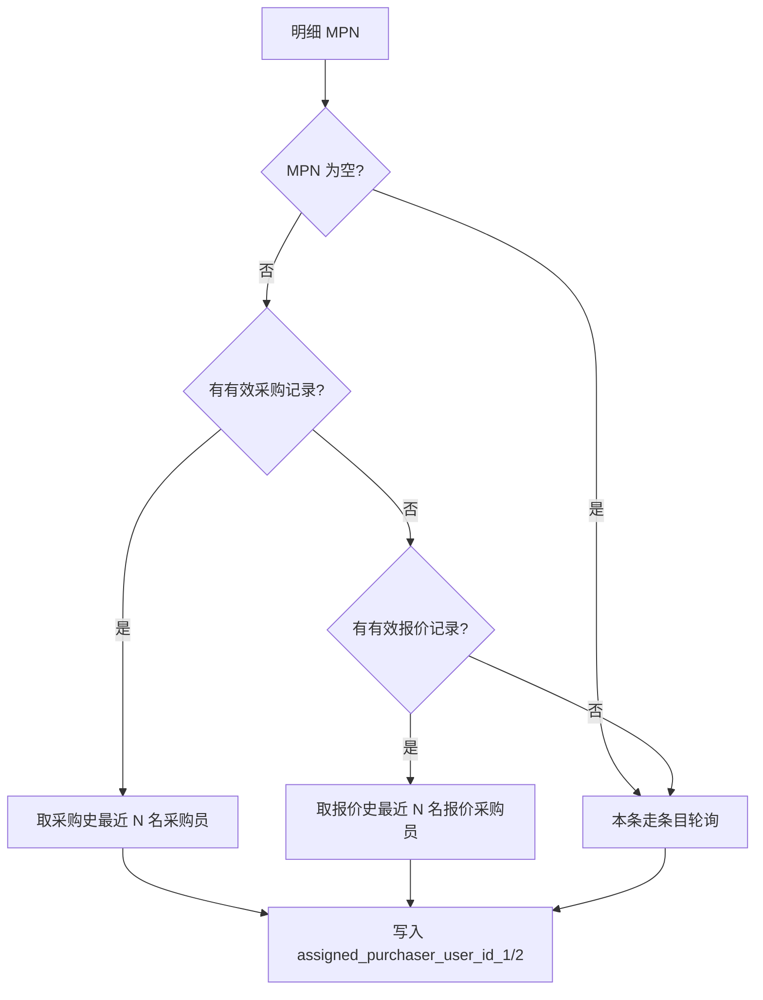

# 采报优先 — 分配采购员机制：功能要求与实现

**文档版本**: 1.0  
**创建日期**: 2026-07-13  
**适用范围**: 新建/编辑需求（`/rfqs/create`）、需求明细采购员分配、采购参数  

---

## 1. 背景与目标

在既有「条目轮询」「品牌轮询」之外，新增第三种分配方式 **采报优先**（`assign_method = 5`）：按物料型号（MPN）优先分配给**曾采购过**或**曾报价过**该型号的采购员，提高询价响应效率与业务连续性。

新建需求页默认分配方式由 **采购参数 → 默认分配方式** 配置（系统参数 `System.RFQ.DefaultAssignMethod`），出厂默认 **采报优先（5）**。

---

## 2. 分配方式编码（assign_method）

| 值 | 名称 | 创建页可选 | 策略类 |
|----|------|------------|--------|
| 1 | 系统分配同一采购 | 否（历史） | — |
| 2 | 条目轮询 | 是 | `ItemRoundRobinPurchaserAssignStrategy` |
| 3 | 品牌轮询 | 是 | `SameBrandPurchaserAssignStrategy` |
| 4 | 指定采购员 | 否（手工分配后写入） | — |
| **5** | **采报优先** | **是（默认）** | **`PurchaseQuotePriorityPurchaserAssignStrategy`** |

常量：`CRM.Core/Constants/RfqAssignMethodCodes.cs`  
前端枚举：`CRM.Web/src/constants/rfqFormEnums.ts`、`CRM.Web/src/types/rfq.ts`

---

## 3. 功能要求（产品约定）

### 3.1 采报优先 — 逐条明细规则

对每条 `RFQItem`，按 **明细 `mpn`**（物料型号）依次判断：



| 优先级 | 数据来源 | 采购员字段 | 时间字段 | 排序 |
|--------|----------|------------|----------|------|
| 1 | `purchaseorderitem.pn` + `purchaseorder` | `purchase_user_id` | `purchaseorder.CreateTime` | 最近优先 |
| 2 | `quote.mpn` | `purchase_user_id` | `quote.CreateTime` | 最近优先 |
| 3 | 无记录 | 报价员池条目轮询 | 全局游标 | 与 assign_method=2 单条一致 |

**说明**：

- 主路径一旦命中（采购或报价），槽位 1、2 **均只从该路径**取人，**不会**用报价史补采购史的第二槽位。
- 整单 `rfq.assign_method` 仍保存为 **5**；部分明细走轮询兜底时，主表分配方式不变。

### 3.2 MPN 匹配

- **精确匹配**：`Trim` + 忽略大小写（`RfqMpnMatch.NormalizeKey`）。
- 不使用列表查询的 `Contains` 模糊匹配，避免 `BAT54` 误匹配 `BAT54C`。

### 3.3 报价员池约束

- 历史采购员/报价员须同时在 **报价员池**（`sys_purchase_quoter_pool`）内且 **在职**（与 `GetOrderedActivePoolUserIdsAsync` 一致）。
- 不在池内或已停用 → 视为无该条历史，继续下一优先级或轮询。

### 3.4 有效单据

| 类型 | 计入条件 |
|------|----------|
| 采购单 | `purchaseorder`、`purchaseorderitem` 未删除；`purchaseorder.status` **排除** `-1`（审核失败）、`-2`（取消） |
| 报价单 | `quote` 未删除；`quote.status` 为 `0`（新建）或 `1`（成单）；**排除** `2`（关闭） |

### 3.5 多人分配（报价人数 N = 1 或 2）

系统参数 **报价人数**（`System.RFQ.RoundRobinAssigneeCount`）决定每条明细写入 `assigned_purchaser_user_id_1` / `_2` 的人数。

| 槽位 | 规则 |
|------|------|
| 槽位 1 | 当前主路径（采购或报价）下，按时间 **最近** 的 distinct 采购员 |
| 槽位 2 | 同路径下 **次近** 的 distinct 采购员 |
| 仅 1 名历史、N=2 | 槽位 1 用历史采购员；**槽位 2 对该明细走条目轮询**（排除槽位 1，仅推进游标 1 步） |
| 无历史 | 整行条目轮询（与 assign_method=2 单条相同） |

**同日多人**：同一采购员取该日 **CreateTime 最新** 的一条记录；多人比较时按 `EventTime` 降序，再按单号（`purchase_order_code` / `quote_code`）、再按主键 Id 打破平局。

### 3.6 边界情况

| 场景 | 行为 |
|------|------|
| 明细 `mpn` 为空 | 跳过采报逻辑，**直接条目轮询** |
| 报价员池为空 | 分配结果为 `null`，需求主单可为待分配（`status=0`） |
| 编辑需求新增明细 | 若主单 `assign_method=5`，**新增行同样走采报优先**（与品牌轮询编辑行为一致） |

### 3.7 默认分配方式（采购参数）

| 项 | 约定 |
|----|------|
| 菜单 | **参数管理 → 采购参数 → 默认分配方式**（侧栏位于「报价员池」下方） |
| 可选值 | 采报优先（5）、条目轮询（2）、品牌轮询（3） |
| 默认值 | **5（采报优先）** |
| 作用范围 | 仅影响 **新建需求页** `/rfqs/create` 打开时的「分配方式」下拉默认选中项；用户仍可改选 |
| 不影响 | 已保存需求的 `assign_method`；编辑页加载已有需求的分配方式 |

系统参数：`System.RFQ.DefaultAssignMethod`（`ValueString` 存 2/3/5）。

---

## 4. 与「需求保护时长」的关系

**需求保护时长**（`System.RFQ.DemandProtectionMinutes`）控制的是 **分配之后** 采购员在 `/rfq-items` 上的**可见/可报价范围**，与 **采报优先**（分配时选人）相互独立：

- 采报优先：创建/新增明细时 **写入** `assigned_purchaser_user_id_1/2`。
- 需求保护时长：超过配置分钟数后，采购部内具备数据权限的采购员可见/可报价已过期明细。

详见：[需求保护时长-设计与实现](./需求保护时长-设计与实现.md)、`RfqDemandProtectionRules`。

---

## 5. 实现架构

### 5.1 分配编排

```
RFQCreate / RFQService.CreateAsync | SyncRfqItemsOnUpdateAsync（新增行）
    → RfqPurchaserAssignmentOrchestrator.AssignAsync(assignMethod, context)
        → assign_method=5 → PurchaseQuotePriorityPurchaserAssignStrategy
            → IRfqMpnPurchaserAffinityLookup（采购史 / 报价史）
            → RfqPurchaserRoundRobinPicker（兜底与第二槽位补人）
```

| 组件 | 路径 |
|------|------|
| 编排器 | `CRM.Core/Services/RfqAssignment/RfqPurchaserAssignmentOrchestrator.cs` |
| 采报优先策略 | `CRM.Core/Services/RfqAssignment/PurchaseQuotePriorityPurchaserAssignStrategy.cs` |
| MPN 历史查询 | `CRM.Infrastructure/RfqAssignment/RfqMpnPurchaserAffinityLookup.cs` |
| 轮询取人（共用） | `CRM.Core/Services/RfqAssignment/RfqPurchaserRoundRobinPicker.cs` |
| MPN 精确匹配 | `CRM.Core/Utilities/RfqMpnMatch.cs` |
| 默认分配方式校验 | `CRM.Core/Utilities/RfqDefaultAssignMethodRules.cs` |
| 分配上下文 | `CRM.Core/Interfaces/RfqAssignment/RfqPurchaserAssignmentModels.cs`（含 `Mpn`） |

DI 注册：`CRM.API/Extensions/ServiceExtensions.cs`（策略、`RfqPurchaserRoundRobinPicker`）；`CRM.Infrastructure/Extensions/ServiceCollectionExtensions.cs`（`IRfqMpnPurchaserAffinityLookup`）。

### 5.2 历史查询算法（摘要）

1. 从库中拉取未删除、状态有效的采购行/报价行。
2. 内存中 `RfqMpnMatch.IsExactMatch` 过滤 MPN。
3. 过滤 `poolUserIds`。
4. 按 `PurchaserUserId` 分组，组内取最近一条记录的代表时间。
5. 按代表时间降序取前 `maxCount`（= 报价人数）个 distinct 用户 Id。

接口：`CRM.Core/Interfaces/RfqAssignment/IRfqMpnPurchaserAffinityLookup.cs`

### 5.3 数据落库

| 字段/表 | 说明 |
|---------|------|
| `rfq.assign_method` | 创建成功且至少一行有分配时写入所选方式（含 5） |
| `rfqitem.assigned_purchaser_user_id_1/2` | 分配结果 |
| `rfqitem.mpn` | 采报优先计算输入（创建时来自请求明细） |
| `sysparam` | `System.RFQ.DefaultAssignMethod`、`System.RFQ.RoundRobinAssigneeCount`、报价员池相关参数 |

**无需新增业务表字段**（`assign_method` 已有，仅扩展取值 5）。

### 5.4 API

| 用途 | 方法 | 路径 | 权限 |
|------|------|------|------|
| 管理端读写默认分配方式 | GET/PUT | `/api/v1/purchase-params/default-assign-method` | `rbac.manage` |
| 新建需求页读取默认 | GET | `/api/v1/rfqs/default-assign-method` | `rfq.create` |

DTO：`CRM.API/Models/DTOs/PurchaseParamsDtos.cs`  
控制器：`PurchaseParamsController`、`RFQsController`（`default-assign-method` 路由须在 `{id}` 之前注册）。

### 5.5 前端

| 位置 | 文件 |
|------|------|
| 分配方式下拉选项 | `CRM.Web/src/constants/rfqFormEnums.ts` |
| 新建需求默认项 | `CRM.Web/src/views/RFQ/RFQCreate.vue`（`resolveDefaultAssignMethod` → `rfqApi.getDefaultAssignMethod`） |
| 采购参数页 | `CRM.Web/src/views/System/PurchaseDefaultAssignMethodSettings.vue` |
| 侧栏导航 | `CRM.Web/src/views/System/PurchaseParamsLayout.vue` |
| 路由 | `CRM.Web/src/router/routes.ts` → `default-assign-method` |

### 5.6 系统参数与 SQL

| ParamCode | 说明 | 默认 |
|-----------|------|------|
| `System.RFQ.DefaultAssignMethod` | 新建需求默认分配方式 | `5` |
| `System.RFQ.RoundRobinAssigneeCount` | 每条明细分配人数 | `2` |
| `System.RFQ.PurchaserRoundRobinCursor` | 轮询游标 | `0` |

可选种子脚本（可重复执行）：

- `scripts/ensure_rfq_default_assign_method_postgresql.sql`

服务层首次保存时也会自动创建 `sysparam` 行（与需求保护时长等行为一致）。

### 5.7 测试

| 测试类 | 覆盖 |
|--------|------|
| `PurchaseQuotePriorityPurchaserAssignStrategyTests` | 双槽采购史、单槽+轮询补第二人、无历史轮询、空 MPN |
| `RfqMpnMatchTests` | MPN 精确匹配 |
| `RfqDefaultAssignMethodRulesTests` | 默认分配方式合法值 |

---

## 6. 相关文档

| 文档 | 关系 |
|------|------|
| [需求明细分配采购员](../PRD/业务功能/需求报价/需求明细分配采购员.md) | 采购员分配总览（已补充三种方式） |
| [业务规则总览](./业务规则总览.md) §3 需求（RFQ） | 条目/品牌/采报优先规则索引 |
| [RFQ 明细状态枚举](./RFQ明细状态枚举.md) | 明细状态与报价回写 |

---

## 7. 修订记录

| 版本 | 日期 | 说明 |
|------|------|------|
| 1.0 | 2026-07-13 | 初版：采报优先（assign_method=5）需求与实现；默认分配方式采购参数 |
