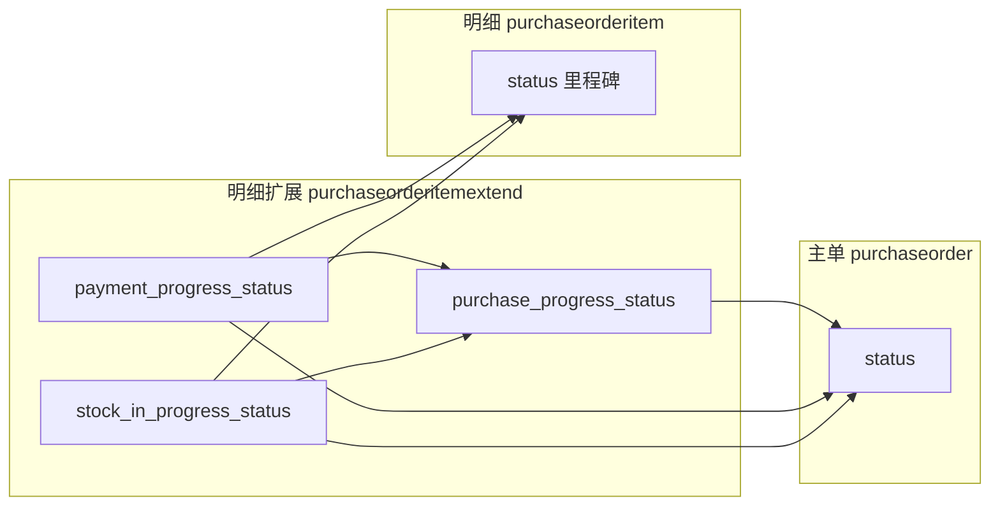

# 采购订单主状态与明细状态

主表字段：`purchaseorder.status`（`smallint`）。  
明细主状态字段：`purchaseorderitem.status`。  
明细扩展进度字段：`purchaseorderitemextend` 上的 `purchase_progress_status`、`stock_in_progress_status`、`payment_progress_status` 等（0=待 / 1=部分 / 2=完成）。

前端采购订单列表/详情「状态」列读 **主表** `status`；采购订单明细列表「采购状态」「入库状态」「付款状态」等读 **扩展表** 进度字段。明细表 `purchaseorderitem.status` 为流程里程碑编码，与扩展进度字段含义不同。

---

## 1. 主状态枚举（`purchaseorder.status`）

| 数值 | 含义 |
|------|------|
| 1 | 新建 |
| 2 | 待审核 |
| 10 | 审核通过 |
| 20 | 待确认 |
| 30 | 已确认 |
| 50 | 进行中 |
| 100 | 采购完成 |
| -1 | 审核失败 |
| -2 | 取消 |

前端文案：`CRM.Web/src/constants/purchaseOrderStatus.ts`。

---

## 2. 人工流转（`PurchaseOrderService.UpdateStatusAsync`）

| 当前状态 | 允许目标 |
|----------|----------|
| `1 新建` | `2 待审核`、` -2 取消` |
| `2 待审核` | `10 审核通过`、`-1 审核失败`、`-2 取消` |
| `-1 审核失败` | `1 新建`、`-2 取消` |
| `10 审核通过` | `20 待确认`、`-2 取消` |
| `20 待确认` | `30 已确认`、`-2 取消` |
| `30 已确认` | `50 进行中`、`-2 取消` |
| `50 进行中` | `100 采购完成` |

待办审批（`ApprovalsController` / `PURCHASE_ORDER`）：待审态与主单 `2` 对齐；通过/驳回写入对应主状态。

### 2.1 前半段主单与明细同步

当人工将主单更新为 `1 / 2 / 10 / 20 / 30` 时，**全部明细** `purchaseorderitem.status` 与主单同步（`ShouldSyncOrderAndItemStatus`）。

**业务意义**：新建至已确认阶段，主单与明细保持同一审批节点；进入执行阶段（50、100）后，明细按实际业务里程碑独立维护。

---

## 3. 主状态自动同步（与明细扩展对齐）

实现：`PurchaseOrderMainStatusSyncService` / `PurchaseOrderMainStatusCompute`（`CRM.Core/Services/PurchaseOrderMainStatusSyncService.cs`）。

**不参与自动重算的主状态**（保持原值）：`AuditFailed(-1)`、`Cancelled(-2)`，以及 **小于已确认(30)** 的主状态（新建/待审/已通过/待确认）。

**有效明细**：`purchaseorderitem.status != -2`（`-2` = 取消，不参与判断）。

### 3.1 `已确认(30) / 进行中(50) → 进行中(50)`

当主状态 **≥ 已确认(30)**，且至少一条有效明细扩展出现 **部分付款** 或 **部分入库**：

| 条件 | 扩展字段 | 判定 |
|------|----------|------|
| 部分付款 | `payment_progress_status` | `> 0` 且 `< 2`（即 `1`） |
| 部分入库 | `stock_in_progress_status` | `> 0` 且 `< 2`（即 `1`） |

满足 **任一** 即升为 **进行中(50)**。

**说明**：仅「待付款(0)」「付款完成(2)」或「待入库(0)」「入库完成(2)」**不会**单独因该字段触发主单进入进行中；须出现 **部分(1)** 态。

### 3.2 `已确认(30) / 进行中(50) → 采购完成(100)`

当主状态 **≥ 已确认(30)**，且 **全部有效明细** 的采购进度均为 **完成**：

- 扩展表 `purchase_progress_status >= 2`

单条明细「采购完成」口径见 §4.1（付款完成 **且** 入库完成）。

### 3.3 `进行中(50) / 采购完成(100) → 已确认(30)`（回退）

当主状态为 **50** 或 **100**，但：

- 未满足 §3.2（非全部明细采购完成），且  
- 未满足 §3.1（无任何明细部分付款/部分入库）

则回退为 **已确认(30)**。

典型场景：付款/入库反核销或刷新后扩展回写为待/完成，不再存在部分态。

### 3.4 同步触发时机

| 场景 | 入口 |
|------|------|
| 业务事件重算明细扩展后 | `PurchaseOrderItemExtendSyncService.RecalculateAsync` 末尾调用 `TrySyncOrderMainStatusAsync`（入库、付款核销、到货通知等链路） |
| 详情页「刷新扩展」 | `PurchaseOrderService.RefreshItemExtendsAsync`：逐行 `RecalculateAsync` + 同步明细 `status` + 同步主状态 |
| Debug 批量修复 | `POST /api/v1/debug/refresh-purchase-order-main-status`：全部采购订单逐单 `RefreshItemExtendsAsync`；跳过 `-1/-2`；`/debug/data` 页「刷新采购订单状态」 |

---

## 4. 明细扩展进度（`purchaseorderitemextend`）

由 `PurchaseOrderItemExtendSyncService.RecalculateAsync` 维护。进度字段统一：**0=待 / 1=部分 / 2=完成**。

明细或主单为取消时：该行 `purchase_progress_qty = 0`，`purchase_progress_status = 0`。

### 4.1 采购状态（`purchase_progress_status`）

| 状态值 | 含义 | 条件 |
|--------|------|------|
| 0 待采购 | 未进入执行 | 行未取消，且未满足采购中/完成条件 |
| 1 采购中 | 执行中 | 未同时付款+入库完成，但已确认（`purchaseorderitem.status >= 30`）或已有入库数量或已有核销付款 |
| 2 采购完成 | 该行采购闭环 | **入库完成** 且 **付款完成**（见下） |

**入库完成**：`qty_receive_total`（有效采购入库单累计数量）≥ 行 `qty`。  
**付款完成**：有效付款单（排除取消、审核失败）下该行 `verification_done` 累计 ≥ 行应付 `qty × cost`（`payment_amount`）。

### 4.2 入库状态（`stock_in_progress_status`）

相对本行有效采购数量 `qty` 与 `qty_receive_total`：

| 状态值 | 条件 |
|--------|------|
| 0 待入库 | `qty_receive_total <= 0` |
| 1 部分入库 | `0 < qty_receive_total < qty` |
| 2 入库完成 | `qty_receive_total >= qty` |

有效入库单：`stockin.status = 已入库(2)` 且 `stock_in_type = 采购`，经 `stockinitemextend.purchase_order_item_id` 关联本行。

### 4.3 付款状态（`payment_progress_status`）

相对行应付 `payment_amount`（= `qty × cost`）与已核销 `payment_amount_finish`：

| 状态值 | 条件 |
|--------|------|
| 0 待付款 | `payment_amount_finish <= 0` |
| 1 部分付款 | `0 < payment_amount_finish < payment_amount` |
| 2 付款完成 | `payment_amount_finish >= payment_amount`（且 `payment_amount > 0`） |

### 4.4 开票状态（`invoice_progress_status`）

相对 `purchase_invoice_amount` 与 `purchase_invoice_done`（按入库/质检/采购来源归集进项发票），规则同 0/1/2 进度模型；**不参与** §3 主状态自动同步。

---

## 5. 明细主状态（`purchaseorderitem.status`）

里程碑编码（与主单前半段节点 + 执行里程碑并存）：

| 数值 | 含义 |
|------|------|
| 1 | 新建 |
| 2 | 待审核 |
| 10 | 审核通过 |
| 20 | 待确认 |
| 30 | 已确认 |
| 40 | 已付款 |
| 50 | 已发货 |
| 60 | 已入库 |
| 100 | 采购完成 |
| -1 | 审核失败 |
| -2 | 取消 |

另：`stock_in_status`、`finance_payment_status`、`stock_out_status` 为 **0/1/2 汇总态**（未/部分/全部），由财务/库存链路维护，与扩展进度字段并行；列表「入库/付款状态」列以扩展进度为准。

### 5.1 刷新时自动对齐（`ComputeItemStatusAfterRefresh`）

在 `RefreshItemExtendsAsync` 中，扩展重算后按事实 **上调或下调** 明细 `status`（取消/审核失败行不改）：

**上调里程碑**（取较高者，不降低已有人工更高态以外的逻辑由下调段约束）：

| 扩展/行字段 | 明细 `status` 至少升至 |
|-------------|------------------------|
| `payment_progress_status >= 2` | `40 已付款` |
| `stock_out_status >= 2`（明细列） | `50 已发货` |
| `stock_in_progress_status >= 2` | `60 已入库` |

**下调**（扩展重算后未达里程碑时压回，避免「status=已入库」与「入库进度=待入库」长期不一致）：

- 入库进度 `< 2` 且当前 `>= 60` → 压至不超过 `30/40/50`（视付款、出库达成情况而定）
- 出库 `< 2` 且当前 `>= 50` → 压至不超过 `30/40`
- 付款进度 `< 2` 且当前 `>= 40` → 压至 `30 已确认`

**说明**：明细 `status` 自动刷新 **最高常规里程碑为 60（已入库）**；`100 采购完成` 不在此自动上调路径（主单「采购完成」由 §3 扩展 `purchase_progress_status` 驱动）。历史数据若 `status=100` 仅可能来自人工/Debug/旧逻辑。

---

## 6. 三者关系小结

| 层级 | 字段 | 采购完成 / 进行中 判定依据 |
|------|------|---------------------------|
| 主单 | `purchaseorder.status` | §3：部分付款/部分入库 → 50；全部扩展采购完成 → 100 |
| 扩展 | `purchase_progress_status` | §4.1：付款完成 **且** 入库完成 → 2 |
| 明细 | `purchaseorderitem.status` | §5.1：按付款/入库/出库里程碑刷新，常规最高 60 |

---

## 7. 相关实现索引

| 项 | 位置 |
|----|------|
| 主单人工改状态 | `PurchaseOrderService.UpdateStatusAsync`、`ValidateStatusTransition` |
| 主状态自动同步 | `PurchaseOrderMainStatusSyncService`、`IPurchaseOrderMainStatusSyncService` |
| 明细扩展重算 | `PurchaseOrderItemExtendSyncService.RecalculateAsync` |
| 明细 status 刷新 | `PurchaseOrderService.ComputeItemStatusAfterRefresh`、`RefreshItemExtendsAsync` |
| 扩展字段模型注释 | `CRM.Core/Models/Purchase/PurchaseOrderItemExtend.cs` |
| 前端主状态文案 | `CRM.Web/src/constants/purchaseOrderStatus.ts` |
| Debug 批量刷新 | `DebugController.RefreshPurchaseOrderMainStatus`、`CRM.Web/src/views/Debug/DebugData.vue` |
| 业务规则速查 | [业务规则总览](./业务规则总览.md) §6 |
| 扩展字段详解 | [PurchaseOrderItemExtend 统计字段文档](../EBS/采购/PurchaseOrderItemExtend统计字段文档.md) §8 |
