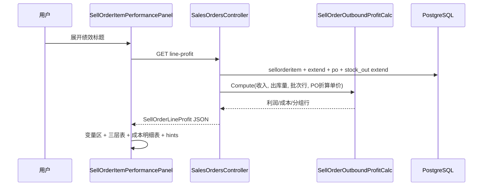

# 销售订单明细绩效 — 设计与实现

**状态：** 已上线（三层利润 + 实际批次出库成本 + 出库成本明细表）  
**页面：** `/sales-orders/:id`（销售订单明细详情面板正下方）  
**测试对照：** [销售订单明细绩效-测试对照说明](../../QA/销售/销售订单明细绩效-测试对照说明.md)  
**关联 EBS 对照（只读）：** [SellOrderItemExtend 统计字段文档](../EBS/销售/SellOrderItemExtend统计字段文档.md)  
**关联 FrontCRM：** [销售订单明细概况-设计与实现](../销售订单明细概况-设计与实现.md)、[业务规则总览](../业务规则总览.md)（出库利润 · 批次成本）

---

## 1. 业务定位

销售订单详情页，在 **「销售订单明细详情」** 面板下方增加独立 **「绩效」** 面板。选中某条销售明细后，展示该行 **三层利润口径**（报价 / 预计销售 / 出库），并辅以变量对照、公式展开、出库成本明细与固定规则说明。

| 概念 | 说明 |
|------|------|
| **适用对象** | 单条 `sell_order_item` |
| **与概况分工** | [概况](../销售订单明细概况-设计与实现.md) 管执行进度矩阵；**绩效管利润**，字段与列表/扩展表同口径 |
| **面板开闭** | 与明细详情面板同开同关（收起明细详情则绩效一并消失） |
| **面板内折叠** | 绩效标题栏可折叠，**默认折叠**；**展开时才请求** `line-profit` |
| **嵌套折叠** | 「出库成本明细」在绩效已展开时可见，**默认再折叠** |

---

## 2. 设计需求

### 2.1 入口、权限与懒加载

| 项目 | 要求 |
|------|------|
| 入口 | `/sales-orders/:id` → 订单明细 Tab → 单击/双击某行 → 明细详情面板下方出现绩效 |
| 显示条件 | `soItemLinePanel.visible`；`!maskSaleSensitiveFields`；具备金额查看权限 |
| 懒加载 | 绩效默认折叠 → **不请求** API；用户展开绩效标题 → `GET .../line-profit` |
| 刷新 | 明细关联数据变更时父组件递增 `refreshKey`；绩效已展开则重新拉取 |
| 脱敏 521 | `line-profit` 返回 `data: null`，前端显示空状态 |

权限与概况一致：`sales-order.read` + `sales.amount.read`（见 §5）。

### 2.2 三层利润指标

每层一行，列：**利润（USD）**、**利润率（收入÷成本倍数）**、**毛利率 %**（tooltip 展示公式）。

| 层 | 扩展表利润字段 | 利润率口径 | 收入基数 |
|----|----------------|------------|----------|
| **报价** | `QuoteProfitExpected` / `ReQuoteProfitExpected`（有报价成本快照用 ReQuote） | 扩展表 rate；成本为 0 → 展示 `—` | 行 `qty × convert_price` |
| **预计销售** | `SalesProfitExpected`（瀑布见下） | `收入 USD ÷ 所用成本`；无来源或成本为 0 → `—` | 同上 |
| **出库** | `ProfitOutBizUsd` | `出库收入 ÷ 出库采购成本`；出库成本为 0 且利润 ≥ 0 → `—` | `QtyStockOutActual × convert_price` |

**预计销售成本瀑布**（`SellOrderSalesExpectedProfitCalc`，与绩效 `salesExpectedCostSource` 一致）：

1. 本行存在任一 `purchaseorderitem` → 成本 = **全部 PO 明细**折 USD 合计（不论状态，价可为 0），公式标注 **采购成本**；
2. 否则备货已覆盖整行 qty（出库批次优先，否则备货拣货）→ **备货采购成本** = 加权单价 × 行 qty；未覆盖整行 → 不进本档；
3. 否则有报价折成本 → **报价成本**；
4. 否则无预计销售利润，界面 **「-」**（扩展表存 0）。

每层利润行下方展示 **计算公式（变量已代入）** 列表，将当前明细真实数量/单价代入，右侧写出计算结果（与扩展表同步逻辑一致）。

中间层 **不** 单独展示「采购利润（全 PO）」；有 PO 时预计销售与全 PO 成本同口径；存在未确认 PO 时用 info 说明。

### 2.3 公式变量对照区

面板顶部 **公式变量对照** 分区展示公式所用变量当前值，便于与下方公式行逐项比对。

| 分区 | 内容 |
|------|------|
| **销售** | 数量、原币单价、汇率快照、折算 USD 单价、行金额、销售收入 USD |
| **报价快照** | 报价原币/折算单价、报价成本合计；无快照时显示「无报价成本快照」 |
| **采购成本** | PO 数量/成本合计、已确认 PO 成本；**按 PO 明细行**展示 `折算采购单价 × 数量 = 成本`（有 `poCostLines` 时不显示汇总均价行） |
| **出库** | 已出库数量、出库销售收入；有实际批次时 **按 PO 明细行**展示 `真实采购单价 × 数量`；展示批次采购单价（合计÷数量）；出库采购成本合计 |

**文案约定：** 界面统一使用 **「折算采购单价」「批次采购单价」「真实采购单价」**，不使用「加权均价」字样（回退口径在公式/说明中称「PO 折算采购单价」）。

**折行规则：** 变量项为「标签 + 数值」；宽度不足时在 **标签与数值之间** 折行，数值整段不换行（`flex-wrap` + `white-space: nowrap`）。

### 2.4 出库成本明细表

三层利润表与异常说明之间，增加 **「出库成本明细」** 折叠表（`el-collapse`，默认折叠）。

| 列 | 字段来源 |
|----|----------|
| 出库单 | `stock_out.stock_out_code`，链接 `/inventory/stock-out/:stockOutId` |
| PO 明细 | `stock_out_item_extend.purchase_order_item_code` |
| 采购单价（USD） | `PurchasePriceUsd` |
| 出库数量 | `QtyStockOut`（为 0 时回退 `stock_out_item` 实出数量） |
| 成本小计（USD） | `qty × PurchasePriceUsd`（保留 2 位小数） |

**显示条件：** `useActualOutboundCost === true` 且 `outboundCostDetails.length > 0`。  
**表尾：** 「出库采购成本合计」= `outboundCostUsd`，须与变量区、扩展表 `ProfitOutBizUsd` 所用成本一致。  
**标题摘要：** `共 N 张出库单 · M 行批次`。

无批次快照时 **不展示** 本表，仅保留出库层 info 说明（回退 PO 折算采购单价）。

### 2.5 异常说明

使用 `el-alert` + i18n（`salesOrderDetailView.performance.hints.*`），不链帮助文档。文案前缀统一为层名（**报价** / **预计销售** / **出库**），可带入 `purchaseProgressStatus` / `stockOutProgressStatus` 的 `extendTriLabel` 展示标签。

| 规则 | 类型 | 判定要点 |
|------|------|----------|
| 无报价成本快照 | info | `quoteCostUsd <= 0` 且报价利润率不可算 |
| 报价层收支平衡 | info | 有报价成本、利润 ≈ 0、利润率 ≈ 1.00 |
| 无已确认采购成本 | info | `poCostUsdConfirmed <= 0` |
| 预计销售收支平衡 / 平价 | info | 已确认成本 > 0、利润 ≈ 0 |
| 已下单未确认 PO 成本 | info | `poCostUsdTotal > poCostUsdConfirmed` 且全 PO 利润更高 |
| 尚未出库 | info | `qtyStockOutActual <= 0` 且出库利润 ≈ 0 |
| 已出库但毛利为 0 | info | 平价或单价≈成本 |
| 出库利润为正但成本为 0 | warning | 利润率 `—` |
| 无出库批次快照（回退） | info | `!useActualOutboundCost` 且已出库 |
| 销售收入无效 | warning | `revenueUsd <= 0` |

---

## 3. 数据口径

### 3.1 出库成本与利润（核心）

出库层成本与 `sellorderitemextend.ProfitOutBizUsd` 由 `SellOrderOutboundProfitCalc` 与 `SellOrderItemExtendSyncService` 统一计算。

**优先（实际批次）：** 已完成销售出库单（`stock_out`，状态 2 已出库 / 4 已完成，类型销售）下，每条 `stock_out_item_extend`：

```
出库采购成本 USD = Σ (PurchasePriceUsd × 出库数量)
出库利润 USD     = Σ ProfitOutBizUsd
                 （若利润全为 0 且成本 > 0，则 出库销售收入 − 出库采购成本）
```

**回退：** 无可用 extend 快照（无行、数量全 0、采购单价全 0 且无利润）时：

```
出库采购成本 USD = QtyStockOutActual × PO折算采购单价
PO折算采购单价   = Σ(po.qty × po.convert_price) ÷ Σ(po.qty)
出库利润 USD     = 出库销售收入 − 出库采购成本
```

`useActualOutboundCost` 为 true 表示走实际批次分支。

### 3.2 line-profit API

```
GET /api/v1/sales-orders/{orderId}/sell-order-items/{itemId}/line-profit
```

`detail-tab-aggregates` **不** 再携带 `lineProfit`，避免打开明细详情时预加载绩效。

**主要响应字段：**

| 字段 | 说明 |
|------|------|
| `quote` / `salesExpected` / `outbound` | 各层 `profitUsd`、`profitRate`（展示口径，见 `SellOrderItemProfitDisplay`） |
| `poCostLines[]` | 采购变量区：PO 明细、折算单价、数量、成本 |
| `outboundCostLines[]` | 公式区摘要：按 PO+单价 **分组** 后的批次行 |
| `outboundCostDetails[]` | 明细表：每条 extend **一行**，含 `stockOutId` / `stockOutCode` |
| `useActualOutboundCost` | 是否实际批次口径 |
| `outboundCostUsd` / `outboundRevenueUsd` | 出库成本与收入 |
| `effectiveOutboundAvgCostUsd` | 展示用批次单价（实际成本÷出库数量）或回退 PO 折算单价 |

### 3.3 与扩展表同步

| 场景 | 行为 |
|------|------|
| 销售订单详情「刷新状态」/「刷新单价」 | `POST .../refresh` `facet=status|price`（兼容 `refresh-item-extends` = price）→ `RecalculateAsync(StatusOnly)` 写回 extend（含 `SalesProfitExpected`） |
| Debug 批量 | `POST /api/v1/debug/refresh-sellorder-main-status` 或 `refresh-sellorderitemextend-outbound-profit` 逐行重算 |
| 离线脚本 | `scripts/refresh_sellorderitemextend_outbound_profit_postgresql.sql`（先预览再 UPDATE） |

**列表 vs 绩效：** 明细列表「预计销售利润」读落库 `sellorderitemextend.SalesProfitExpected`；绩效面板 `line-profit` **实时**按瀑布重算。公式改版后历史行不会自动变，需详情「刷新状态」或「刷新单价」或 Debug 批量写回。备货出库若扩展行误挂备货原销售行，重算加载批次成本与出库数量归属一致（头表挂客单行 + 备货/样品/空绑定）。

批量重算若遇「销售数量 < 已出库/已通知数量」会失败（数据不一致），需在业务上修正数量后再刷。

---

## 4. 实现方法

### 4.1 数据流



### 4.2 后端

| 模块 | 路径 | 职责 |
|------|------|------|
| 绩效 API | `CRM.API/Controllers/SalesOrdersController.cs` | `GetSellOrderItemLineProfit`、`BuildSellOrderLineProfitAsync` |
| 批次行加载 | 同上 `LoadSellOrderOutboundCostLinesAsync` | 计算用原始 extend 行 |
| 明细行加载 | 同上 `LoadSellOrderOutboundCostDetailsAsync` | 明细表用，带出库单号 |
| 利润计算 | `CRM.Core/Utilities/SellOrderOutboundProfitCalc.cs` | `Compute`、`GroupCostLinesForDisplay`、`OrderCostDetailsForDisplay` |
| 扩展同步 | `CRM.Core/Services/SellOrderItemExtendSyncService.cs` | `RecalculateAsync` → `ApplyProfitFields` |
| 展示口径 | `CRM.Core/Utilities/SellOrderItemProfitDisplay.cs` | 成本为 0 时利润率 null |
| Debug 批量 | `CRM.API/Controllers/DebugController.cs` | `refresh-sellorderitemextend-outbound-profit` |
| 单测 | `tests/CRM.Core.Tests/Utilities/SellOrderOutboundProfitCalcTests.cs` | 批次/回退/排序 |

### 4.3 前端

| 模块 | 路径 | 职责 |
|------|------|------|
| 面板容器 | `CRM.Web/src/components/RFQ/SellOrderItemPerformancePanel.vue` | 折叠、懒加载、`refreshKey` |
| 成本明细表 | `CRM.Web/src/components/RFQ/SellOrderOutboundCostDetailTable.vue` | `el-collapse` + `el-table` |
| 挂载点 | `CRM.Web/src/views/RFQ/SalesOrderDetail.vue` | 明细详情面板下方 |
| 类型与 API | `CRM.Web/src/api/salesOrder.ts` | `SellOrderLineProfit` 等 |
| 公式文案 | `CRM.Web/src/utils/sellOrderLineProfitFormulas.ts` | 三层公式代入 |
| 变量对照 | `CRM.Web/src/utils/sellOrderLineProfitVariables.ts` | 四区变量 + PO/批次行 |
| 异常规则 | `CRM.Web/src/utils/sellOrderLineProfitHints.ts` | hints 列表 |
| 格式化 | `CRM.Web/src/utils/sellOrderLineProfitDisplay.ts` | 金额、倍数、毛利率 |
| i18n | `CRM.Web/src/locales/zh-CN.ts` / `en-US.ts` | `salesOrderDetailView.performance.*` |

### 4.4 实现阶段对照

| 阶段 | 内容 | 状态 |
|------|------|------|
| MVP | 三层利润 + 公式 + 异常说明 | 已上线 |
| 懒加载 | 绩效默认折叠，展开才请求 `line-profit` | 已上线 |
| 出库批次成本 | `stock_out_item_extend` 真实采购价；扩展同步与 Debug/SQL 重算 | 已上线 |
| 变量展示增强 | PO/批次按明细行展示；去除「均价」文案；标签/数值折行 | 已上线 |
| 成本明细表 | `outboundCostDetails` 折叠表 | 已上线 |

---

## 5. 权限

与 [销售订单明细概况](../销售订单明细概况-设计与实现.md) 一致：`sales-order.read` + `sales.amount.read`。  
`mask521` / 销售敏感脱敏开启时，整个绩效面板不展示。

---

## 6. 自检清单

- [ ] 双击明细行后，绩效面板出现在明细详情面板正下方
- [ ] 收起明细详情后，绩效面板一并消失
- [ ] 绩效标题默认折叠，折叠时不请求 `line-profit`
- [ ] 展开后三层利润与列表 `SalesOrderItemList` / extend 同口径
- [ ] 出库成本为 0 且利润 ≥ 0 时，出库利润率显示 `—`
- [ ] 有实际批次时，变量区展示 PO/批次明细行，非「加权均价」文案
- [ ] 有实际批次时，可展开「出库成本明细」，表尾合计 = `outboundCostUsd`
- [ ] 无批次快照时显示回退说明，不展示成本明细表
- [ ] 无金额权限或脱敏时不显示绩效面板

---

## 7. 代码索引（速查）

```
CRM.API/Controllers/SalesOrdersController.cs     # line-profit
CRM.API/Controllers/DebugController.cs           # 批量刷新出库利润
CRM.Core/Utilities/SellOrderOutboundProfitCalc.cs
CRM.Core/Services/SellOrderItemExtendSyncService.cs
CRM.Core/Utilities/SellOrderItemProfitDisplay.cs
CRM.Web/src/components/RFQ/SellOrderItemPerformancePanel.vue
CRM.Web/src/components/RFQ/SellOrderOutboundCostDetailTable.vue
CRM.Web/src/utils/sellOrderLineProfit*.ts
scripts/refresh_sellorderitemextend_outbound_profit_postgresql.sql
```

---

*文档版本：与 developV3 绩效面板全量功能同步；EBS 目录只读对照，实现口径以本文与 `SellOrderOutboundProfitCalc` 为准。*
