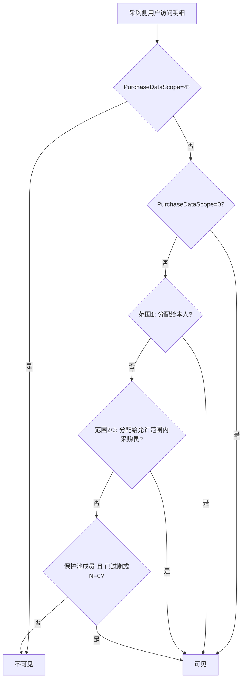

# 需求保护时长 — 功能要求与实现

**文档版本**: 1.0  
**创建日期**: 2026-07-13  
**适用范围**: 需求明细列表（`/rfq-items`）、需求详情明细行、报价列表、创建/编辑报价  

---

## 1. 背景与目标

新建需求时，系统会为每条明细分配 1～2 名采购员（见 [需求明细分配采购员](../PRD/业务功能/需求报价/需求明细分配采购员.md)）。在明细创建后的短时间内，希望**仅被分配的采购员**能看到并报价，避免其他采购员过早介入。

**需求保护时长**即在明细创建后的一段可配置时间内，限制非分配采购员的**可见范围**与**报价权限**；超过该时间（或配置为 0）后，采购部内具备数据权限的采购员可参与该明细。

本机制作用于**分配之后**的访问控制，与分配方式（条目轮询 / 品牌轮询 / 采报优先）相互独立。

---

## 2. 功能要求（产品约定）

### 2.1 核心行为

| 项 | 约定 |
|----|------|
| 配置入口 | **参数管理 → 采购参数 → 需求保护时长**（侧栏位于「默认分配方式」下方） |
| 系统参数 | `System.RFQ.DemandProtectionMinutes`（整数，单位：分钟） |
| 默认值 | **30** 分钟（参数未配置或非法值时后端回退） |
| 取值范围 | **0 ～ 43200**（0 ～ 30 天） |
| 时间基准 | **`rfqitem.CreateTime`**（UTC），非需求主单创建时间 |
| 到期判定 | **严格大于**：`UtcNow - CreateTime > N 分钟` 视为已过期；恰好满 N 分钟仍在保护期内 |
| **0 的含义** | **无保护期**（非「关闭功能」）：采购部内符合保护池条件的采购员，**立即可见并可报价**分配给其他人的明细 |

### 2.2 保护期内（N > 0 且未过期）

| 角色 | 可见 | 可报价 |
|------|------|--------|
| 系统管理员 | 是 | 是 |
| 采购部 / 采购运营部总监（`DEPT_DIRECTOR` + 主部门 `IdentityType` 2/3） | 是 | 是 |
| **该行分配的采购员**（`assigned_purchaser_user_id_1/2`） | 是 | 是 |
| 采购数据范围匹配到「本人下属/部门内分配人」的经理 | 是 | 否（非本人分配行，仅数据范围可见） |
| 其他采购部采购员（保护池成员） | **否** | **否** |

### 2.3 保护过期后（N > 0 且已过期）或 N = 0（无保护期）

在既有**采购数据范围**规则之上，**保护池成员**对**任意**需求明细（含分配给其他人的行）：

- **可见**：需求明细列表、需求详情行级展示、报价列表（关联需求侧过滤）
- **可报价**：创建/编辑报价时通过 `CanQuote` 校验

**保护池成员**须同时满足：

1. `BelongsToPurchaseDept == true`（隶属采购侧部门）
2. `PurchaseDataScope != 4`（非「采购无权限」）
3. 或为系统管理员（管理员不参与业务池逻辑，始终全权）

**注意**：保护池**不要求**用户在「报价员池」内；与分配时的报价员池是不同概念。

### 2.4 采购数据范围与保护的叠加

采购侧可见性由 `RfqDemandProtectionRules.IsPurchaseSideVisible` 统一判定，优先级如下：

| PurchaseDataScope | 保护期内额外可见 | 保护过期 / N=0 额外可见 |
|-------------------|------------------|-------------------------|
| 0 全部 | — | —（本就全部可见） |
| 1 本人 | 仅分配给本人的行 | 保护池：全部明细 |
| 2 本部门 | 部门内分配人的行 | 保护池：全部明细 |
| 3 本部门及子部门 | 同上 | 保护池：全部明细 |
| 4 无权限 | 永不可见 | 永不可见 |

销售侧数据范围规则**不变**；列表查询为销售可见 **或** 采购可见（并集）。

### 2.5 报价权限（与可见性略有差异）

`RfqItemQuoteAccessRules.CanQuote` 在保护过期后允许保护池成员报价，但**不**因采购数据范围 2/3 而对非分配行开放报价（经理看得到下属分配的行，不代表能替下属报价）。

| 条件 | 可报价 |
|------|--------|
| 系统管理员 | 是 |
| 采购部总监 | 是 |
| 分配给当前用户 | 是 |
| 保护池成员 +（已过期 或 N=0） | 是 |
| 其他 | 否 |

### 2.6 不影响的范围

| 项 | 说明 |
|----|------|
| 分配逻辑 | 不改变 `assign_method` 与 `assigned_purchaser_user_id_1/2` 的写入 |
| 需求主单状态 | 不因保护到期而变更 |
| 已存在报价 | 不回收、不转移 |
| 销售侧 | 销售数据范围逻辑独立，不受保护时长影响 |

---

## 3. 配置与 API

### 3.1 管理端

| 项 | 值 |
|----|-----|
| 路由 | `/system/purchase-params/demand-protection` |
| 组件 | `PurchaseDemandProtectionSettings.vue` |
| 权限 | `rbac.manage` |
| 控件 | 数字输入，步进 5，min=0，max=43200 |

### 3.2 API

| 方法 | 路径 | 说明 |
|------|------|------|
| GET | `/api/v1/purchase-params/demand-protection-minutes` | 读取当前分钟数 |
| PUT | `/api/v1/purchase-params/demand-protection-minutes` | 保存；body `{ "minutes": number }` |

DTO：`PurchaseParamsDemandProtectionMinutesDto`、`SetPurchaseParamsDemandProtectionMinutesRequest`（`CRM.API/Models/DTOs/PurchaseParamsDtos.cs`）。

### 3.3 系统参数与 SQL

| ParamCode | 说明 | 默认 |
|-----------|------|------|
| `System.RFQ.DemandProtectionMinutes` | 保护分钟数 | `30` |

可选种子脚本（可重复执行）：

- `scripts/ensure_rfq_demand_protection_minutes_postgresql.sql`

首次在后台保存时，`PurchaseQuoterPoolService.SetDemandProtectionMinutesAsync` 也会自动插入 `sysparam` 行。

---

## 4. 实现架构

### 4.1 规则核心

| 类型 | 路径 |
|------|------|
| 保护规则 | `CRM.Core/Utilities/RfqDemandProtectionRules.cs` |
| 报价权限 | `CRM.Core/Utilities/RfqItemQuoteAccessRules.cs` |
| 参数读写 | `CRM.Infrastructure/PurchaseParams/PurchaseQuoterPoolService.cs` |
| 常量 | `CRM.Core/Constants/SysParamCodes.cs` → `RfqDemandProtectionMinutes` |

关键方法：

| 方法 | 用途 |
|------|------|
| `HasProtectionPeriod(minutes)` | `minutes > 0` |
| `IsProtectionExpired(createTime, minutes, utcNow)` | 过期判定；`minutes <= 0` 恒为 true |
| `ProtectionCutoffUtc(minutes, utcNow)` | 列表 SQL 筛选：`CreateTime <= cutoff` |
| `CanParticipateInProtectionPool(summary)` | 是否可因保护到期扩大可见/报价 |
| `IsPurchaseSideVisible(...)` | 采购侧单行可见性 |
| `RfqItemQuoteAccessRules.CanQuote(...)` | 创建/编辑报价授权 |

### 4.2 应用落点

| 场景 | 实现 |
|------|------|
| 需求明细列表 / 看板 | `CRM.Infrastructure/RFQ/RfqItemListFilter.cs` — 采购侧 OR 条件含保护池 + cutoff |
| 报价列表（需求关联过滤） | `CRM.Infrastructure/Quotes/QuoteListFilter.cs` — 同上 |
| 需求详情行级展示 | `DataPermissionService.GetRfqItemLineVisibilityPredicateAsync` |
| 需求主单采购侧准入 | `DataPermissionService.PassesPurchaseAccessToRfqAsync` — 任一明细可见即可 |
| 创建/编辑报价 | `QuoteService.EnsureCanQuoteRfqItemAsync` → `CanQuote` |

列表层使用 `ProtectionCutoffUtc` 做数据库侧预过滤（`protectionMinutes <= 0 || CreateTime <= cutoff`），与 `IsProtectionExpired` 语义一致。

### 4.3 前端

| 文件 | 说明 |
|------|------|
| `CRM.Web/src/views/System/PurchaseDemandProtectionSettings.vue` | 设置页 |
| `CRM.Web/src/views/System/PurchaseParamsLayout.vue` | 侧栏导航 |
| `CRM.Web/src/api/purchaseParams.ts` | `getDemandProtectionMinutes` / `setDemandProtectionMinutes` |
| `CRM.Web/src/router/routes.ts` | `demand-protection` 子路由 |
| `CRM.Web/src/locales/zh-CN.ts` | 文案与 0 分钟说明 |

### 4.4 数据模型

**无需新增表或字段**。仅使用：

- `sysparam` 存配置
- `rfqitem.create_time` 作保护计时起点
- `rfqitem.assigned_purchaser_user_id_1/2` 作分配对象判定

---

## 5. 测试

| 测试类 | 覆盖 |
|--------|------|
| `RfqDemandProtectionRulesTests` | 0 分钟语义、严格 `>` 过期、保护池资格、过期后他人可见、保护期内仅分配人 |

---

## 6. 相关文档

| 文档 | 关系 |
|------|------|
| [需求明细分配采购员](../PRD/业务功能/需求报价/需求明细分配采购员.md) | 分配采购员与保护时长分工 |
| [采报优先-分配采购员-设计与实现](./采报优先-分配采购员-设计与实现.md) | 分配方式与保护机制独立 |
| [业务规则总览](./业务规则总览.md) §3 需求（RFQ） | 规则索引 |
| [需求明细查无报价-设计与实现](./需求明细查无报价-设计与实现.md) | 明细状态与报价入口（查无报价后仍可报价） |

---

## 7. 修订记录

| 版本 | 日期 | 说明 |
|------|------|------|
| 1.0 | 2026-07-13 | 初版：需求保护时长产品约定与实现索引 |
