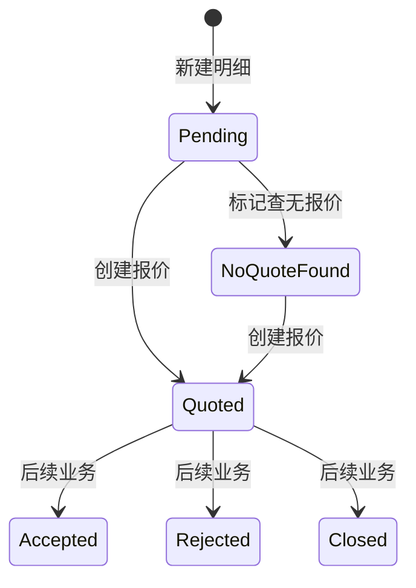

# 需求明细「查无报价」— 功能要求与实现

**文档版本**: 1.0  
**创建日期**: 2026-06-26  
**适用范围**: 需求明细（`/rfq-items`）、需求详情页展示、报价创建回写  

---

## 1. 背景与目标

采购员在询价过程中，可能确认某条需求明细**市场上无货或无法取得有效报价**。此时需要一种轻量标记，让业务方可见「已查无报价」，又**不必创建空报价单**，且**不影响需求主单流转**。

「查无报价」即上述场景下的明细行级状态（`rfqitem.status = 5`）。

---

## 2. 功能要求（产品约定）

### 2.1 核心行为

| 项 | 约定 |
|----|------|
| 状态含义 | 采购侧确认该行**查无报价**（无货/无价/无法报价） |
| 状态变更 | 仅 **`0（待报价）→ 5（查无报价）`** |
| 操作入口 | **需求明细列表**（`/rfq-items`）行操作；需求详情页**只读展示**，不提供标记按钮 |
| 确认交互 | 二次确认弹窗后提交 |
| 创建报价单 | **不**通过本操作创建；标记时**禁止**该行已有未删除的 `quote` 记录 |
| 主单联动 | **不**回写 `rfq.status` |
| 通知 | **不**发送业务通知（无额外消息/邮件） |
| 后续报价 | 标记为 5 后，仍可对同一明细**直接创建报价**；创建成功后明细状态 **5→1（已报价）** |

### 2.2 前置条件（可标记）

同时满足方可标记：

1. 明细 `status == 0`（待报价）
2. 该行 **报价记录数为 0**（无未删除 `quote.rfq_item_id = 明细 id`）
3. 关联需求主单 **非** 终态关闭/取消（`rfq.status` 不为 `7`、`8`）
4. 当前用户对该需求有数据权限，且具备与「报价」相同的业务权限（见 §4）

### 2.3 不可标记场景

| 场景 | 服务端错误信息（示例） |
|------|------------------------|
| 明细非待报价 | 仅待报价状态可标记查无报价 |
| 已有报价记录 | 该明细已有报价记录，无法标记查无报价 |
| 需求已关闭/取消 | 需求已关闭或已取消，无法操作 |
| 无数据权限 / 非分配报价员 | 无权限操作该需求明细 / 无权标记该需求明细为查无报价 |

### 2.4 展示要求

| 位置 | 要求 |
|------|------|
| 需求明细列表 | 「明细状态」列；筛选器含「查无报价」；操作列/更多菜单「查无报价」 |
| 需求详情 | 列表/面板视图的明细状态、页头统计 pill（`查无报价 N 行`，仅 N>0 显示） |
| 文案 | 中文「查无报价」；英文 `No Quote Found` |

---

## 3. 状态与流转

明细状态权威定义见 [RFQ 明细状态枚举](./RFQ明细状态枚举.md)。



**注意**：`Pending` 且已有报价记录时，列表/详情**展示**为 `Quoted`，但库内可能仍为 `0`，直至创建报价回写为 `1`。

---

## 4. 权限

### 4.1 业务权限（与「报价」一致）

后端 **`RfqItemQuoteAccessRules.CanQuote`**（`CRM.Core/Utilities/RfqItemQuoteAccessRules.cs`）：

- 系统管理员
- 采购部 / 采购运营部 **总监**（`DEPT_DIRECTOR` + 主部门 IdentityType 2/3）
- 该行 **分配的报价员**（`AssignedPurchaserUserId1` 或 `AssignedPurchaserUserId2`）

前端 **`canQuoteRfqItem`** + 行状态/报价条数校验（`RFQItemList.vue` → `canMarkNoQuoteRow`）。

### 4.2 API 权限码

控制器 **`RFQsController.MarkNoQuote`** 标注 `[RequirePermission("rfq.read")]`；细粒度拒绝由服务层 `MarkNoQuoteAsync` 抛出 `UnauthorizedAccessException`（403）。

---

## 5. 后端实现

### 5.1 枚举

```csharp
// CRM.Core/Models/RFQ/RfqItemStatus.cs
NoQuoteFound = 5,
```

### 5.2 服务方法

**`RFQService.MarkNoQuoteAsync`**（`CRM.Core/Services/RFQService.cs`）

1. 校验明细存在且未删除  
2. `status == Pending`  
3. 无未删除报价记录  
4. 主单非 7/8  
5. 数据权限 `CanAccessRFQAsync`  
6. `RfqItemQuoteAccessRules.CanQuote`  
7. 写 `item.Status = NoQuoteFound`，更新 `ModifyTime`  
8. **不**修改 `rfq`、**不**写 `quote`、**不**发通知  

接口定义：`IRFQService.MarkNoQuoteAsync`。

### 5.3 创建报价时的回写

**`QuoteService.CreateAsync`**（`CRM.Core/Services/QuoteService.cs`）

- 若带有效 `RFQItemId`，且明细当前状态为 **`0` 或 `5`**，创建报价后回写为 **`1（已报价）`**
- 其他状态不覆盖  

即：查无报价行在后续补录报价时，与待报价行享有相同回写规则。

### 5.4 API

| 方法 | 路径 | 说明 |
|------|------|------|
| POST | `/api/v1/rfqs/items/{itemId}/mark-no-quote` | 标记查无报价 |

**成功响应**：`{ id, status: 5 }`  

**HTTP 映射**：400 参数；403 无权限；409 业务冲突（状态/已有报价/主单终态）；500 其他  

实现：`CRM.API/Controllers/RFQsController.cs` → `MarkNoQuote`。

### 5.5 数据库

无新增表/字段；复用 `rfqitem.status`（`smallint`）。**无需**单独迁移脚本（取值 5 为应用层枚举扩展）。

---

## 6. 前端实现

### 6.1 API

`CRM.Web/src/api/rfq.ts` → `markNoQuote(itemId)` → POST 上述路径。

### 6.2 需求明细列表

**文件**：`CRM.Web/src/views/RFQ/RFQItemList.vue`

| 能力 | 实现 |
|------|------|
| 状态筛选 | `el-option` value=`5` |
| 操作按钮 | `canMarkNoQuoteRow`：可报价 + status=0 + 报价条数=0 |
| 提交 | `handleMarkNoQuote` → 确认框 → `rfqApi.markNoQuote` → 刷新列表 |
| 报价条数 | `quoteRecordCountByRfqItemId`（与展示口径一致） |

### 6.3 需求详情

**文件**：`CRM.Web/src/views/RFQ/RFQDetail.vue`

- **无**标记操作入口  
- 明细状态列/面板：共用 `rfqItemLineStatus.ts`  
- 页头统计：`rfqItemQuoteStatPills` 含 `noQuote`（count>0 时展示）  

### 6.4 共享工具

**`CRM.Web/src/utils/rfqItemLineStatus.ts`**

- `effectiveRfqItemLineStatus`：`5` 不被报价条数提升为 `1`  
- `rfqItemStatusTagType`：`5` → `warning`  
- `RFQ_ITEM_STATUS_I18N_KEYS`：`rfqItemList.status.noQuote`  

### 6.5 国际化

- `CRM.Web/src/locales/zh-CN.ts`：`rfqItemList.status.noQuote`、`actions.markNoQuote`、`confirmMarkNoQuote`、`rfqDetail.itemQuoteStats.noQuote`  
- `CRM.Web/src/locales/en-US.ts`：对应英文  

---

## 7. 测试

| 用例 | 位置 |
|------|------|
| 待报价且无报价 → 标记为 5 | `tests/CRM.Core.Tests/Services/RFQServiceTests.cs` → `MarkNoQuoteAsync_PendingItemWithoutQuotes_SetsStatus5` |
| 报价权限规则 | `tests/CRM.Core.Tests/Utilities/RfqItemQuoteAccessRulesTests.cs` |

建议手工验证：列表标记 → 详情状态/pill 更新 → 对该行再建报价 → 状态变 1。

---

## 8. 与非目标（刻意不做）

- 不批量标记查无报价（仅单行操作）  
- 不在需求详情页提供标记入口  
- 不自动关闭需求主单或明细  
- 不写入 OrderJourney / 审批流  
- 标记时若已有报价，应走报价流程而非本功能  

---

## 9. 代码索引

| 层级 | 路径 |
|------|------|
| 枚举 | `CRM.Core/Models/RFQ/RfqItemStatus.cs` |
| 服务 | `CRM.Core/Services/RFQService.cs` → `MarkNoQuoteAsync` |
| 报价回写 | `CRM.Core/Services/QuoteService.cs` → `CreateAsync` |
| 权限 | `CRM.Core/Utilities/RfqItemQuoteAccessRules.cs` |
| API | `CRM.API/Controllers/RFQsController.cs` |
| 列表页 | `CRM.Web/src/views/RFQ/RFQItemList.vue` |
| 详情页 | `CRM.Web/src/views/RFQ/RFQDetail.vue` |
| 状态工具 | `CRM.Web/src/utils/rfqItemLineStatus.ts` |
| 前端类型 | `CRM.Web/src/types/rfq.ts` |

---

## 10. 维护

- 若调整前置条件、权限或是否联动主单：先改本文档与 [业务规则总览](./业务规则总览.md)，再改 `MarkNoQuoteAsync` 与前端 `canMarkNoQuoteRow`。  
- 若新增明细状态：同步 [RFQ 明细状态枚举](./RFQ明细状态枚举.md) 与 i18n。
