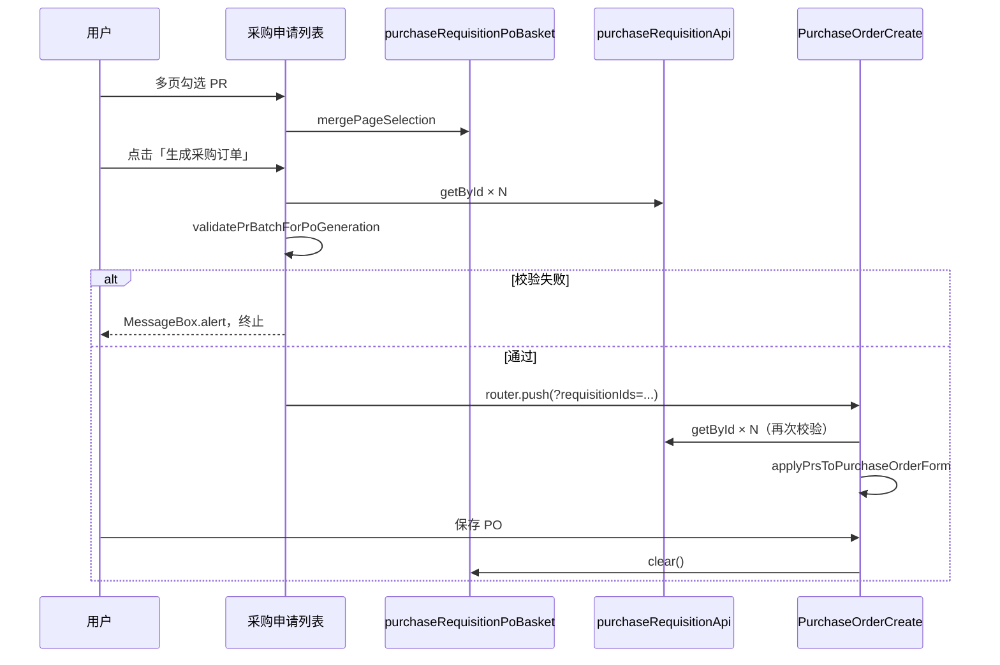

# 采购申请多选批量生成采购订单

> **目标**：用户在采购申请列表跨页勾选多条申请，合并生成 **一张** 采购订单（Multi-PR → Single PO）。  
> **实施日期**：2026-07-03  

**关联文档**：

- 《[列表复选篮子批量操作规范 PRD](../PRD/规范/UI规范/列表复选篮子批量操作规范PRD.md)》— 页脚篮子 UI 与交互标准  
- 《[业务列表规范](../PRD/规范/UI规范/业务列表规范.md)》§1.3.1 — 篮子旁「生成采购订单」主按钮样式  
- 《[新建采购订单 PRD](../PRD/业务功能/采购订单/新建采购订单PRD.md)》— 单条/批量进入新建页  
- 《[采购订单明细-添加明细与以销定采约束](./采购订单明细-添加明细与以销定采约束.md)》— 进页后客单禁手工加行  
- 《[采购申请业务逻辑](../EBS/采购申请PRD.md)》— PR 数据模型与状态  

---

## 1. 业务概述

| 项 | 说明 |
|----|------|
| **用户故事** | 采购员在「采购申请列表」勾选多条可下单申请，一次生成一张 PO，减少重复录单 |
| **与单条区别** | 单条：`?requisitionId=`；批量：`?requisitionIds=id1,id2,...`（逗号分隔，顺序=篮子 `idOrder`） |
| **结果** | 一张 PO、N 条明细（每条对应一条 PR，带各自 `SellOrderItemId`） |
| **篮子命名** | 页脚文案「复选篮子（n）」；抽屉标题「待生成采购单」 |

---

## 2. 设计要求（业务规则）

### 2.1 数量限制

| 规则 | 值 | 错误码 |
|------|-----|--------|
| 最少条数 | **2** | `batchMinCount` |
| 最多条数 | **50** | `batchMaxCount` |

常量：`PR_PO_BATCH_MIN = 2`，`PR_PO_BATCH_MAX = 50`（`purchaseRequisitionBatchPo.ts`）。

### 2.2 可加入篮子 / 可批量生成的 PR 状态

仅 **「新建」(0)** 或 **「部分完成」(1)** 可勾选入篮；其它状态勾选时自动取消并提示。

```ts
isPrBasketEligibleStatus(status) => status === 0 || status === 1
```

### 2.3 批量合并一致性（全部选中 PR 须同时满足）

| 校验项 | 规则 | 错误码 |
|--------|------|--------|
| 报价供应商 | 每条须有 `quoteVendorId`；且 **全部相同**（忽略大小写） | `vendorMissing` / `vendorMismatch` |
| 预填 PO 类型 | `prefillPurchaseOrderType` 一致（1 客单 / 2 备货 / 3 样品） | `poTypeMismatch` |
| 报价币别 | `quoteCurrency`（或 fallback `currency`）一致 | `currencyMismatch` |
| 状态 | 均为 0 或 1 | `statusNotAllowed` |

> **说明**：同一 `quoteVendorId` 是合并为一单的核心约束；币别/订单类型不一致时须拆单。

### 2.4 预填 PO 头字段规则（多条 PR）

以 **`applyPrsToPurchaseOrderForm`** 为准，**第一条 PR（`prs[0]`）** 与聚合规则如下：

| PO 头字段 | 规则 |
|-----------|------|
| `type` | 首条 `prefillPurchaseOrderType`（校验已保证全单一致） |
| `vendorId` / `vendorName` / 联系人 | 首条报价供应商与意向联系人 |
| `currency` | 首条报价币别 |
| `deliveryDate` | 全部 PR 交期 / 预期采购时间中的 **最晚日期**（`resolveLatestDeliveryDate`） |
| `purchaseUserId` / `purchaseUserName` | 首条 PR 的采购员解析（`resolvePurchaserFromPr`）：**报价采购员 → RFQ 采购员 → 申请采购员** |
| `comment` | 批量时置空（各 PR 备注进入对应明细行） |

### 2.5 预填 PO 明细规则

每条 PR 调用 `buildPoLineItemFromPr` 生成一行草稿，关键字段：

- `sellOrderItemId` ← PR 的销售明细 ID（以销定采链路）
- `pn` / `brand` / `qty` / `cost` ← PR 物料与报价
- `deliveryDate` ← PR 行交期，缺省用头表交期
- `comment` ← PR 行备注

明细条数 = PR 条数；**不**在 PO 行上存储 `PurchaseRequisitionId`。

### 2.6 权限

与单条「生成采购订单」相同，前端 `canGeneratePurchaseOrderFromRequisition`（`purchaseOrderCreateGate.ts`），与后端 `PurchaseOrderCreateGate` 对齐：

- 系统管理员；或
- `purchase-order.write`；或
- `purchase-requisition.write` +（采购部门身份 / `purchase-order.read` / 采购角色码）

无权限时：列表无勾选列、无篮子底栏。

### 2.7 校验时机（双保险）

| 阶段 | 位置 | 失败行为 |
|------|------|----------|
| **跳转前** | `PurchaseRequisitionListPage.handleBatchGenerateFromBasket` | `getById` 拉全量 → `validatePrBatchForPoGeneration` → `ElMessageBox.alert`，**不打开**新建页 |
| **新建页 onMounted** | `PurchaseOrderCreate.handleGenerateFromRequisitions` | 再次校验；失败 alert 后 `router.back()` |
| **用户保存 PO 后** | — | 成功创建后 **清空篮子** Pinia store |

---

## 3. UI / 交互设计

遵循《列表复选篮子批量操作规范 PRD》。

### 3.1 列表页（`PurchaseRequisitionListPage.vue`）

| 区域 | 实现 |
|------|------|
| 表格勾选 | `el-table` `type="selection"`，`row-key="id"`，`reserve-selection`（跨页保留勾选） |
| 页脚左 | 列设置 → 行密度锚点 → Spacer → **复选篮子（n）** → **清空篮子** → **生成采购订单** |
| 主按钮样式 | `btn-primary btn-sm basket-batch-purchase-btn`（与销售订单明细「批量申请采购」一致） |
| n &lt; 2 | 主按钮 disabled + tooltip「请至少选择 2 条…」 |
| 抽屉 | 展示篮子快照表（单号、物料、品牌、数量等），可单条移除 |
| 勾选非法状态 | 自动取消勾选 + `statusDenied` 提示 |

### 3.2 详情页（`PurchaseRequisitionDetailPage.vue`）

| 操作 | 说明 |
|------|------|
| **生成采购订单** | 单条，`?requisitionId=` |
| **加入批量** | 写入与列表 **同一** Pinia 篮子；已加入显示「已加入批量」 |
| 状态不可加 | 按钮 disabled + tooltip |

列表与详情 **共享** `usePurchaseRequisitionPoBasketStore`，翻页、切页后篮子仍保留。

### 3.3 新建采购订单页

- 路由 query：`requisitionIds=id1,id2,id3`
- 加载后执行预填；客单类型下 **不可** 手工「添加明细」（见《添加明细与以销定采约束》）
- 创建成功后 `basketStore.clear()`

---

## 4. 技术实现

### 4.1 模块结构

```
CRM.Web/src/
├── types/purchaseRequisitionBasket.ts          # 篮子行快照类型
├── stores/purchaseRequisitionPoBasket.ts       # Pinia：跨页 idOrder + itemsById
├── utils/purchaseRequisitionBatchPo.ts         # 校验、预填、常量
├── views/RFQ/PurchaseRequisitionListPage.vue   # 列表 + 篮子 UI + 批量跳转
├── views/RFQ/PurchaseRequisitionDetailPage.vue  # 加入批量
├── views/RFQ/PurchaseOrderCreate.vue            # requisitionIds 预填 + 成功后清篮
└── tests/purchase-requisition-batch-po.test.ts  # Vitest（14 项）

scripts/test-pr-batch-po.ps1                    # 本地 API 联调（可选）
```

### 4.2 篮子 Store 核心 API

| 方法 | 作用 |
|------|------|
| `upsert` / `upsertFromListRow` | 加入或更新快照；状态非法返回 null |
| `remove` / `clear` | 移除单条 / 清空 |
| `mergePageSelection(allPageRows, selectedOnPage)` | **仅同步当前页**勾选到篮子，其它页已选保留 |
| `idOrder` | 批量生成时 ID 顺序（与勾选先后一致） |

篮子快照字段（列表行）：`id, billCode, pn, brand, qty, status, sellOrderCode, quoteVendorId`。  
完整校验依赖跳转前 **`purchaseRequisitionApi.getById`** 拉取的详情。

### 4.3 批量生成主流程（时序）



### 4.4 路由与 Query

| Query | 场景 |
|-------|------|
| `requisitionId` | 单条 PR → PO |
| `requisitionIds` | 批量，逗号分隔，无空格要求（trim 后解析） |

解析见 `PurchaseOrderCreate.vue` 中 `requisitionIds` computed。

### 4.5 国际化

文案域：`purchaseRequisitionList.basket.*`（`zh-CN.ts` / `en-US.ts`）。

| Key | 用途 |
|-----|------|
| `open` / `countLabel` | 复选篮子（n） |
| `clear` / `clearConfirm` | 清空篮子 |
| `batchGenerate` | 生成采购订单 |
| `batchMinTip` / `batchMaxTip` | 数量限制 |
| `validateVendorMismatch` 等 | 合并校验失败 |
| `batchValidateTitle` | 校验弹窗标题 |

### 4.6 自动化测试

**Vitest**（`purchase-requisition-batch-po.test.ts`）覆盖：

- 各 `validatePrBatchValidateError` 分支
- `resolveLatestDeliveryDate` / `resolvePurchaserFromPr` / `buildPoLineItemFromPr`
- Pinia 篮子 upsert、mergePageSelection、状态过滤

**API 脚本**（`scripts/test-pr-batch-po.ps1`）：登录 → 列表筛 status 0/1 → 尝试批量创建（需库内 ≥2 条 eligible PR）。

---

## 5. 与单条生成的关系

| 能力 | 单条 | 批量 |
|------|------|------|
| 列表操作列 | 生成采购订单 | — |
| 列表篮子 | — | 复选篮子 + 生成采购订单 |
| 详情 | 生成采购订单 | 加入批量 |
| Query | `requisitionId` | `requisitionIds` |
| 最少条数 | 1 | 2 |
| 合并校验 | 无 | 供应商/类型/币别/状态 |

后端 **无** 专用「批量创建 PO」接口；仍为 `POST /purchase-orders`，明细数组由前端预填提交。

---

## 6. 已知边界与后续

| 项 | 说明 |
|----|------|
| 篮子快照 | 列表行字段有限；以 `getById` 全量校验为准 |
| 查询/重置列表 | 当前 **不** 自动清空篮子；用户需自行「清空篮子」 |
| PR 顺序 | 与 `idOrder` 一致，影响预填「首条」头字段 |
| 后端批量校验 | 合并规则目前 **仅前端**；若需防绕过可增 API 层校验（未做） |

---

## 7. 变更文件清单

```
CRM.Web/src/types/purchaseRequisitionBasket.ts
CRM.Web/src/stores/purchaseRequisitionPoBasket.ts
CRM.Web/src/utils/purchaseRequisitionBatchPo.ts
CRM.Web/src/views/RFQ/PurchaseRequisitionListPage.vue
CRM.Web/src/views/RFQ/PurchaseRequisitionDetailPage.vue
CRM.Web/src/views/RFQ/PurchaseOrderCreate.vue
CRM.Web/src/locales/zh-CN.ts / en-US.ts
CRM.Web/src/tests/purchase-requisition-batch-po.test.ts
scripts/test-pr-batch-po.ps1
```

---

## 8. 修订记录

| 日期 | 说明 |
|------|------|
| 2026-07-03 | 首版：多 PR 合并 PO 业务规则、篮子、双端校验、预填规则、实现索引 |
