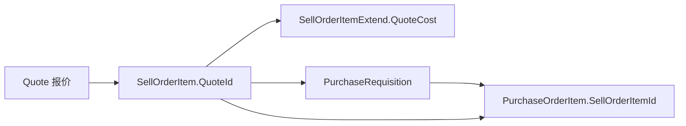

# 销售订单明细「添加明细」与报价溯源约束

> **背景**：销售订单明细通过 `QuoteId` 挂接报价主表，是 **报价 → 销售 → 采购申请 → 采购订单** 链条的上游锚点。  
> 若在 **客单** 主单上通过「添加明细」手工增加 **无报价关联** 的明细，会导致报价成交同步、成本回填、采购员/供应商预填、报价利润统计等环节断裂。  
> **文档状态**：已实施（2026-07-03）。

**关联文档**：

- 《[报价生成销售订单](../PRD/业务功能/需求报价/报价生成销售订单.MD)》— 标准入口、`quoteIds` 预填与 §添加明细 约定  
- 《[采购订单明细-添加明细与以销定采约束](./采购订单明细-添加明细与以销定采约束.md)》— 下游 PO 对 `SellOrderItemId` 的镜像约束（已实施）  
- 《[业务逻辑与数据关系文档](../System/业务逻辑与数据关系文档.md)》— 以销定采与全链路数据流  
- 《[业务规则总览](../System/业务规则总览.md)》§5 / §7 — 客单添加明细、采购申请门禁  
- 《[销售订单明细编号](./销售订单明细编号.md)》— 明细业务编号（正交能力）  
- [帮助：销售订单](../../help/pages/销售订单_MENU_SALES_ORDERS.md) — 用户操作说明  

---

## 1. 问题陈述

### 1.1 现象

销售订单新建/编辑页（`SalesOrderCreate.vue`）右上角 **「+ 添加明细」** 始终可见。  
`addItem()` → `emptyLine()` 将 `quoteId` 置为 `undefined`，保存后库表 `sellorderitem.quote_id` 为 `NULL`。

界面上「采购报价」为 **只读展示**（来自报价预填或扩展表 `QuoteCost`），手工行通常显示 `—`，**不会**自动写入 `QuoteId`。

### 1.2 与采购订单断链的对比

| 维度 | 销售订单缺 `QuoteId` | 采购订单缺 `SellOrderItemId`（客单） |
|------|----------------------|--------------------------------------|
| 字段可选性 | 库表与 API **允许** NULL | 客单场景 **已禁止** NULL（2026-07-03 落地） |
| 销单行本身 | 仍有独立 `SellOrderItemId`，出库/收款可继续 | PO 行无法正确挂接销单，PR 状态与库存分桶异常 |
| 主要断点 | 报价溯源、PR 预填、利润统计 | 以销定采、客单库存类型 |
| 产品隐含场景 | 线下补录、备货/样品 | 备货 PO 仍允许手工行 |

结论：**手工销单明细不会立刻像客单 PO 那样破坏库存分桶**，但会在 **采购侧自动化与经营分析** 上产生可预期的缺口；若业务要求标准客单必须「以报定销」，应在销售侧加约束，与 PO 侧形成对称防护。

---

## 2. 数据模型要点

| 层级 | 字段 | 说明 |
|------|------|------|
| `sellorder.Type` | `1` 客单 / `2` 备货 / `3` 样品 | 头表类型；**当前由用户下拉选择**，保存时原样写入（**未**像 PO 那样按明细重算） |
| `sellorderitem.QuoteId` | 可空 FK → `quote` | **报价溯源唯一落库关联**；报价转销售时写入 |
| `sellorderitemextend` | `QuoteCost`、`QuoteItemId`、报价利润字段 | 创建/更新明细时由 `AddSellOrderItemExtendAsync` 根据 `QuoteId` 回填；无报价时成本按 **0** |
| `purchaserequisition` | `QuoteVendorId`、`QuoteCost` | 创建 PR 时从销单行 `QuoteId` → 报价明细取供应商与成本（`QuoteItemForPrResolver`） |

**不存在** 将手工填写的「采购报价」展示值单独持久化为报价关联的字段；成本必须以 `QuoteId` 链路为准。

### 2.1 标准数据流（有 `QuoteId`）



手工明细跳过 `Quote` 节点：`QuoteCost=0`，PR 缺 `QuoteVendorId`，默认采购员解析失败（除非请求显式带 `PurchaseUserId`）。

---

## 3. 新建/编辑页「添加明细」设计要求

### 3.1 页面与路由

| 模式 | 路由 name | 路径 | 组件 |
|------|-----------|------|------|
| 新建 | `SalesOrderCreate` | `/sales-orders/create` | `CRM.Web/src/views/RFQ/SalesOrderCreate.vue` |
| 编辑 | `SalesOrderEdit` | `/sales-orders/:id/edit` | 同上 |

「添加明细」按钮位于 **物料明细** 折叠区标题栏右侧（`collapse-items-add-btn`），与折叠箭头同一行；文案 i18n：`salesOrderCreate.itemsToolbar.addLine`。

### 3.2 产品目标

1. **客单（`type=1`）**：明细必须来自报价，保证 `sellorderitem.quote_id` 可追溯；禁止在页面上手工追加无报价行。  
2. **备货/样品（`type=2/3`）**：允许手工录入明细，用于线下补录、备货销售等；`QuoteId` 可选。  
3. **与采购订单对称**：PO 客单禁手工加行（`SellOrderItemId`）；SO 客单禁手工加行（`QuoteId`）。  
4. **默认订单类型**：新建页默认 **客单 `1`**；无 `quoteIds` 时通过提示 + 保存校验引导用户从报价入口建单或改选备货/样品。  
5. **不做**头表 `type` 按明细自动重算（评审决议：用户显式选择订单类型，保存时按类型校验即可）。

### 3.3 按钮可见性（S1）

由头表 **订单类型** `formData.type` 决定，**不**单独判断「是否从报价预填」：

| `sellorder.type` | 「添加明细」 | 「删除本行」 |
|------------------|--------------|--------------|
| `1` 客单采购 | **隐藏** | 仅当 `items.length > 1` 时显示删除 |
| `2` 备货采购 | **显示** | 始终可删（允许 0 行由表单其它校验处理） |
| `3` 样品采购 | **显示** | 同备货 |

编辑客单时：用户将类型改为备货/样品后，按钮随即出现（R1：历史脏单修复路径）。

### 3.4 入口与预填行为

| 入口 | query / 行为 | 明细初始来源 | 「添加明细」 |
|------|----------------|--------------|--------------|
| 报价/需求列表 → 生成销售订单 | `quoteIds=id1,id2`（逗号拼接） | 每条报价一行，`quoteId` 写入草稿 | **隐藏**（type 默认客单） |
| 销售订单列表 → 新建 | 无 `quoteIds` | `onMounted` 调用 `addItem()` 一行空草稿 | 客单：**隐藏**；改备货/样品后 **显示** |
| 编辑已有订单 | `SalesOrderEdit` + `id` | `loadOrderForEdit` 加载库表行 | 由当前 `type` 决定 |

报价预填成功时设置 `hasQuotePrefill = true`，用于控制客单提示条（见 §3.5）。

### 3.5 提示与校验文案（S3 / R3）

| 场景 | UI |
|------|-----|
| 新建、无 `quoteIds`、类型为客单 | 订单信息区下方 **Info 提示条**：`salesOrderCreate.hint.customerOrderFromQuote` |
| 客单保存、明细缺 `QuoteId` | `ElMessage.warning`：`salesOrderCreate.validate.customerOrderLineQuoteRequired` |
| 客单保存、0 条明细 | `salesOrderCreate.validate.customerOrderMinOneItem` |
| 客单删至最后一条 | `salesOrderCreate.validate.customerOrderCannotRemoveLast` |

保存校验在 `el-form` 通过后、`afterValidate` 钩子中执行，不通过则不调用 API。

### 3.6 手工行数据约定

`addItem()` → `emptyLine()` 新建草稿：

- `quoteId: undefined`（落库为 `NULL`）  
- 「采购报价」为只读展示（`purchasePriceDisplay`），**不**持久化为 `QuoteId`  
- 备货/样品行 **允许** 保留报价预填带来的 `quoteId`（R4），保存时不强制清空  

客单保存时：**每条**明细须有有效 `QuoteId`（非空、非占位 GUID `00000000-0000-0000-0000-000000000000`）；混合单（部分有、部分无）**一律拒绝**（R2）。

### 3.7 下游门禁（S6）

客单销单行无 `QuoteId` 时，**申请采购** API 硬拒绝（`InvalidOperationException`），文案：*客单销售明细须关联报价后方可申请采购*。备货/样品维持原规则（可无报价，但须指定采购员）。

### 3.8 历史脏数据（R1 / R5 / R6）

- 上线前执行 §11.1 SQL 巡检。  
- 编辑旧客单：可将 **订单类型** 改为备货/样品后保存；保持客单则须补全每行 `QuoteId`。  
- 已有采购申请的行：删行限制沿用系统现有下游规则（R5）。

---

## 4. 实现方法

### 4.1 共享规则（前后端对齐）

| 位置 | 文件 |
|------|------|
| 后端 | `CRM.Core/Utilities/SellOrderItemLinkRules.cs` |
| 前端 | `CRM.Web/src/utils/sellOrderItemLinkRules.ts` |

| API（后端 / 前端） | 用途 |
|---------------------|------|
| `IsLinkedQuoteId` / `isLinkedQuoteId` | 是否有效报价关联 |
| `ShouldAllowManualAddItem` / `shouldAllowManualAddSoItem` | 是否显示「添加明细」 |
| `ValidateCustomerOrderItems` / `validateCustomerOrderItemsForSave` | 客单保存校验 |
| `ValidatePurchaseRequisitionAllowed` | PR 创建门禁（仅后端） |

### 4.2 前端 `SalesOrderCreate.vue`

**计算属性**

```ts
const allowAddSoItem = computed(() => shouldAllowManualAddSoItem(formData.value.type))
const canRemoveSoItem = computed(
  () => formData.value.type !== SO_TYPE_CUSTOMER || formData.value.items.length > 1
)
const showCustomerOrderFromQuoteHint = computed(
  () => !isEditMode.value && formData.value.type === SO_TYPE_CUSTOMER && !hasQuotePrefill.value
)
```

**模板**

- `v-if="allowAddSoItem"` 包裹「添加明细」按钮  
- `v-if="canRemoveSoItem"` 包裹行内删除按钮  
- `v-if="showCustomerOrderFromQuoteHint"` 展示 `el-alert` 提示条  

**方法**

- `addItem()`：首行 `if (!allowAddSoItem.value) return`  
- `removeItem()`：客单仅 1 行时 Toast 并 return  
- `validateSoItemsCustomerOrderLinks()`：保存前校验  
- `handleSubmit` → `runValidatedFormSave(..., { afterValidate: () => validateSoItemsCustomerOrderLinks() })`  

**提交 payload**（不变）：`buildCreateOrUpdateLinePayloads` 含 `quoteId: it.quoteId`。

### 4.3 后端

**`SalesOrderService.cs`**

- `CreateAsync`：在生成单号前 `ValidateCustomerOrderItems(request.Type, request.Items.Select(i => i.QuoteId))`  
- `UpdateAsync`：当 `request.Items` 非空时，以 `request.Type ?? order.Type` 校验后同步明细  

**`PurchaseRequisitionService.CreateAsync`**

- 加载销单头后：`ValidatePurchaseRequisitionAllowed(so.Type, soItem.QuoteId)`

### 4.4 国际化

| Key | 中文 |
|-----|------|
| `salesOrderCreate.itemsToolbar.addLine` | 添加明细 |
| `salesOrderCreate.hint.customerOrderFromQuote` | 客单类型须从报价列表生成；手工录入物料请选用备货或样品类型 |
| `salesOrderCreate.validate.customerOrderMinOneItem` | 客单销售订单至少需要一条明细 |
| `salesOrderCreate.validate.customerOrderLineQuoteRequired` | 客单销售订单的每条明细须关联报价单，请从报价列表生成销售订单 |
| `salesOrderCreate.validate.customerOrderCannotRemoveLast` | 客单销售订单至少须保留一条明细 |

英文见 `CRM.Web/src/locales/en-US.ts` 同路径。

### 4.5 自动化测试

| 套件 | 路径 |
|------|------|
| Core xUnit | `tests/CRM.Core.Tests/Utilities/SellOrderItemLinkRulesTests.cs`（7 例） |
| Web Vitest | `CRM.Web/src/tests/sell-order-item-link-rules.test.ts`（5 例） |

### 4.6 变更文件清单

```
CRM.Core/Utilities/SellOrderItemLinkRules.cs
CRM.Core/Services/SalesOrderService.cs
CRM.Core/Services/PurchaseRequisitionService.cs
CRM.Web/src/utils/sellOrderItemLinkRules.ts
CRM.Web/src/views/RFQ/SalesOrderCreate.vue
CRM.Web/src/locales/zh-CN.ts
CRM.Web/src/locales/en-US.ts
tests/CRM.Core.Tests/Utilities/SellOrderItemLinkRulesTests.cs
CRM.Web/src/tests/sell-order-item-link-rules.test.ts
```

---

## 5. 约束编号速查（S1–S7）

| # | 约束 | 层级 | 行为 |
|---|------|------|------|
| S1 | 客单 **禁止**手工「添加明细」 | 前端 UI | `v-if="allowAddSoItem"` |
| S2 | 客单 **至少 1 条**明细 | 前端 UI | `canRemoveSoItem` + 删最后一条 Toast |
| S3 | 客单每条须有 `QuoteId` | 前端保存 | `afterValidate` |
| S4 | 同上 | 后端 API | `SalesOrderService` Create/Update |
| S5 | 备货/样品允许手工行 | 前后端 | `QuoteId` 可选 |
| S6 | 客单无报价 **申请采购** | 后端 PR | `ValidatePurchaseRequisitionAllowed` 硬拒 |
| S7 | 历史脏数据 | 运维 | §11.1 SQL 巡检 |

**未实施**：头表 `type` 按明细自动重算（评审决议：不做）。

### 5.1 约束后行为对照

| 场景 | 结果 |
|------|------|
| 客单点「添加明细」 | 按钮不可见（S1） |
| 客单纯手工保存 / 混合单 | 保存被拒（S3/S4） |
| 备货单手工加行 | 允许（S5） |
| 无报价客单行申请采购 | PR 硬拒（S6） |
| API 绕过前端 | 后端 S4 / S6 拦截 |

### 5.2 与下游 PO 约束衔接

```text
QuoteId (SO 客单, S3/S4)  →  SellOrderItemId (PR/PO 客单, PO C3/C4)  →  库存分桶
```

详见《[采购订单明细-添加明细与以销定采约束](./采购订单明细-添加明细与以销定采约束.md)》。

---

## 6. 评审决议与脏数据 SQL

| 议题 | 决议 |
|------|------|
| 新建页默认 `type` | **默认客单 `1`**；无 `quoteIds` 时仍默认客单，靠 S1/S3 引导从报价入口建单或改选备货/样品 |
| 头表 `type` 按明细重算 | **不做**（二期不实施） |
| S6 PR 门禁 | **硬拒绝**（客单销单、明细无 `QuoteId` 时 `CreateAsync` 抛错，不降级为 Warning） |
| 历史脏数据 | **先 SQL 巡检**（见 §6.2），再定编辑/修复策略 |

| # | 决议（R1–R6） |
|---|------|
| R1 | 历史脏单：允许改 `type` 为备货/样品后保存；`type=1` 仍须每行有 `QuoteId` |
| R2 | 混合单保存一律拒绝 |
| R3 | 无 `quoteIds` 新建客单展示固定提示 |
| R4 | 备货/样品行允许带 `QuoteId` |
| R5 | 脏行有 PR 时删行沿用现有下游约束 |
| R6 | 先 SQL 巡检再发版 |

### 6.2 脏数据巡检 SQL（PostgreSQL）

执行前请在测试库验证；统计口径：`sellorder.type = 1`（客单），明细 `status = 0`（未取消），主从表 `is_deleted = false`（若列不存在可去掉该条件）。

**① 客单明细缺 `quote_id`（核心脏数据）**

```sql
SELECT
    o."SellOrderId",
    o.sell_order_code,
    o.type,
    o.status AS order_status,
    i."SellOrderItemId",
    i.sell_order_item_code,
    i.pn,
    i.brand,
    i.quote_id,
    i."CreateTime"
FROM sellorder o
JOIN sellorderitem i ON i.sell_order_id = o."SellOrderId"
WHERE o.type = 1
  AND COALESCE(o.is_deleted, false) = false
  AND COALESCE(i.is_deleted, false) = false
  AND i.status = 0
  AND (i.quote_id IS NULL OR BTRIM(i.quote_id) = '')
ORDER BY o.sell_order_code, i.sell_order_item_code;
```

**② 汇总：受影响订单数 / 明细行数**

```sql
SELECT
    COUNT(DISTINCT o."SellOrderId") AS dirty_order_count,
    COUNT(*) AS dirty_line_count
FROM sellorder o
JOIN sellorderitem i ON i.sell_order_id = o."SellOrderId"
WHERE o.type = 1
  AND COALESCE(o.is_deleted, false) = false
  AND COALESCE(i.is_deleted, false) = false
  AND i.status = 0
  AND (i.quote_id IS NULL OR BTRIM(i.quote_id) = '');
```

**③ 混合单：同一客单内既有报价行又有无报价行**

```sql
SELECT
    o."SellOrderId",
    o.sell_order_code,
    COUNT(*) FILTER (WHERE i.quote_id IS NOT NULL AND BTRIM(i.quote_id) <> '') AS lines_with_quote,
    COUNT(*) FILTER (WHERE i.quote_id IS NULL OR BTRIM(i.quote_id) = '') AS lines_without_quote
FROM sellorder o
JOIN sellorderitem i ON i.sell_order_id = o."SellOrderId"
WHERE o.type = 1
  AND COALESCE(o.is_deleted, false) = false
  AND COALESCE(i.is_deleted, false) = false
  AND i.status = 0
GROUP BY o."SellOrderId", o.sell_order_code
HAVING
    COUNT(*) FILTER (WHERE i.quote_id IS NOT NULL AND BTRIM(i.quote_id) <> '') > 0
    AND COUNT(*) FILTER (WHERE i.quote_id IS NULL OR BTRIM(i.quote_id) = '') > 0
ORDER BY o.sell_order_code;
```

**④ 脏行是否已产生采购申请（评估修复难度）**

```sql
SELECT
    o.sell_order_code,
    i.sell_order_item_code,
    i.quote_id,
    pr."PurchaseRequisitionId",
    pr.bill_code AS pr_bill_code,
    pr.status AS pr_status
FROM sellorder o
JOIN sellorderitem i ON i.sell_order_id = o."SellOrderId"
LEFT JOIN purchaserequisition pr
    ON pr.sell_order_item_id = i."SellOrderItemId"
   AND COALESCE(pr.is_deleted, false) = false
WHERE o.type = 1
  AND COALESCE(o.is_deleted, false) = false
  AND COALESCE(i.is_deleted, false) = false
  AND i.status = 0
  AND (i.quote_id IS NULL OR BTRIM(i.quote_id) = '')
ORDER BY o.sell_order_code, i.sell_order_item_code;
```

**⑤ `quote_id` 指向不存在的报价（断链引用）**

```sql
SELECT
    o.sell_order_code,
    i.sell_order_item_code,
    i.quote_id
FROM sellorder o
JOIN sellorderitem i ON i.sell_order_id = o."SellOrderId"
LEFT JOIN quote q ON q."QuoteId" = i.quote_id
WHERE o.type = 1
  AND COALESCE(o.is_deleted, false) = false
  AND COALESCE(i.is_deleted, false) = false
  AND i.status = 0
  AND i.quote_id IS NOT NULL
  AND BTRIM(i.quote_id) <> ''
  AND q."QuoteId" IS NULL
ORDER BY o.sell_order_code;
```

---

## 7. 修订记录

| 日期 | 说明 |
|------|------|
| 2026-07-03 | 首版讨论稿：问题分析、约束 S1–S7、与 PO 约束对照 |
| 2026-07-03 | 评审决议与脏数据 SQL；实施 S1–S6、单测 |
| 2026-07-03 | 补充 §3 新建/编辑页「添加明细」设计要求与 §4 实现方法 |
